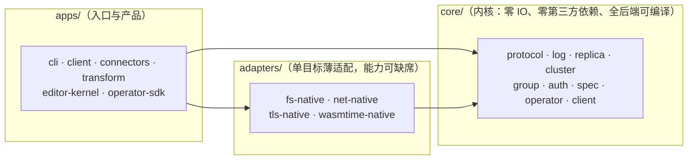

# moonflux — MoonBit 全栈流式计算平台

> **正式立项**：2026-09-15 · **项目目录**：`~/workspace/moonflux` · **对标参考**：[Fluvio](../fluvio) · **组件资产**：[mbel](../mbel)（动态规则引擎）、[mbel-orch](../mbel-orch)（函数分发设计参考）· **状态**：P0–P14 全部达成，门禁 32 步全绿（[路线图与进度](docs/project-roadmap.md)）

## 这是什么

**moonflux 是一个用 MoonBit 全栈开发的流式计算平台，与 Fluvio 具备同等的能力与地位。**

- **全栈 MoonBit**：从内核（编解码 / 线协议 / 存储 / 复制状态机 / 权限表）到系统集成（网络 / TLS / wasmtime 宿主）、从 CLI 到 Web 拖拽编辑器，单一语言贯穿；换来三样东西——native 与 WASM 双形态可移植、沙箱与内存安全、AI 辅助开发效率。
- **能力对等**：分区提交日志、follower 拉取复制与集中提名选主、消费组与托管偏移、版本化线协议、沙箱化可编程算子、动态表达式规则、连接器框架、TLS + 认证授权、可视化编辑器。
- **与 Fluvio 的关系**：Fluvio 是**对标系统与设计参考**（架构研究、能力基准、语义参照），**不是宿主、不是依赖**；对标语义逐条建账验证（[兼容性矩阵](docs/compatibility-matrix.md)）。

**名称**：**Moon**Bit × **Flux**（流）。

## 核心主张

1. **一内核多后端**：同一份内核编译为 Native 服务端、WASM 沙箱算子、浏览器客户端三种形态；依赖方向 `core ← adapters ← apps` 由 MoonBit `supported_targets` 的依赖 fail-fast 在**编译期**强制（报告 4.5）。
2. **内核是纯计算**：零 IO、零第三方依赖（仅 `moonbitlang/core`）、无 panic 解析、时钟与随机注入——确定性重放与故障重放的前提（AGENTS.md §5）。
3. **动态性内建**：mbel 表达式作为消费路径的动态规则，改规则秒级生效、免编译免重启；表达式函数集是版本化资产，发布期拦截错误（决策 10/27）。
4. **对标为主、移植可选**：以 Fluvio 为设计参考自建同等能力；代码级移植（Rust→MoonBit）若能显著加速实现，经「MoonBit 语境合理性」四检后可用（AGENTS.md §1.1），验收门槛与自建一致。
5. **分阶段达成、门禁推进**：每个能力面以**可证伪的门禁**收口（故障注入、对拍、拒绝路径断言），不以"看起来能跑"代替（AGENTS.md §2）。

## 快速开始

```bash
moon build --target native          # 单二进制：_build/native/debug/build/apps/cli/cli.exe

cli.exe serve --data-dir d --listen 127.0.0.1:19420 &
cli.exe pipeline apply -f demo.json --data-dir d
cli.exe produce --topic events --file in.txt --remote 127.0.0.1:19420
cli.exe consume --topic events --remote 127.0.0.1:19420
```

五分钟跑通、最小集群、消费组、函数集、TLS + 认证、故障排查——见 **[实用文档](docs/user-guide.md)**。

## 架构一瞥



箭头 = **依赖方向**（`core ← adapters ← apps`），违规在 `moon build --target X` 直接失败；运行时数据流见[架构总览](docs/architecture.md) §1。

三种服务端（`serve` / `spu` / `sc`）是**同一个单线程事件循环**：accept → poll → 逐帧分发 → flush，绝不阻塞在单个对端上（P13 后三者同形）。复制是 follower 拉取原始帧（字节一致）；水位 `HW = min(LEO)` 只前进；放置与提名是控制面的**状态**、随心跳应答下发；控制面从不拨号数据节点。完整阐述（协议、存储不变量、复制、安全、算子、验证体系）见 **[架构总览](docs/architecture.md)**。

## 能力与范围

能力清单（每项的状态与门禁证据）见 **[功能矩阵](docs/feature-matrix.md)**。与 Fluvio 逐条对标语义的验证状态见 **[兼容性矩阵](docs/compatibility-matrix.md)**。

| 能力域 | 一句话现状 |
| :--- | :--- |
| 数据面 | 分区日志、段滚动/索引/retention、崩溃恢复、键控 compaction（记录只删不搬，偏移不变）✅ |
| 复制与集群 | follower 拉取、逐分区水位/选主、分歧回归、资产下发 ✅；镜像 ⏳ |
| 消费语义 | 重放、提交读开关、消费组（至少一次、世代围栏）✅；事务 ⏳ |
| 可编程 | 表达式 + 函数集 + wasm 算子沙箱（双预算、fail-closed）✅；ABI v2 标量调用 ✅（P26） |
| 接入与协议 | 帧协议 v2、多路复用、WS、认证/授权/TLS（含节点间）✅；MQTT/Kafka 连接器 ✅（P19/P20） |
| 产品面 | CLI、PipelineSpec、Web 编辑器 ✅；多语言 SDK / K8s ⏳（K8s 有意排最后） |

## 文档导航

| 想了解 | 去哪里 |
| :--- | :--- |
| 怎么构建、怎么用、怎么排障、五个实战示例 | [`docs/user-guide.md`](docs/user-guide.md) |
| 架构为什么是这个形状、代码在哪 | [`docs/architecture.md`](docs/architecture.md) |
| 现在能做什么、什么状态 | [`docs/feature-matrix.md`](docs/feature-matrix.md) |
| 做到哪一步了、接下来做什么 | [`docs/project-roadmap.md`](docs/project-roadmap.md) |
| 一页看板：已完成 / 待办 / 阻塞 / 返工 | [`docs/progress-board.md`](docs/progress-board.md) |
| 能不能上生产、缺什么 | [`docs/production-readiness.md`](docs/production-readiness.md) |
| 与 Fluvio 对标语义的验证状态 | [`docs/compatibility-matrix.md`](docs/compatibility-matrix.md) |
| 在 Fluvio 参考仓库作业的规则 | [`docs/fluvio-reference-guide.md`](docs/fluvio-reference-guide.md) |
| 立项的技术依据（Fluvio 全景剖析） | [`docs/fluvio-moonbit-evaluation.md`](docs/fluvio-moonbit-evaluation.md) |
| 给 agent 的工程纪律（必读） | [`AGENTS.md`](AGENTS.md) |

## 资产索引

| 资产 | 位置 | 说明 |
| :--- | :--- | :--- |
| **项目规约** | [`AGENTS.md`](AGENTS.md) | 项目章程：金规则 7 条 / 内核红线 / 验证流程 / 事件循环与安全纪律 / 不做清单 / 文档规范（§10） |
| **架构总览** | [`docs/architecture.md`](docs/architecture.md) | 分层与包清单 / 事件循环 / 协议 / 存储 / 复制与控制面 / 安全 / 算子 / 验证体系 |
| **实用文档** | [`docs/user-guide.md`](docs/user-guide.md) | 构建 / 快速开始 / CLI 参考 / 集群与消费组 / 安全配置 / 存储运维 / **实战示例（5 个）** / 故障排查 |
| **功能矩阵** | [`docs/feature-matrix.md`](docs/feature-matrix.md) | 能力清单的单一真相：功能 × 状态 × 证据入口 |
| **路线图与进度** | [`docs/project-roadmap.md`](docs/project-roadmap.md) | 进度管理的单一真相：阶段详情 / 里程碑台账 / 排期 |
| 进度看板 | [`docs/progress-board.md`](docs/progress-board.md) | 带日期的进度快照：已完成 / 待办 / 优先级 / 阻塞 / 返工 + 功能点简介（派生视图，真相在 roadmap） |
| 生产就绪度评估 | [`docs/production-readiness.md`](docs/production-readiness.md) | 分级结论 / 支撑证据 / 事故级缺口 / 最小生产化清单（快照；上线评审的输入） |
| 兼容性矩阵 | [`docs/compatibility-matrix.md`](docs/compatibility-matrix.md) | 每个对标语义的验证状态与证据入口（图例单一真相） |
| CLI 命令工具规划 | [`docs/cli-roadmap.md`](docs/cli-roadmap.md) | 命令面现状盘点 + 对标 Fluvio CLI 的分阶段映射（决策 13） |
| 算子 ABI v2 设计稿 | [`docs/operator-abi-v2-scalar.md`](docs/operator-abi-v2-scalar.md) | 不可信标量函数的沙箱路线（只设计不实现，决策 28） |
| 算子沙箱取证 | [`docs/p2-wasm-host-spike.md`](docs/p2-wasm-host-spike.md) | wasmtime 进程内宿主的探针实证与落地实录 |
| SDF 示例移植与缺口 | [`docs/sdf-examples-port.md`](docs/sdf-examples-port.md) | 对标示例集 8 例的逐条对照、语义映射表与缺口清单（P29） |
| SDF Studio 对标探索 | [`docs/sdf-studio-exploration.md`](docs/sdf-studio-exploration.md) | 图形化方案的事实、概念对照、三阶段提案与非目标（P29） |
| 算子 ABI v3 设计稿（键控状态） | [`docs/operator-abi-v3-state.md`](docs/operator-abi-v3-state.md) | 状态=压实键控主题 + 宿主视图；窗口骑事件时间；11 条门禁形态（只设计不实现） |
| 算子作者指南 | [`docs/operator-authoring-guide.md`](docs/operator-authoring-guide.md) | 写一个 guest 算子：ABI 面、三种形状、配置、构建自检、挂载与纪律（P30/T112） |
| SDF 缺口追平方案 | [`docs/sdf-gap-closure-plan.md`](docs/sdf-gap-closure-plan.md) | 九条缺口逐条判定：追平 / 变通 / 不做，含设计要点、门禁形态与排期（P29 后续） |
| 立项评估报告 v1.6 | [`docs/fluvio-moonbit-evaluation.md`](docs/fluvio-moonbit-evaluation.md) | 七章：Fluvio 全景 / 功能详解 / 分层路径 / 后端 / mbel / 编辑器 / 结论路线图 |
| 对标参考工作规约 | [`docs/fluvio-reference-guide.md`](docs/fluvio-reference-guide.md) | 在 Fluvio 参考仓库内作业时的 agent 硬规则 |
| 安全面取证客户端 | [`scripts/mfs_probe.py`](scripts/mfs_probe.py) | 独立实现的 MFS 客户端（Python）：安全门禁用它伪造节点命令，断言针对**服务端授权** |
| mbel 表达式引擎 | [`../mbel`](../mbel) | v0.3.3；动态规则层的候选内核（评估见报告第五章） |
| mbel-orch 设计文档 | [`../mbel-orch`](../mbel-orch) | 函数管理与分发平台（设计参考） |

## 代码结构

```
moonflux/
├── AGENTS.md              # 项目规约（章程）：任何任务开始前必读
├── docs/                  # 产品文档（架构/实用/功能矩阵/路线图）+ 对标与设计文档
├── core/                  # 内核：零 IO、零第三方依赖、全后端可编译
├── adapters/              # 单目标薄适配：fs/net/tls/wasmtime-native
├── apps/                  # 入口与产品：cli / client / connectors / transform / editor-kernel / operator-sdk
├── scripts/               # 门禁（gates.sh + e2e-*）与对拍工具
└── web/editor/            # Web 编辑器前端
```

## 关键决策记录

1. **架构对标为主、移植为辅（可选）**：以 Fluvio 为设计参考自建同等能力平台；**允许在能显著加速实现时做代码级移植**（Rust→MoonBit 翻译），须过「MoonBit 语境合理性」四检（AGENTS.md §1.1）；Fluvio 不作为宿主或依赖；每个模块的"移植 vs 自建"决策随该模块立项记入本条；
2. **算子沙箱用经典 core-wasm ABI 语义**（对标 SmartModule 的设计取舍：极小 ABI + 版本化载荷 + 预算治理）；不引入 WIT/组件模型作为首期依赖（报告 1.2.8 / 3.6）；
3. **后端实现顺序：Native 先行**（2026-09-15 修订）——Source/Sink、数据面、客户端都需要**独立的外部读写**（网络 / 文件 / 协议 / MQ / 硬件直采），WASM 沙箱只能做宿主中介的计算、不适合承载连接器；WASM 后置为"数据路径内算子沙箱"形态（P2），JS/wasm-gc（浏览器客户端）最后；**内核的全后端可编译纪律由 CI 矩阵保持**（不依赖 WASM 先行倒逼）。本条修订自报告 4.4 的原始排序（其"WASM 先行"以"扩展层切入"为前提，与全平台定位的前置条件不同；修订注见报告 4.4）；
4. **动态规则内核选型 mbel**：MoonBit 宿主库内嵌；跨语言/沙箱形态用 core-wasm + 薄 ABI（报告 5.3 / 5.4）；
5. **编辑器 spec-first**：先立 PipelineSpec 与 CLI 编译器，UI 只是 spec 渲染器（报告 6.3）；
6. **并行与分布归宿主架构**：计算单元无状态化，"宿主并行 × guest 虚拟"（报告 4.6）。
7. **PipelineSpec 文档格式用 JSON**（2026-09-15）：MoonBit 内核仅依赖 `moonbitlang/core`（无 YAML 解析器），v1alpha1 以 JSON 为规范文档格式；JSON 是 YAML 子集，纯 JSON 语法书写的 YAML 文档天然兼容。YAML 全量解析视需求另立依赖决策；
8. **P0 会话协议为内部帧格式**（2026-09-15）：`serve/produce --remote/consume --remote` 使用 10 字节头 `MFS` 帧封装线协议批帧，仅供 P0 demo；完整版本化协议服务化与多路复用按路线图属 P1，届时替换并纳入对拍矩阵；
9. **P0′ 拓扑的执行形态**（2026-09-15）：`pipeline apply` 持久化 `topology.json`（pipeline 名 + spec 文档），编译为纯函数——重编译即还原拓扑；`pipeline run` 在单进程内顺序执行编译出的拓扑（source→broker→sink）。多进程/远程执行在 P1 协议服务化基础上接管；含 `mbel-p1` 能力标记的拓扑 run 期拒绝执行（可证伪的未实现声明）。
10. **动态规则作用于消费路径**（2026-09-15，P1）：mbel transforms 在 fetch/回放路径逐条执行（对标 SmartModule 的消费侧流处理语义）——历史数据按当前规则重现，这也是「改规则秒级生效」可证伪的关键；规则资产（表达式）随 spec 版本化，`pipeline apply` 时做发布期静态检查（mbel Compile mode：语法/未知函数/未知变量/类型错误全部拦截），运行期 compile-once + Vm 程序缓存复用到每记录。
11. **规则热重载机制**（2026-09-15，P1）：`serve` 每个请求前 stat `topology.json`（纳秒 mtime），变更即重编译换入——`apply` 后无需重启；重载失败保留旧规则并告警（绝不静默、绝不空转）。秒级精度不足会漏检测（秒内两次 apply），故 fs 适配器 mtime 用纳秒。
12. **协议服务化与 SDK 连接抽象**（2026-09-15，P1）：帧协议 v2 = `MFS` magic + 版本 2 + cmd + 请求 id + 长度；会话以 HELLO/WELCOME 握手（主版本不匹配回结构化 `unsupported-version`，v1 时代对端被明确拒绝而非静默断开）；错误帧带稳定错误码。客户端 SDK（`apps/client`）把连接抽象为注入式函数字段（TCP / socketpair），使全流程可进程内单测；多路复用与并发连接仍在后续里程碑（P1 保持顺序会话）。
13. **CLI 命令工具规划**（2026-09-16）：CLI 是产品化入口与 PipelineSpec 的权威执行器，命令面对标 Fluvio CLI 命令面（报告 §2.x 实录）分四批补齐——「现在可做」（topic 管理 / consume·produce 形态补齐 / profile / `pipeline delete` / codec 工具）→ P2 伴随（算子管理雏形，对标 SmartModule）→ P3 控制面（partition / cluster / spu / consumer / benchmark）→ P4（SDK 对齐与插件机制）；规划与勘误清单见 [`docs/cli-roadmap.md`](docs/cli-roadmap.md)，不改变 P2 进行中工作。
14. **算子沙箱宿主选型：wasmtime C API（进程内）**（2026-09-16，P2）：选 wasmtime 而非自研解释器或子进程宿主——它就是本项目对标对象 SmartModule 所用的运行时，语义对齐成本最低；**进程内**（非子进程）保证算子调用与 mbel 同构（同地址空间、注入式接口、无跨进程协议）；以 **dlopen 运行时解析符号**接入（`MOONFLUX_WASMTIME_LIB` 可覆盖路径），因此**不引入链接期依赖**——内核红线只约束 core，但适配层同样保持"能力可缺席"（无 libwasmtime 时只有 wasm 算子不可用，其余功能完好）。**代价与纪律**：shim 手写 C，类型镜像尺寸必须取自真实 `wasmtime.h`（T15 的两个镜像尺寸错位曾导致栈破坏——取证见 [`docs/p2-wasm-host-spike.md`](docs/p2-wasm-host-spike.md)）；上游后台编译曾被 moonspawn 交互触发 panic，故引擎固定 `parallel_compilation=false`。
15. **算子 ABI v1 定稿**（2026-09-16，P2）：guest 侧固定 7 个导出（`mf_op_abi_version` / `mf_op_alloc_input` / `mf_op_init` / `mf_op_process` / `mf_op_output_len` / `mf_op_last_status` / `mf_op_last_error`），**导出名不可配置**（spec 无 `export` 字段——开放只会诱使作者偏离契约）；**缓冲调用协议**：宿主无法伪造 guest 的 Bytes（boxed 指针 + 头部），故由 guest 持缓冲、宿主只传指针，输出长度单独暴露；**载荷即线协议批帧**（`base_offset = -1`，offset 是宿主记账，绝不进沙箱）；**配置走 `mf_op_init`**（spec 的 `config` 对象原样透传，host 不解释——ABI 承诺的配置入口此前空转，P2 打通）。**版本门**：宿主与 guest 的 ABI 版本不一致即拒绝实例化（不允许"尽力而为"）。
16. **WASI-stub 策略：guest 无导入**（2026-09-16，P2）：算子模块以 `--target wasm` 编译但**不得有 import 段**——宿主不提供任何 WASI 实现（`wasmtime_instance_new` 以空导入实例化），因此算子不能做 IO、不能读时钟、不能用随机源；这与内核红线同源（AGENTS §5），也让"算子即纯函数"成为**结构性事实**而非约定。构建门禁 `tools/probe_operator_exports.py` 直接以编译器 WAT 为真相源断言导出面；需要配置或外部行为的算子，通过 init config 与记录字段表达。

17. **复制语义：follower-pull + HW = min(LEO)（2026-09-16，P3）**：副本**主动拉取**（`SYNC_FETCH` 复用 fetch 语义），leader 永不 push；**高水位 = 副本集合（含 leader 自身）各 LEO 的最小值**，只前进不回退（迟到的低 LEO 报告被忽略）；**LRS ≈ ISR 是算出来的而非存起来的**（`core/replica.lrs_members` 按滞后阈值现算：落后即失去投票权、仍继续收记录、追上自动回归）；**数据面无 leader epoch**——不是漏了字段，而是有任期号就成了另一个协议（Raft），对标系统在数据面没有它，故 `Role`/`ReplicaState` 里没有任期。读语义：`ReadCommitted ≤ HW`、`ReadUncommitted ≤ LEO`（默认 Uncommitted，对标事实），**该钳制在 `core/replica` 已实现并有单测，但尚未接到线协议的 FETCH 应答上**（矩阵 #11 记 ⚠️）。
18. **分歧处理（2026-09-16，P3，参考系统未定义、本项目显式定义）**：没有 epoch 可比较尾巴，所以回归副本与本分区新 leader 的分歧必须由规则裁决——**新 leader 的 LEO 是唯一权威**：`local_leo > leader_leo` 即 `truncate_to(leader_leo)`，并把丢弃的记录数/字节数写进日志（绝不静默）。落地还要一条顺序纪律：follower 必须**先问 leader 的 LEO**（`CMD_OFFSET_INFO`，与位置无关）再决定截断或拉取——用 "send me bytes from N" 提问时，N 越过 leader 末端就无法回答，分歧恰恰就是这种情况。
19. **副本集合 ≠ 在线节点集合（2026-09-16，P3）**：placement 持久化（`cluster-state.json`），**已分配但离线的节点留在副本集合里**——这正是"副本死亡时 HW 停住"的语义来源；反过来，节点增减会重塑副本集合并由 follower 自动补数据（**与对标系统的差异留痕**：对标系统明确不做存量再平衡，moonflux 能做，因为追平路径已经存在且被门禁覆盖）。**并发写（矩阵 #8）的 P3 答案**：不给段文件加多写者锁，而是**每个分区同一时刻只有一个 leader**——写入串行化由复制协议保证，节点内仍是单进程串行。
20. **控制面纪律：SC 不主动拨号数据节点（2026-09-16，P3）**：两类进程都是单线程循环（服务请求与做家务交替），因此**互相调用会死锁**（门禁中真实复现：SC 提名时候选正在向 SC 询问，双方各等到超时）。最终形态：**提名是 SC 的一个状态**，随 `CMD_LEADER` 应答下发；候选读到"自己被提名"→ 自己提升 → `CMD_CONFIRM` 回报；SC 只校验"这个分区确实许给过你"。所有节点间调用带 1s 网络超时（忙的节点只能让一次调用失败）。元数据存储**接口可插拔**（`MetadataStore{load,save}`，本地文件为首个后端；**目前只有一个真后端**，K8s CRD 待 P4），元数据带单调版本、重复名/非法名在写入前拒绝；**单 SC 假设显式声明**，第二个写入者以结构化冲突失败而非 last-writer-wins。
21. **节点形态与可观测性（2026-09-16，P3）**：单二进制多子命令落地为 `serve`（全在一体，向后兼容）/ `spu`（数据节点 + 向 SC 报到）/ `sc`（控制面）/ `topic create|list|delete` / `cluster nodes|status|leader|offsets`。**存活是推导的**：表里只记 `last_seen`，离线由时钟推出，转换只报一次（level-triggered，不是每 tick 的日志流）。工程细节留痕：macOS 的 `SO_RCVTIMEO` **不作用于 accept**（改为 `poll()` + accept 的 shim）；`@env.now()` **是毫秒**（按纳秒再除一次会把 3 秒超时变成 3000 秒）；长驻节点重定向的 stdout 是块缓冲（新增 `fflush` 后的 `note()`，否则集群事件在进程运行时读不到、被信号杀掉时全丢）。

22. **浏览器传输：同端口 WebSocket 网关（2026-09-17，P4）**：浏览器不能开 TCP，因此 `serve --ws` 在**同一端口**嗅探前 4 字节——HTTP 走 RFC 6455 升级，否则把字节还给帧路径。协议一个字节没变（WS 二进制帧里装的还是 `MFS`），**网关只是传输**：握手、SHA-1/Base64、掩码校验（拒绝未掩码的客户端帧——接受它是代理投毒口子）、分片重组、ping/pong 都在传输层，之上的帧编解码与命令分发与 TCP 路径完全共用。非 upgrade 的 HTTP 请求得到带原因的 400。
23. **客户端内核化（2026-09-17，P4）**：帧编解码与会话状态机搬进 `core/client`（纯计算、全后端可编译），`apps/client` 只剩原生传输构造器。**理由**：浏览器要用 CLI 用的同一份客户端逻辑，而不是第二份实现。代价与边界（实测）：`pub using` 是源码级结构（不能写在 moon.pkg）、能再导出类型与函数但**不能**再导出枚举构造器、且**不能给外部类型定义方法**——因此传输构造器是自由函数（`@native.tcp(...)`），需要构造器的调用方直接 import 内核包。内核侧还提供 `Conn::memory_pair()`（内存双工对），于是客户端自身的 12 项测试在 wasm-gc 上也能跑。
24. **Web 编辑器 = spec 的渲染器（2026-09-17，P4）**：`apps/editor-kernel` 编译到 **js** 目标 + 静态页 `web/editor/`；页面拥有像素与 socket，内核拥有 spec/校验/拓扑/协议。**"图 → spec"只在内核里发生一次**（`build_spec`），所以改 UI 不会悄悄改格式；校验复用 `core/spec`、拓扑复用 `core/pipeline`、应答解析复用 `core/client`。为什么不是 wasm-gc：wasm-gc 模块的 `Bytes`/`String` 是自己 GC 堆里的引用类型、不导出线性内存、无宿主胶水 ⇒ JS 无法构造入参（实测导出签名如此）；js 目标才是浏览器原生调用约定，wasm-gc 的可编译性由矩阵保持。协议为此补了 `CMD_APPLY_PIPELINE`（部署动词），服务端复用静态检查 + 落盘 + 既有热重载。**该缺口已于 P5 T32 修复**：`serve` 改为 poll 驱动的事件循环，浏览器长连接与多个 CLI 客户端可以同时在场（P4 门禁的断言阶段现在就在浏览器连接打开时通过）；`spu`/`sc` 仍是有意单连接（对端已知且少），已在代码中注明。

25. **并发由事件循环提供，不是线程（2026-09-17，P5）**：`serve` 的 accept-处理-关闭循环改为 `ConnectionHub`（`apps/cli/hub.mbt`）——poll 所有连接，只推进有数据的那个；**半个帧留在缓冲里等下一轮**，写侧按 socket 可写性排空（`send_some` 返回 0 即"满了，下一轮再写"），因此一个只连不读或只写不读的对端都不能拖慢别人。适配层为此新增 `set_nonblocking` / `recv_some` / `send_some` / `poll_readable`，其中**"would-block ≠ EOF ≠ 错误"三者可区分**是正确性前提（有单测钉住）。**不引入线程/async**：节点仍是"服务 + 定时家务"的单线程循环（AGENTS §1.2）。**慢客户端策略**：outbox 超 8MiB 判定对端不读并带日志断开（不能让它吃内存）。**`spu`/`sc` 仍有意单连接**（对端已知且少：控制面 + 该分区 follower 轮流拉取），已在代码注明而非默默不同。
26. **跨语言与工具链的三条实测事实（2026-09-17，P4/P5 期间）**：js 目标里 **`Int64` 是 BigInt**（传 number 会在内核内抛异常并静默中断调用方——浏览器编辑器踩过）、**`Bytes` 是 `Uint8Array`**；**wasm-gc 模块无法被 JS 直接调用**（其 `Bytes`/`String` 是自身 GC 堆内的引用类型、不导出线性内存、无宿主胶水），因此要给浏览器 API 就用 `is-main` + `link: { "js": { "exports": [...] } }` 编译到 js（库包不产出 js 制品）；`pub using` 只能在源码里、可再导出类型与函数但**不可**再导出枚举构造器，且**不可**为外部类型定义方法（传输构造器因此是自由函数）。这些是工具链事实而非偏好，写进 AGENTS 的纪律块以避免重复踩。

27. **函数集 = 版本化规则资产（2026-09-17，P6）**：mbel 的表达式体自定义函数以**资产**形态进入平台——一份 JSON 文档部署到节点（`function-set create|get|list|delete`，协议命令 22–25），集合带**单调 revision**，spec 的表达式节点按**名**引用（`$.spec.transforms[i].functions`），apply 时解析并绑定：解析到的 revision 写进 `topology.json`，更新集合**必须 re-apply** 才生效。**与算子体系治理同构**（工件化 / 版本化 / 发布期校验 / 预算 / fail-closed），区别只在运行时位置（宿主侧 mbel vs wasmtime 沙箱），而这个区别由**信任边界**决定：函数集是经评审的平台资产（**不可信标量函数的终态是决策 28 的 ABI v2**，本路径不得被当作沙箱用）。**校验分两层并留痕**（实测，ticket 36 §评估校核）：*资产级* = 名字白名单 + 结构 + 纯度（mbel 的名字/参数/函数体规则以注册委派给 mbel 为唯一权威）；*类型* = 只覆盖被引用闭包——mbel 按调用点推断参数类型，"整集合类型校验"不可得，故不承诺。**纯度**：拒绝 `now`（`builtin/time.mbt` 中唯一读宿主时钟者；`date`/`duration` 是字符串解析、`timezone` 裁到 UTC），文本 token 扫描、宁可误拒。**语法面实测**：顶层表达式用三元 `?:`，`if {}` 块只在函数体内合法（Vm 编译阶段拒绝）——门禁两侧都钉。**两个工程发现**：深递归错误文本约 4.4 KB/次，错误出口统一截断到 `apps/transform.MAX_ERROR_CHARS`；`node.mbt` 的 HELLO 曾把*帧*版本号当*协议主版本*发送（`serve` 校验时暴露，已修）。
28. **ABI v2 标量调用设计稿（2026-09-17，P6；只设计不实现）**：不可信标量函数的路线是 ABI v1 的**加法扩展**——7 个批导出不动，新增可选标量导出（`mf_op_scalar_abi_version` / `mf_op_eval`），宿主侧按 `{函数名 → 模块, 预算}` 注册表逐调用执行，request 首版为 JSON `{"fn","args"}`；确定性仍由 guest 无导入**结构性**保证。**触发条件**：出现"用户提交的标量函数"需求（多租户扩展）。设计、开放问题与不实现声明见 [`docs/operator-abi-v2-scalar.md`](docs/operator-abi-v2-scalar.md)；**本里程碑不实现 ABI v2、不做 mbel-in-guest、不做函数集集群分发、编辑器不加函数集 UI**。

29. **多分区 = 复制的单元（2026-09-17，P7）**：控制面早已逐分区放置/选主，本里程碑把**数据节点**补上——`HostTable` 按 `(topic, partition)` 持有宿主，每个宿主的 `ledger`/`leader`/`replicas` 相互独立，因此**水位、故障、换主、分歧都以分区为单位**：一个静默成员只让它所在的那些分区的水位停滞，其它分区照常推进（门禁第 3 腿就是这条）。**放置随心跳应答下发**（与"提名随 CMD_LEADER 应答"同构，决策 20）：节点不发明放置；应答未到而请求先到时，用 `CMD_LEADER` 按需兜底一次——那是延迟，不是第二套规则。**退化自放置**：当应用管道指向的主题**没有任何声明**（或没有控制面）时，节点自持该主题的 partition 0——这是 P7 之前的隐式行为，现在写下来并注明（有声明时永远以控制面为准）。**每分区 LEO 随节点记录上报**：记录载荷尾部**加法**一节（旧解码器不校验读尽、新解码器缺段得当空表，故不加帧版本号）；`NodeRecord.leo` 保留为兼容字段（=应用主题 partition 0 的 LEO）。**写入只认 leader**：非宿主与跟随者都结构化拒绝并附 leader 地址。**分歧截断退到帧边界**：`core/log.truncate_to_boundary` —— leader 的 LEO 可能落在本副本的某帧**内部**，而日志不存半个批（`truncate_to` 会拒绝），于是切到前一帧边界并由复制重新拉取：代价是一次重拉，不是一条记录。
30. **节点间调用改为"协作式阻塞"（2026-09-17，P7，实测驱动）**：多分区把节点间调用从"星形"（跟随者→leader）变成"环"（每个节点既跟随又领导），同步阻塞调用于是让三个节点互相听不见——**实测**：SC 应答 18ms，而一次 `cluster offsets` 要 1.0–1.5s，复制持续超时重试，甚至因周期长于 3s 存活超时而被控制面判死。四步修复，都留了痕：①`spu` 的数据端口改用 P5 的 `ConnectionHub`（多连接、单线程），且 **accept 超时 = 循环 tick（50ms）而非心跳周期**（阻塞式 accept 让每次 poll 都花掉一个超时，这是 1.4s 里的主要成分）；②**每分区每 tick 一次调用**：把"先问 leader 的 LEO 再拉"合并为一次 `SYNC_FETCH`（应答本就带回 leader 的末端与水位，发散也因此可判），ACK 仅在**有新闻**时发；③**协作式等待**：`peer_call` 在等对端应答时继续服务自己的连接（非阻塞 socket + poll + 泵），把"失聪窗口"从"一次调用的长度"降到"一次 poll 的间隔"——这是环状拓扑能跑通的关键；④转移方向上的失败被当作**重试**而非故障（复制是收敛的，下一个 tick 再来），失败**只报一次**（首次失败 + 状态迁移），不刷屏。**后续已做**：段索引/retention（P8，决策 31）；**持久复制连接**（P10）——每分区一条长连接（握手一次、每轮一请求一应答），任何错误即丢链接、下一轮重拨（超时的请求可能留下在途应答，把它读成下一条的答案是静默的协议污染）；"一个请求在途"是它成立的前提（单线程）。可证伪的门禁断言不是"更快"，而是**结构事实**：一轮又一轮复制没有再次拨号（`e2e-p7-partitions.sh` 的 link 腿）。

31. **存储：段是磁盘的单位，索引是加速器，删除要有下界（2026-09-17，P8）**：分区日志 = **一串段**（`topics/<topic>/partition-N/<20位 base>.log`，注入式 `SegmentStore{open_segment, list, open_index, remove}`）。**不变量**：段边界永远是帧边界；base 严格递增、中间空段 = 空洞 → **拒绝**而不是修补；只有最后一段可能带撕裂尾（恢复只扫它）；**空尾段在 open 时丢弃**（"建段"与"首次 append"之间崩溃的语义）。**滚动在写入之前判断**（"这段满了，开下一段"）——不是风格选择：`serve` 每个请求重开日志，而"写后再滚"留下的空尾段会被下一次 open 按崩溃语义丢掉，阈值因此**永远不生效**（P8 实测复现）。**索引**（`<base>.idx`，`MFI1` + base + 条目 + **CRC**）是加速器而**不是真相**：缺失/截断/校验不过/锚点非单调/越界，一律回退全扫——两条路径必须逐字节一致（门禁用"删掉所有 `.idx` 再读"来钉）。封存（滚动时）才写索引；最后一段本来就要扫（恢复），顺便重建并写回，被 kill 也能自愈。**retention 只删整段**，且要求 `段末 ≤ floor`——`floor` 是**应用的判断**（本项目的已提交前缀：leader 用它自己的 HW，独立 broker 用自己的 LEO），内核绝不猜"哪些数据没人要了"；策略默认关闭（`MOONFLUX_RETAIN_BYTES`/`_MS` 显式开启），每次删除都报告段 base/记录数/字节数与新的可读起点；删完之后的更老读得到**结构化拒绝**（"没了"≠"空"）。**followers 不跑 retention**（保留它们已有的），时间口径由应用传入（内核不读时钟）。

32. **消费组：至少一次、世代围栏、分配随心跳下发（2026-09-17，P9）**：参考系统**没有**消费组，所以语义按本项目的需要定义，但形状沿用既有风格：**控制面即协调者**（唯一知道"谁持有什么"的地方），**成员存活是推导的**（与节点同一超时：静默即离开、离开只报一次），**分配随心跳应答下发**（与放置、提名同构——状态走在成员本来就要发的那个通道上），**世代（epoch）是成员集合的世代**：只有"谁持有什么"变化才换代（重复上报不换），任何提交都带它，**过期即拒**（`ERR_GROUP`）——换主期间的旧属主不能覆盖新属主的进度。**分配是纯函数**（range：成员按 id 排序、分区切连续段），同一成员集合永远同一结果，所以再平衡可复现可评审。**语义声明**：至少一次（提交发生在处理之后），**不声称**恰好一次；再平衡窗口内两个成员**可能短暂同时读同一分区**（成员要等下一条心跳才知道换代），门禁因此断言的是"稳定后不交叠 + 投递无缺口（重复允许）"。**与 retention 合流**：下界从"已提交前缀"变成 `min(HW, 最慢消费组的提交偏移)`，但**从未提交的组不算"落后"**（它还没开始），因此不阻碍删除——消费晚于删除会得到结构化 `OffsetOutOfRange`（标准答案），而不是静默空读。**落盘**：偏移与世代存 `groups.json`（原子写），损坏即 fail——静默重置别人的消费进度不是可恢复的意外。**成员侧**：`consume --group G [--member M] [--follow] [--commit-ms N]`（提交按间隔而非按记录；空闲也要心跳，否则被清扫），`group list|describe|commit` 三个运维动词（describe 的滞后由 CLI 向各分区 leader 观测；commit 与成员走同一请求、受同一围栏，没有特权路径）。

33. **预算的强制口径是 fuel，墙钟只做观测（2026-09-17）**：矩阵 #14 一直挂着一个 ⚠️"墙钟超时是声明的 hint，未接线"。接线之前先问了一个更基本的问题：**该不该接线**。答案是不该——墙钟门禁会让**同一批数据**在机器繁忙时失败、空闲时通过，这与 AGENTS §5 的重放红线直接冲突（"不可重放的预算不是预算"）。因此把承诺改成事实：**强制 = 记录数（内核）+ fuel（宿主，确定性、无时钟）**；**观测 = 墙钟**——宿主在每次调用后测量耗时（`OperatorInstance.last_call_ms`，测量发生在 adapter 层，那里允许读时钟），超过档位阈值（`call_timeout_hint_ms`）只产生一个**报告**（`over_time_hint`）：run 路径打一行告警、`operator verify` 打印一次空批耗时、`operator describe` 明说这三个数字是 report-only。**演进**：若将来确实需要"杀掉一个跑太久的算子"，正确形态是 fuel 调参（确定性）或把算子移出数据路径，而不是引入一个会让重放不确定的时钟门禁。

34. **资产权威在控制面，节点是缓存（2026-09-17，P11）**：集群里 `pipeline apply` 与 `function-set create` 此前都是**逐节点**的（每个集群门禁都对每个 spu 各做一次），这是多节点使用的真实摩擦。现在：**控制面持有集群的期望管道与函数集**，`pipeline apply --remote <sc>` 发布到集群（SC 侧做**同一套发布期校验**——坏 spec 不落盘、不成为期望态）；**心跳只带修订号**，节点发现修订前进才拉文档（几 KB 的文档不该每 500ms 走一趟），在**本地编译**（编译是纯函数 ⇒ 同文档同拓扑）、本地校验（函数集按需从控制面拉取，节点仍自己过一遍发布期检查——控制面是权威不是唯一守门人）、本地落盘并热重载。**三条纪律**：① **pull 而非 push**（SC 不主动拨号数据节点，决策 20 的延续）；② **修订不回退**（本地修订更高意味着"控制面还没追上"，不是"该退回"；门禁用"把 SC 的文档改回修订 1 再重启"来钉）；③ **失败即保留**（拉取/校验/编译任一步失败都保留在跑的管道，且**每个修订只报一次**——一个每 500ms 重复的告警就是没人再看的日志）。单机口径不变：`serve` 无控制面时自己 apply（`cluster_revision` 缺省 0 = 非集群托管）。

35. **安全面：认证在握手期、授权是闭合表、TLS 双向可配且校验是默认（2026-09-17，P12）**：① **认证**——凭据在握手期交换（`CMD_AUTH=35`，HELLO/WELCOME 之后、任何业务命令之前），三处服务端（数据 hub、`serve` 会话、SC 控制端口）一律"认证前不服务"，未认证 `ERR_AUTH_REQUIRED=9`、越权 `ERR_FORBIDDEN=10`（分开"先说你你是谁"与"不是你"）；token 比较**常数时间**（`==` 会在首个不同字节返回，足以用秒表逐字节恢复）；**默认关闭但启动明示**（`authentication DISABLED (...): every connection is trusted`）——静默的安全模式本身就是漏洞。② **授权**——`permit(role, cmd)` 是**闭合显式表**（未列出的命令对非 Root 一律拒绝：新增命令忘分类时失败关闭，而不是悄悄开一扇门），角色 `Root/ReadWrite/ReadOnly/Node`，其中 **Node 单独成组**：能伪造 `SYNC_ACK` 就能推动所有 committed read 依赖的高水位，能伪造 `REGISTER` 就能往"最小值定义水位"的副本集合里塞幽灵副本（门禁实测了这个后果）；**权限判定在每个分发入口一处、且在解析载荷之前**（门禁断言错误码恰为 10，而不是载荷错误）。③ **TLS**——OpenSSL 经 dlopen 垫片接入（无链接期依赖），`@net.Stream` 接口让明文与 TLS 成为同一接口的两个构造器（hub、复制链接、控制调用共用一份代码）；**客户端一律 `VERIFY_PEER` + `SSL_set1_host`**：OpenSSL 客户端默认 `SSL_VERIFY_NONE`，装了 CA 却不要求校验照样握手成功——那比不做 TLS 更糟，因为它看起来是成功的（第一版就是这么错的，门禁因此断言**拒绝**而非连通）；服务端握手**有界**、失败即关套接字；出站调用有**读写期限**（TLS 会话没有 SO_RCVTIMEO，"节点不得挂住节点"必须由期限保证）。④ **节点间**同样认证 + TLS：`spu`/`sc` 用同一套 flags 既服务又出站（`PeerLink{token, tls}` 贯穿控制调用、领导视图、确认、复制链接），控制面的五条 CLI 路径全部改为携带该 link——**不认证的控制调用被删除**（留一个"忘记带凭据"与"故意不带"长得一样的 helper 是陷阱）。⑤ **凭证只做参数，内核不读环境**：库若自己读凭据文件，它的每个嵌入者都会替它做一个它没做的安全决定。

36. **控制面也是 poll 驱动的一条循环（2026-09-17，P13）**：P12 留下的边界——控制面一次只服务一条连接，一个"连上不说话"的探测者能把节点挤出存活窗——按数据面的既有形态解决：`sc` 改用 `ConnectionHub`（`dispatch_control_frame` 逐帧分发 + hub 的握手/认证），于是**三种服务端（`serve` / `spu` / `sc`）是同一个循环形状**。执行中两件事被门禁改写，都留痕：① **"每轮至多一次阻塞握手"是错的**——限制"每轮等几次"改不了"等"本身，沉默连接占着 backlog 的位置，真实客户端仍被队头阻塞饿死（门禁三次运行：drain 全红 / 每轮一次红 / 不等待绿）。正解是**步进式握手**：`adopt` 只 attach，连接进入 `TlsHandshake` 阶段，每轮由 `step_handshake` 推进一步（非阻塞 socket 上 `SSL_accept` 立即返回 want-read/want-write），期限到了才丢弃——沉默对端从此只值"每轮一次立即返回的调用"，`MAX_HANDSHAKES_PER_ROUND` 这类预算**不需要存在**。② 门禁顺带逼出两个**既有真 bug**：`SyncLink::connect` 在握手期不泵（注释理由是"我们还没有在途请求"，但漏了**你等 WELCOME 时正是别人在等你的节点**）——三个节点环上同时拨号就互相等死，`sample` 采样显示节点 100% 时间卡在这里；以及垫片用 `send()` 写而没有忽略 SIGPIPE，**对端在 poll 与 write 之间消失就能杀掉整个服务端**（退出码 141，日志无 panic）。两条都修了：握手期也泵（顺带删掉从无调用者的 `redial`），垫片进程级忽略 SIGPIPE 让写失败变成调用点本来就在处理的 `EPIPE`。**判据的进化**也记一笔：P13 门禁腿 1 断言的不是"看起来还行"，而是**三个症状计数器**（`is offline` / `leader of` / `offering`）在探针窗口前后不变——误判离线本身就是代价，而选举与提名是它留下的痕迹；腿 4 是反例腿（kill 一个节点后**必须**仍然打出 offline），防止"不再误判"退化成"不再检测"。
37. **文档重构为「介绍 + 手册」**（2026-09-17）：README 收敛为项目介绍与决策记录——进度管理移入 [`docs/project-roadmap.md`](docs/project-roadmap.md)、操作手册移入 [`docs/user-guide.md`](docs/user-guide.md)、架构说明移入 [`docs/architecture.md`](docs/architecture.md)、能力清单移入 [`docs/feature-matrix.md`](docs/feature-matrix.md)；同一事实只有一个权威位置，README 只留摘要与链接（补记：本条此前只在文末被引用，2026-09-18 补成正式条目）。
38. **键语义与键控压实**（2026-09-18，P14）：`produce` 支持 `--key` / `--key-separator`（无分隔符行跳过并告警，对标报告 §2.3.4）；压实以**连续偏移段**为最小重帧单位——v2 批内偏移是「基址 + 序号」的位置语义，拆分批次等于重编号，而偏移是记录的身份证（消费偏移、水位、截断都建立在它之上），所以记录**只被删除、绝不搬迁**；读取路径改为信任 `batch.base_offset` 并容忍空洞（`read_raw` 经 `base_offset` 报告落点，复制据此 `skip_to` 跨洞）。`cluster compact` 由**每个持有该分区的节点各自执行**（只做 leader 会让故障切换复活已删键），floor 取 leader 报告的水位（follower 可滞后 → 删得更少，永不多删）。依据：报告 §2.3.4、§2.7。
39. **载荷预算：一个批次上限，贯穿生产/消费/复制**（2026-09-19，P15）：起因是门禁之外的一次实测——**8.7 MiB 的 `produce` 被服务端静默重置**（`connection reset by peer`，服务端日志一行都没有），**10 MiB 的 `consume` 被服务端在写一半时丢弃**（`peer is not reading`）。根因是一个自相矛盾的常量：协议的解码器接受 16 MiB 批帧，而 hub 的收发缓冲写死 8 MiB——**传输比协议更严格，且不说**。修法是让一个真相（`@protocol.MAX_BATCH_BYTES`）派生出所有预算，并让每一段路径显式处理它：① **生产分批**（`PRODUCE_CHUNK_BYTES` = 4 MiB，`Producer::send` 与本地 `produce` 同一套；偏移在到达序上连续，故一次发送仍报一个区间；批间不保证原子），单条 key/value 超 4 MiB 由生产者**按名字**拒绝；② **读取窗口按字节封顶**（`read_bounded` / `read_raw_bounded`，且"至少一条/一帧"——让读者前进不了比让解码器拒绝更糟）；③ **fetch 应答带 `scan_end` 加法尾段**：窗口会被字节截断、规则还会过滤，只有服务端知道"分区到头了"与"这一窗满了"的区别，"返回条数 < 请求条数"不能用来判断读完；④ **复制另有更小的窗口**（`REPLICATION_WINDOW_BYTES` = 1 MiB）：应答是一帧、由 tick 循环写出，16 MiB 需要几十轮 poll，长过 2s 的对端期限；⑤ **传输缓冲从协议派生**，超限**记日志**再关连接。执行中顺带修掉三个**既有真 bug**：客户端的 `recv_exact` 每次 recv 都写回缓冲区起点，**任何分片到达的应答都被静默损坏**（7 MiB fetch 报 `bad fetch reply` 的真因，现由 `fill_exact` 的脚本化分片测试钉住）；`SyncLink::await_frame` **每读 8 KiB 就泵一次**，而每次泵值一个 50 ms poll tick，于是大批次复制永远超期、`hw` 停在 0（改成"先抽干 socket 再泵"）；TLS 垫片**从不清理 OpenSSL 的错误队列**（线程局部且粘滞），于是一次失败握手之后，`SSL_get_error` 会把健康的 WANT_READ 报成 SSL_ERROR_SSL——安全门禁先故意试坏证书、紧接着的正常 produce 就死在 13 字节帧头上（修法：每次 SSL 操作前 `ERR_clear_error()`，并把 ZERO_RETURN 当干净关闭；见 AGENTS P12 纪律）。门禁 `scripts/e2e-p15-bulk.sh`（5 腿：20 MiB 端到端逐字节一致 / 跨分块偏移精确 / 超限记录按名拒绝且服务端存活 / 超限帧被报告且服务端存活 / 12 MiB 批次复制逐字节一致）。
40. **日志句柄：一个进程一份，有界且无人跨调用持有**（2026-09-19，P16）：P15 的门禁顺带量到一件事——**打开一次日志比它看起来贵得多**：`open_partition_log` 要恢复尾部（扫最后一段，这本身就是恢复语义）并重建活动段索引，而当时**每个请求都打开一次**（produce、fetch、心跳里的 LEO、每一轮复制、每秒的保留扫描）。12 MiB 段 + 512 记录/轮的复制因此是 O(段长)/轮：节点把 tick 花在重扫上，错过 3s 心跳窗，**被控制面判成离线**——这不是"稍微慢"，是一条健康的节点被判死。修法是把打开过的日志留在进程里（`apps/cli/logcache.mbt`），并靠两条不变量让它安全：① **缓存是唯一持有者**——没有任何调用点把句柄存进字段跨调用持有，所有路径每次按名字重新取（命中缓存），因此"淘汰"只是策略而非正确性 bug：被淘汰的句柄一定是没人拿着的那一个；② **一个进程一个写入者**——数据节点拥有它宿主的分区、单机 broker 拥有自己的数据目录，append/roll/truncate/skip_to/压实/保留全部经**同一个句柄**进行，句柄自己维护 `segments`/`next_offset`，所以**不需要失效机制**（将来若出现第二条写入路径，失效必须先于它存在）。缓存有上限（`MOONFLUX_LOG_CACHE`，默认 128，LRU 淘汰）——客户端可以给任意主题名，每个首次触碰都会建日志，没有上限就是 fd 耗尽。每次真实打开会往 **stderr** 打一行 `opened topic[p] (log end N, M segment(s))`：既是运维可见性，也是门禁的结构计数器（关掉缓存时它随请求数增长）。效果实测：12 MiB 复制从"永远 `deadline`、`hw` 停在 0"变成 **1 秒收敛**；20 MiB 远程生产 9.5s → **2.0s**。执行中暴露并修掉一个**既有真 bug**：新建段被标成 `index_saved: true`（磁盘上其实什么都没有）——在"每请求重开"的时代看不出来（恢复扫描会把标志重置回去），句柄一旦长期存活就变成"**索引永远不写**"，`e2e-p8-storage.sh` 的"至少两个 `.idx`"腿因此变红；修法是两处建段点从 `false` 起步（`index_saved` 是"磁盘索引与内存锚点一致"的事实断言，不是乐观默认）。同一次执行还纠正了两条门禁自身的错误假设：**"新副本"必须是新进程**（P14 腿 8 原先在运行中的节点底下删数据目录——那不是一个操作员能做的动作，P16 让缓存持有句柄后它变成了"内存 LEO=5、磁盘空无一物"，于是既不拉取也无洞可跨），以及**别让 `pipefail` 把空 glob 变成静默退出**（P8 的 `ls *.idx | wc -l` 在断言之前就杀掉了脚本，红得没有原因）。门禁 `scripts/e2e-p16-logcache.sh`（6 腿：13 请求跨 6 段只开一次 / 关缓存则按请求打开 / 单条缓存淘汰后重开不丢记录 / retention 经缓存句柄后地板语义不变 / 12 MiB 复制零"判离线"投诉且一次打开 / 压实经缓存句柄掉 14999 条被取代记录且两副本逐字节一致）。
41. **基准：数字只报告，门禁只断言结构**（2026-09-22，P17）：`benchmark produce/consume/latency` 给数据面立吞吐/延迟基线（对标 `fluvio benchmark`；参考系统的 consumer 基准未发布，本工具补了 consume 与 produce→consume 可见性两个模式——P16 的回归护栏需要读写两侧）。设计上有四条钉子：① **墙钟不进 pass/fail**——决策 33（fuel 计量、墙钟只报告）在数据面的推论：同一批数据不能在空闲笔记本上过、在满载 CI 上红；门禁断言的是结构事实（计数与偏移区间、值头序号校验、百分位单调、`opened` 计数、按名拒绝），**P16 的回归护栏是 `opened` 计数腿，不是任何毫秒数**；② 基准记录的值头 4 字节 = 该记录自己的偏移——负载下最便宜的完整性检查，恰好钉住「应答基址错位」这一类 bug（`--verify` 消费侧重导出，不匹配即退出非零）；③ 一批一帧（`--batch-records` × wire ≤ chunk 上限），逐批计时才有意义；偏移不连续 = 硬失败——**基准不打印正确性有问题的报告**；④ 计时用垫片的单调微秒时钟（`mf_cli_now_us`，CLOCK_MONOTONIC）——`@env.now()` 只有毫秒，本地回环的 p50 会圆成 0。**基准的第一次运行就抓到一个既有真缺陷**：`poll_once` 先在 `accept()` 里睡一整个 tick（`HUB_TICK_MS=200`）再 poll 既有连接——锁步的请求-应答对端（一切 CLI 客户端）下一请求总落在上一应答 flush 之后的 accept 窗口里，**每请求恒定 ~200 ms、与载荷无关**（8 字节与 128 KiB 同价）；修法是 listener 与全部连接进同一个 poll 集、accept 只在就绪后调用（ticket 75）：本地铁环回 ack ~202 ms → ~0.1 ms，produce 吞吐 2.4k → 116k recs/s（29.8 MB/s），latency e2e p50 404 ms → 189 µs。**顺带修正旧叙事**：P15 的"20 MiB 远程生产 2.0s"与 P16 的"12 MiB 复制 1 秒收敛"里有相当一部分是这笔 tick 税，不是数据搬运的时间；P13 门禁没抓到它，因为门禁断言的是"不阻塞/不误判"，从不量延迟——这正是基准立项的理由。提速还浮出两条**门禁自身的时序竞态**（p8 启动期 retention 扫描先于本腿 produce、p14 follower 压实 floor 滞后 leader 一轮——产品语义按设计正确），一并修在门禁侧。门禁 `scripts/e2e-p17-bench.sh`（6 腿）。
42. **帧是偏移的载体：一段连续偏移一帧；serve 是自己的账本**（2026-09-23，P18）：两张已定位小票的收口，外加三个实测才发现的既有缺陷。① **fetch 应答按连续段分帧**：`read_bounded` 返回的是真偏移的带洞条目（规则过滤、压实都会造洞），而旧 `frame_window` 把整个窗口重打包成**一个**帧——客户端按帧内「基址+序号」推导，空洞之后的偏移全部错位。实测：压实后幸存者 0,2,3 被打成 **0,1,2**——**compaction 今天就触发**，不止规则（P14 门禁没抓到是因为它的洞都在日志开头，恰好在帧基址之前）。wire 与解码端早已逐帧按基址推导，修法纯服务端（`ReplyPacker`：连续则并帧，空洞/扇出重复各起新帧；未过滤窗口仍单帧、逐字节不变）。② **本地消费游标按偏移推进**（末条偏移 + 1），不按条数——条数 < 跨度时游标落回头部重复读（实测 2,3,2,3）；P17 的 benchmark 本地消费同病同修。③ **布尔 flag 不再吞参数**：`parse_flags` 原先把 `--committed` 的下一个参数当值吃掉——`--committed --remote X` 静默变成**本地**消费默认目录（每个门禁都恰好把布尔 flag 写在末尾才没炸）；布尔集合（committed/follow/verify/ws/tls-require-client）现在不取值。④ **serve 的命令面**：topic 家族落地——声明入 serve 自己的元数据库（与函数集同库同版本），list 是**声明 ∪ 磁盘**的并集（produce 自动创建的主题漏报即是说谎），delete = **先失效日志缓存再删数据目录**（P16 预言的「第二条写入路径」第一条实例，`log_cache_evict_topic` 先于 `remove_dir_all` 存在），rf>1 结构化拒绝（单节点谈副本是说谎）；group 家族**解释性拒绝**（协调者是控制面——P9 纪律；serve 上做完整协调需要放置与 leader 地址发现，独立小票候选）。门禁：p14 腿 9–11（远端/committed 跨中洞真偏移、本地零重复）+ p0 的 topic/group 腿 + wbtest 10 条（分帧 6、flag 解析 4）。
43. **连接器学会流式：三态 pull，和一只自己写的 MQTT 3.1.1 客户端**（2026-09-23，P19）：`pipeline run` 此前是严格一次性的——一次 `pull()` → append → transform → sink → 退出——订阅型源（MQTT）装不进去，而 `Source.pull` 的返回类型也没有「此刻没数据」与「源已耗尽」的区别。不做这个区分就有两种错法：流式源被当成耗尽（订阅一次就退出），或一次性源被反复重放（`file_source` 每次 pull 都重读整文件，循环会无限追加同一份数据）。修法是**三态 pull**（`Records` / `Quiet` / `Exhausted`）：一次性源记住"已交付"（第二次 pull 报 `Exhausted`，行为逐字节不变），流式源用 `Quiet` 表达静默；`pipeline run` 变成 `Records` → 处理并继续拉 / `Quiet` → 短睡再拉 / `Exhausted` → 退出 0 的循环。然后是 MQTT 客户端本身：**零依赖手写 MQTT 3.1.1**（依赖纪律下，"写客户端"是这笔交易便宜的一半——固定头 + 剩余长度 varint + 十余种控制包），跑在 `@net` 上；`mqtt_source` 首拉建连订阅、之后按读期限收消息（`Quiet` 语义），`mqtt_sink` 每批发布记录值；spec 增 `{"type":"mqtt","url":"mqtt://[user:pass@]host[:port]/topic"}`，**坏 url 在 apply 期拒绝**（连接器会拒绝打开的 URL，spec 不把它存下来）。**边界写成边界而不是 TODO**：订阅与发布均 QoS 0（订阅 QoS 0 ⇒ broker 按 min 降级，入站只需处理 QoS 0；防御性 PUBACK 防止 packet id 被读成 payload；出站 QoS 1 是明示的后续候选）；不做 TLS/遗嘱/保留消息/自动重连（断线 = 结构化错误）；URL 内嵌凭据会随 spec 落入 `topology.json`——受信网络或 broker 侧 ACL。顺带两处小修：stdout 汇每批 flush（被重定向的 stdout 是块缓冲的，流式 run 不会自己退出——P4 教训的重述），以及 `core/pipeline` 的 sink detail 不再对所有汇都写 "stdout sink"（对 http/mqtt 汇是说谎）。门禁 `scripts/e2e-p19-mqtt.sh`（5 腿），对端是 `scripts/mqtt_test_broker.py`——**独立第二实现按规范说话**（同 `mfs_probe.py` 的精神）：CONNECT 形状、SUBSCRIBE topic、PUBLISH 内容都在线上字节上断言；Kafka 协议面远大于 MQTT（ApiVersions/Metadata/Produce/Fetch/RecordBatch v2/压缩编解码），单独立票排后。
44. **对接生态对象：给 Kafka 写一只客户端，并且不让"两边自洽"冒充正确**（2026-09-23，P20）：Kafka 是 moonflux 的**互操作端点**，不是对标参考系统（AGENTS §7）——本里程碑只在协议客户端这一侧存在，moonflux 自身的语义（至少一次、无 leader epoch、默认未提交读）不被 Kafka 的默认假设改写。实现是**零依赖手写**的五个**锁定版本**、非 flexible 编码的 API（ApiVersions v0 / Metadata v1 / ListOffsets v1 / Produce v3 / Fetch v4）+ **RecordBatch v2** 的构建与解析（CRC 从 attributes 偏移 21 起覆盖——baseOffset 与 batchLength 不在其内，这正是 broker 能改写偏移而不重算 CRC 的原因；记录级 varint 全部 zigzag，而批头计数不是）+ **CRC-32C 进 `core/codec`**（Kafka 要的是 Castagnoli，不是内核已有的 IEEE CRC-32）。spec 增 `{"type":"kafka","url":"kafka://host:port/topic[?partition=N&from=earliest|latest|<offset>]"}`，坏 url 在 **apply 期**拒绝；客户端连上先发 ApiVersions 探针并**断言支持区间**——不兼容的 broker 在连接期按名报错（"broker does not support Produce v3 (advertises v0..v2)"），而不是留到解析期。**边界写成边界**：无压缩（按 codec 名拒绝）、无消费组（偏移是进程内存，重启按 `from` 重开）、无幂等/事务（producer_id=−1）、无 TLS/SASL、acks=1、分区 0（URL 可指）。验证上有两条**外部锚点**，因为它们防的是这个项目里最阴的一种错——**两个实现都归我们写，"两边自洽"可以冒充正确**：① CRC-32C 用已知检验向量钉住（`"123456789"` → `0xE3069283`），MoonBit 与 Python 两侧各自手写、各自自查；② 开发期把 **kafka-python 3.0.11**（隔离安装在 /tmp，不进依赖、不进 gates）当作第三方解码器，解析我们客户端实际发出的 ApiVersions/Metadata/Produce 请求——**我们手造的 RecordBatch 被它的 `DefaultRecordBatch` 解析出 `magic=2, records=[b'one', b'two']`**（命令与输出留痕于 ticket 83）。门禁 `scripts/e2e-p20-kafka.sh`（5 腿），对端 `scripts/kafka_test_broker.py` 校验每批的 CRC-32C 并按规范解析记录；执行中抓到的最贵一课写在纪律块里：**请求与应答一样要带 4 字节长度前缀**——少了它 broker 把 api_key 当长度读，表现为连接期挂住。
45. **细粒度授权：grants 收窄租户，审计记住例外**（2026-09-25，P21）：生产就绪度评估点名的唯一开发缺口。凭据可携带**按主题 grants**（`auth.json` 的凭据条目增 `"grants":[{"topic":"orders","read":true,"write":true}]`——未知键、非法主题、重复主题、全 false 都在加载期 fail-fast），`authorize_topic` 作为**角色表之后的第二道门**：角色表先于载荷解析判定"这类命令你能不能发"（P12 不变），grants 只回答"这个主题你碰不碰"——**只收窄、不放大**（read-only 带 write grant 仍不可写），无 grants 的凭据行为与 P12 完全相同（回归腿钉住），Node 与 Root 越过 grants（基础设施与操作员不是租户）。**审计日志** `<data-dir>/audit.log`（JSON 行）记录认证结果、权限拒绝（角色表与 ACL）与主题生命周期——**不是每条记录**（审计的是状态迁移，不是数据量），**凭据永不入审计**（p12 腿 10 的 grep 会盯），写失败走 stderr（审计静默停摆比没有审计更糟）。判定的落点沿用 P12 的"一处分发入口"纪律：数据命令在主题解析后、触碰日志前；拒绝即 `ERR_FORBIDDEN` 并审计。**附赠发现**：预 hub 时代的 `handle_connection` 死代码里封存着一条**完整的不认证命令路径**（serve --ws 若曾走到它会绕过凭据表与角色表）——随本里程碑删除（187 行），分发路径的副本必须带同样的认证与鉴权。对标签注：参考系统的授权是三级策略（Role×ObjectType×Action，判定在 SC 管理面，报告 §2.11.1）——本项目按主题**实例级**授权更细，且带独立审计流（超出对标），判定在数据面分发入口。门禁：`e2e-p12-security.sh` 腿 8–10。
46. **单机消费组：serve 自任协调者**（2026-09-25，P22）：P18 曾以「需要 sc + spu 集群」拒绝
    serve 的 group 命令——但协调器的三件依赖（元数据、数据目录、时钟）serve 一样不缺，拒绝的
    理由早已不成立。现在 serve 持有**与控制面同一个 `GroupRegistry`**（成员内存态、`groups.json`
    持久化、同一世代围栏、同一清扫），五条 group 命令与 SC 逐字同构地分发，成员与门禁都分辨
    不出对端是谁。三处随宿主而来的事实：① **分区来源 = 声明 ∪ 磁盘**——serve 的 produce 自动
    建题不落声明（P18），枚举漏掉它们就是给组发空份额；磁盘侧取 max(index)+1 而非数目录
    （`produce --partition 3` 只建 partition-3，数目录会把 4 个分区说成 1 个）；② **地板同一条
    规则**——compact 与 retention 都取 min(自身末端, 组地板)，且 retention 从「applied 主题」
    扩为「磁盘上的一切」（集群节点对每个宿主分区跑 retention，这是 serve 侧的诚实等价物；
    策略仍默认关闭）；③ **成员凭据走 `client_token` 口径**（--token 优先、MOONFLUX_TOKEN 兜底）
    ——组路径此前只读环境变量，`--token` 的成员在认证之下拿到的第一句回答是 `ERR_AUTH_REQUIRED`
    （集群侧同样存在，只是门禁一直跑在无认证之下没暴露）。**权限表的一次显式重归类**：`CMD_LEADER`
    （"分区在哪"）加入 `is_data_read`——能读数据的人必须能找到数据，数据本身仍有自己的门
    （ACL/fetch）；它保留在 `is_node_command`（数据节点的放置兜底依赖它），集群与单机行为一致。
    对标签注：无——这是本项目的部署形态语义（单机 serve = 自持集群），不是从参考系统借的。
    门禁：`scripts/e2e-p22-serve-groups.sh`（7 腿；对端 = 单个 serve）+ `e2e-p0` 翻转的 group 腿。
47. **命令面尾巴收口：观测的两条腿与一份连接档案**（2026-09-25，P23）：cli-roadmap 挂了三轮的
    三条命令一次清账。① `partition list`——对标 `fluvio partition list` 的平表
    （PARTITION/LEADER/REPLICAS/HW/LEO），**纯客户端组合**（topic list 定分区数 → 每分区
    LEADER + OFFSET_INFO），不做第二个权威：它与 `cluster offsets` 逐分区一致是门禁断言；
    集群（SC）与单机（serve 自 P22 应答 LEADER）同一实现。顺带暴露并补齐 **serve 缺
    `CMD_OFFSET_INFO` 臂**——`cluster offsets` 与 `group describe` 的滞后列对 serve 从未
    通过（单机 broker 无副本，hw = leo = 日志末端是构造事实）。② `cluster spu list`——
    注册表 + 承载计数（逐分区放置视图里数副本归属）；**每节点磁盘字节需要节点上报（协议
    加法段），缺位留痕而非拿 leader 侧字节冒充**。③ `profile`——命名连接档案
    （`$MOONFLUX_CONFIG` 或 `~/.moonflux/config`），`resolve_remote` 单点解析：显式
    `--remote` 优先 → current profile → 报错；**档案不是凭据库**（携带 token 的档案在加载
    期按名拒绝——凭据已有两条口径，第三条静默口径是替用户做的安全决定，P12 纪律）；本地/
    远端模式切换不受档案影响（produce/consume/benchmark 的本地模式由是否带 --remote 决定，
    档案不隐式把人切进远端）。**`topic add-partition` 明确不做**：加分区是放置调和事件，
    属元数据面扩展，不混入命令面收口。门禁：`scripts/e2e-p23-cli.sh`（5 腿）。
48. **无重启轮转：换文件即生效**（2026-09-25，P24）：决策 35 点名的"证书轮转"收口。机制是
    **mtime 监视**而不是 SIGHUP——循环本就有一秒的 housekeeping 节拍，一次 stat 微秒级，
    且"磁盘上的文件被换了"正是所有密钥轮转流程（cert-manager 在内）产生的统一事件，还免了
    信号垫片。三条规则：① **只有新连接看见新材料**——已建立的连接保留其证书与已认证的身份
    直到自然断开（这正是轮转想要的语义：不丢任何在途会话）；在途 TLS 握手用旧上下文走完。
    ② **坏文件保旧并大声警告**——重载失败（半写的文件、损坏的 JSON）让前一份材料继续服务，
    stderr 说清楚；**启动才是 fail-fast 的地方**（auth.json 损坏拒绝启动），把配置笔误变成
    宕机是最坏的交换。③ **认证开启而无 TLS 启动即警告**——"凭据走明文线上"是操作员不该
    无意做出的决定（P12"静默的安全模式本身就是漏洞"的延伸）。**SASL 顺势给出边界声明而非
    留白**：自有面凭据以 token-over-TLS 交付，挑战-响应机制在强制 TLS 之下不新增保护，
    明文端口的缓解是 TLS（或干脆不要凭据的受信本地目录），不是第二套机制；Kafka 连接器侧
    的 SASL/TLS 是互操作候选（决策 44 边界）。门禁：`scripts/e2e-p24-rotation.sh`
    （4 腿：新 CA 可用、旧 CA 被拒、旧凭据被拒、进程存活 + SC 同机制 + 明文警告）+
    `rotation_wbtest` 3 条（损坏返回 Err 而非杀进程、热重载换表、文件消失不炸）。
49. **批压缩：编解码是平台能力，锚点必须在外部**（2026-09-25，P25）：feature-matrix 挂账的
    "压缩编解码"收口。`core/codec/deflate.mbt`（纯 MoonBit，零依赖零时钟）：inflate 支持
    RFC 1951 全部三种块型（stored/固定/动态 Huffman + LZ77 窗口的重叠逐字节复制），deflate
    用固定 Huffman + 贪心 LZ77（确定性匹配，链深有界）——不追求最小输出，只要求**任何解码器
    都能读**、且同输入同输出（内核红线）。容器两种：zlib（RFC 1950 + adler32）与 gzip
    （RFC 1952，复用既有 IEEE CRC-32——真实 Kafka broker 的 GZIPOutputStream 产物）。
    **外部锚点纪律再执行一次**：Python zlib 把每个样本按三容器两级别压缩存成金标语料
    （`tools/gen_deflate_vectors.py` → `deflate_gen.mbt`），我们的解码器必须逐字节读回
    Python 的输出；e2e 上再对向锚定——我们的压缩器产生的批由 Python 测试 broker 解压并
    逐记录断言，Python gzip 压缩的批由我们的解码器逐字节读回。"两边都是自己写的"在
    压缩上比在 CRC 上更危险：一个双方都容忍的位错误就是静默数据损坏。**炸弹上界**：解压
    输出超 `MAX_BATCH_BYTES`（单一预算的真值，与 P15 合一）即结构化拒绝——几 KB 的压缩批
    膨胀成 GB 分配是攻击面不是边界情况。**Kafka 连接器**按压缩列行动：gzip 解压后解析、
    snappy/lz4/zstd 仍按名拒绝、产生端 `?compression=gzip` 可选（默认仍为未压缩，P20 的
    字节一致形状不变）、未知 codec 在 apply 期按名拒绝。**自有协议不压缩**（显式边界）：
    压自有 MFS 帧要先重定义预算语义（压前还是压后计），那是立项不是开关。执行中自抓三个
    自身 bug：deflate 漏写 BTYPE 块头位、块头写在数据之后、容器校验和误覆盖 deflate 流
    而非原文——都是自家解码器先红、金标语料后红的顺序，外部锚点的价值就在这。门禁：
    `scripts/e2e-p25-compression.sh`（4 腿）+ codec wbtest 9 条。
50. **ABI v2 标量调用：不可信标量函数的终态落地**（2026-09-25，P26）：决策 28 的设计稿触发了自己的条件（出现"用户提交的标量函数"需求），于是设计变代码——**v1 的七个批导出一个不改**，v2 导出**可选且成对**（`mf_op_scalar_abi_version` + `mf_op_eval`：只出一个 = 模块损坏，一个不出 = v1-only 模块照旧合法），探针转为**强制**这条配对规则。**返回通道沿用 v1 的拆分**（设计稿原写"eval 返回输出长度"，按本稿维护规则先改稿再改码）：调用返回答案缓冲的指针（guest Bytes 降为 i32，与 `mf_op_process` 同形）、长度走既有 `mf_op_output_len`、失败走 `last_status`/`last_error`——两个导出，不发明第三条缓冲协议。宿主侧是**节点配置**：`scalar-functions.json`（revision + name/module/tier/max_calls_per_batch，未知字段拒绝），绑定发生在 **apply**——未注册名与 v1-only 模块都在那里按名拒绝；fuel **每调用安装**（标量预算与批预算分开），trap → `BudgetExceeded`、其余失败 → 结构化 `EvalError`，**已产出的一半批次绝不落 Sink**。guest SDK 的 `GuestScalarFn` **显式声明参数类型**并在求值前校验——有意不同于 mbel 的按调用点推断，因为这是不可信输入，而这个差异是文档事实而非实现细节。**执行中修掉两处既有缺陷**：① `pipeline run` 的链是**逐记录**应用的——每批上限因此永不触发，且 v1 批算子在数据路径上从来只收到过单条批（改为按整批应用；`serve` 的 fetch 路径仍逐条，因为偏移挂在条目上，其真实上界是"每链调用一条记录"，已在代码注明）；② 设计稿把"guest 无导入"当结构性事实，但门禁**从未检查过 import 段**（探针只读导出签名）——**没有门禁的文档断言就是传说**，探针现在也读 WAT 的 import 段（四个算子模块全过）。关键证据是**同一变换的两种写法逐字节一致**（沙箱 guest 的 shout vs mbel `upper(value)`）——两条标量路径互为语义参照。门禁 `scripts/e2e-p26-scalar.sh`（6 腿：端到端 + mbel 对拍 + 四类结构化拒绝且无半批输出）+ 真 wasmtime 集成测试 9 条 + 内核 codec 测试；设计稿 §7 回填落地实录。
51. **CI 接线：一条门禁、两个宿主、一个工具链版本**（2026-09-27，工程面）：工作流落在 [`.github/workflows/ci.yml`](.github/workflows/ci.yml)——`fast`（`gates.sh fast`，12 步）随每次推送与 PR 在 **ubuntu-latest** 上跑，`full`（全套 43 步 E2E）**手动触发**（`gh workflow run ci`）在 macos-14 上跑：E2E 脚本是 BSD 用户习惯（BSD `stat`、`lsof`）且依赖 `openssl` CLI，Linux 上跑不了；全量 25 分钟若挂自动，人就会开始忽略红叉。**接线只用了三次红跑，就把「Linux 从未验证」（production-readiness §3.2）从一句声明变成了事实清单**：① **依赖解析要 registry 索引**——`dimon-83/mbel@0.3.3` 的源码虽已随仓库 vendored 在 `.mooncakes/`（119 个文件，git 追踪），moon 仍要过索引，新机器没有索引时**十条腿全红**（`--frozen` 同样失败，在空索引的克隆上实测）；② **wasmtime 的头文件与库路径硬编码了 Homebrew**（`-I/opt/homebrew/include`、`libwasmtime.dylib`）→ Linux 上 native 后端根本编不出来；③ `fs_shim.c` 用 `st_mtimespec`（glibc 是 `st_mtim`），同一类 macOS-only。**顺带抓出两个假绿**（同一类：工具没跑成却报 PASS）——编译矩阵只看输出里有没有 `^Error`（把 `moon` 移出 PATH，四条腿全绿）、`moon info` 只看 `git status` 且吞掉 stderr（依赖图坏掉时照样报"接口新鲜"）；两条都改为**看退出码并打印输出**，各自有实测证据。**工具链版本是这条路线上的硬约束**：CI 装 `latest`（当日 `moon 0.1.20260920` / `moonc v0.10.14`），而 CDN **拒绝对版本化 URL 提供服务**（`0.1.20260629` 带不带 build hash 都 403，本机复核），因此"把本地版本钉进 CI"不可得；两个格式器的方向恰好相反（新版给结构体字面量补尾随逗号、旧版删掉），**没有任何一棵树能同时满足两边**，于是仓库采纳 CI 那一版：`moon fmt` 重排 59 个 `.mbt` + 7 个 `moon.pkg`、`moon info` 重排 27 个 `.mbti`——**`.mbti` 的非空行增删为 0**（只删掉尾随空行），公开接口未动，这条事实是让该提交可略读而不必逐行读的关键。**推论**：本地工作副本必须 `moon upgrade` 到与 CI 同版本，否则本地 `moon fmt --check` 会朝相反方向报红；上游再改格式时，CI 会在 fmt/info 两条腿上**大声报红**而不是悄悄漂移。证据：run `36324100660`（fast success，1 分 41 秒）；**首次手动 `full` 于 2026-09-27 在 macOS 上跑满 43/43**（run `36325414560`，5 分 13 秒）——那次首跑的两条红腿（p12/p13）是**门禁自身的启动时序假设**（端口先开、模式宣告后写，冷 runner 上一次 grep 抢不过它），修法与证据见看板返工台账第 13 条。
52. **编辑器函数集 UI：面板、表单、选择器、漂移标记——四件套都渲染内核**（2026-10-05，P27）：roadmap「下一梯队」第一项落地（P26 收口时议定的六部分范围）。编辑器获得函数集的**资产管理面**：面板（列表/刷新/删除/载入表单，WELCOME 后自动 LIST）、编辑表单（集合名 + 函数行，部署即 CREATE）、表达式节点的集合下拉（图节点带 `functions`，`build_spec` 派生进 spec）、修订漂移标记（部署时快照引用集合的 revision，LIST 发现前进即提示 re-apply）。**三条边界是这条决策的实体**：① **页面不见字节、不见 spec、不见资产格式**——资产文档构建（`mf_editor_build_function_set`）与 CRUD 帧构建全在 `apps/editor-kernel`（ABI 升 2，页面断言版本而不是靠缺失发现旧制品）；② **编辑器不写第二套校验**——表单本地预检只做形状（集合名复用 `core/spec::valid_topic_name`），mbel 名字/参数/函数体规则与纯度以节点发布期门禁为唯一权威；③ **漂移标记是编辑器侧 advisory**（服务端真相是 `topology.json` 的绑定 revision，门禁断言数据不断言像素）。**明确不做**：UI 不暴露 ABI v2 标量函数的编写面（不可信标量函数的路径是沙箱，不是可信资产面板）；不为漂移读取新增协议命令——LIST/CREATE/DELETE 既有命令足够。**执行中抓出一个真缺陷**（真页面驱动才现形）：`mf_editor_feed` 的 apply 应答试探读 uleb，而 JSON 应答的首字节 `[`（91）/`{`（123）在长载荷下通过其长度上界——第一条真实 LIST 应答被误读成 `deployed pipeline "{\"name":…`；修法为 **JSON 解码先行**（二进制载荷解析 JSON 必败、自然落空），并以「不短于真实载荷级别」的长夹具钉死（wbtest 11 条；短夹具当年全绿恰是教训——**夹具必须覆盖真实载荷的长度级别**）。门禁 `scripts/e2e-p27-editor-functions.sh`（setup/bump/verify，与 p4-editor 同形不进步表）：面板 CREATE 经 WS 落地、选择器引用入 spec 且 re-apply 换绑 revision 2、**历史按当前规则重现**（`ALPHA?`）+ 新记录（`BETA?`）三腿全绿。
53. **存储维护调度：后台压实加入既有维护节拍**（2026-10-06，P28）：兼容性矩阵的诚实缺口（压实只能操作员手动触发）收口。**立项盘点先修正了一个前提**：retention 自 P9 起已是周期性的（serve 每 1s housekeeping 全盘扫、spu 的 leader tick 逐分区跑），真正缺席的只有压实。设计三条：① **节拍即开关**——`MOONFLUX_COMPACT_MS`（默认 0 = 关）既启用也定节奏，重写数据永远不是默认（与「删除不是默认」同源）；② **重写门槛透传内核**——`MOONFLUX_COMPACT_MIN_DIRTY_BYTES` 就是 `CompactionPolicy.min_dirty_bytes`（P8 时代就有的杠杆），不发明第二套语义；手动 `cluster compact` 保持阈值 0；③ **floor 单一真相**——后台压实的枚举与 floor 和 retention 同源（抽出 `serve_maintenance_targets` 共享；spu 走 `partition_floor`），serve 在 housekeeping 旁加 `last_compact`，spu 在 `HostTable` 上按 `topic/partition` 记每分区节拍——tick 是 50ms，远热于封存段扫描，**不得跟 tick 同频**。不变量全部继承：只动 floor 之下的封存段、永不动活动段、逐段报告、句柄走缓存、幂等是构造性质（无可弃 = 空报告 = 零写）。顺带把 `tools/decode_log_frames.py` 升到 P18 语义（列 1 = 帧基址 + 帧内位置 = **真偏移**，列 2 仍是帧基址，p14 腿 9 的用法不变），空洞在输出里成为相邻偏移的缺口。门禁 `scripts/e2e-p28-maintenance.sh` 5 腿（默认关 / 开后收敛到每键最新且偏移不变 / 组地板挡压实——floor 之上被超越的记录幸存 / 手动命令不变 / spu leader 同语义且非 tick 同频）进 gates.sh 步表（**43 → 44**）。
（2026-10-10，P29）：用户要求"用 [`stateful-dataflow-examples`](https://github.com/infinyon/stateful-dataflow-examples) 的例子构建 moonflux 应用案例，并探索 SDF Studio 图形化方案"。**清点先纠正了几条想当然**（这是本轮最便宜的一课）：32 份 `dataflow.yaml` 里**只有 4 个真算子**（`map`/`filter`/`filter-map`/`flat-map`），`merge`/`split` 是**拓扑**（多源 / 多汇 + sink-scoped transforms）、`regex` 是 `filter` + crates.io crate、`sql` 是宿主函数、`update-state` 是 `states:` + `partition.*`；且**13 份示例需要持久键控状态**。据此落地 8 个可运行案例（[`examples/sdf/`](examples/sdf/) + 门禁 `scripts/e2e-p29-examples.sh` 8 腿，逐案例字节级对拍），并新增两个 guest 算子：`apps/operator-filter`（1→0，`min_len`/`contains`）与 `apps/operator-flatmap`（1→N，`separator`）。**这条不能落在 mbel 上**：表达式变换**必须返回字符串**，"丢弃记录"与"一条变多条"在那里没有拼法——只有批算子的 `Array[Record] -> Array[Record]` 契约让它们成为结构性事实；顺带给 SDK 加 `config_int`（JSON 数字是 double，小数门槛在 `mf_op_init` 拒绝而不是静默取整，有实测旁证）。**三处语义落差必须写清楚**：① moonflux 的 spec 是**入口式**（外部源→主题→汇），**没有 topic 源**，所以 SDF 的"服务"对应物是**节点上唯一一份已应用拓扑**（消费侧变换）而不是一个常驻服务；② 因此 **split 不可表达**（一 spec 一汇、一节点一拓扑），merge 则表达为"两条入口 pipeline 写同一主题"；③ **服务内键控状态、窗口/水位、SQL 引擎、arrow-row state、Rust SmartModule 工具链均无对应物**，作为缺口清单留档（[`docs/sdf-examples-port.md`](docs/sdf-examples-port.md) §4），并给出诚实的替代：**日志即状态**（全量重放 + 键控压实"每键最新" + 消费方自持聚合）。**执行中实测出一个 CLI 缺口**：`function-set create` 只有 `--remote`，单机用户必须先起一个 `serve` 才能把资产写进自己的 data dir——案例 1 的步骤保留并注明原因，这是可以补齐的命令面尾巴，不是设计限制。**Studio 侧同理**：探索文档（[`docs/sdf-studio-exploration.md`](docs/sdf-studio-exploration.md)）的三阶段提案只渲染**已有真相**（`core/pipeline` 的编译结果、既有客户端命令、压实/floor 报告），明确**不画** state 对象与跨服务状态引用（橙色边）——画一个我们没有的东西就是说谎（AGENTS §7）。
55. **发布期静态检查的探针：两个"表达式自己声明的形状"**（2026-10-10，P30/T108）：发布期检查一直是"用探针上下文求值一遍"，而探针里 `value` 被绑成字面量 `"a"`——**那是一个关于输入的断言：它宣称记录不是 JSON**，于是 `fromJSON(value)` 在任何记录流动之前就被拒。**能力一直在，拦住它的是我们自己的检查**。修法不是去掉检查（那会丢掉未知名与类型错误的拦截），而是让探针的形状由表达式自己命名：抽出表达式里 JSON 安全的字符串字面量，构造 `{"k":"k"}`（字符串形状）与 `{"k":1}`（数值形状），**任一成立即允许发布**。**为什么必须两个形状**：探针是对输入的一个断言，而没有任何单一断言能同时服务 `replace(get(...), "-", "*")`（要字符串）与 `get(...) > 60`（要数值）——表达式自己声明了它要哪种。**四条拒绝同时保住**（`scripts/e2e-p1-rules.sh` 两条腿钉住）：字面量坏 JSON（`fromJSON("a")`）、在两个形状上都不成立的类型冲突（`value + 1`）、未知名、以及顶层 if 的 Vm 阶段拒绝。**语义边界说清楚**：探针只保证"表达式在它自己声明的某个形状上类型正确"，不再声称"我们验证过你的数据"；畸形记录仍在**运行期逐条 fail-closed**（有界错误文本）。端到端证据：案例 12 三腿（读字段、按字段重写 JSON 且**数值按数值比较**、`toJSON(fromPairs(toPairs(fromJSON(value))))` **逐字节恒等往返**），案例 13 用它把 `word-length` 写成 `string(len(value))`。
60. **状态：键控日志 + 宿主缓存，ABI v3 让 guest 仍然无导入**（2026-10-11，P30/T114）：九条缺口的第 1 条（服务内持久键控状态）与第 2 条（窗口）的实现第一部分落地（设计稿 [`docs/operator-abi-v3-state.md`](docs/operator-abi-v3-state.md)）。**架构选择**：状态**不是**平台里的第二个 state store，而是**一条键控主题**——宿主启动时重放出视图（缓存）、每批把变更按键写回（真相），于是复制、压实、floor、恢复全部复用既有四件套，"每键最新"就是压实的语义（决策 38 的直系推论）。**ABI 面**：v3 两个导出**可选且成对**（与 v2 同一条纪律），载荷是"自描述状态前缀 + v1 批帧"；**加法的是表面，不是字节**——只有声明了 v3 的模块才会被 `mf_op_state_apply` 调用，v1/v2 载荷一字未动。**guest 无导入得以保持**：状态是数据进出，不是给 guest 一个 KV API（后者需要导入段，会摧毁宿主的纯函数假设，决策 16）。**四条边界写进纪律与本决策**：键必须是 UTF-8 文本；视图有上限且**在写之前拒绝**（写明"没有写入任何状态"）；状态主题不得等于数据主题（环）；**状态是 `pipeline run` 的能力**，serve 的取数路径遇到状态节点按名拒绝（那里没有地方安放状态）。**SDF 的 `partition.assign-key` 的对应物是"批算子给自己的输出设 key"**（`apps/operator-wordkeys` 就是它）——不引入第二套键提取面。**证据**：`scripts/e2e-p31-state.sh` 8 腿（跨进程续算、压实后视图仍正确且地板之下结构化拒绝、两份全新 data dir 逐字节一致、无键按名拒绝且 sink/状态都无写入、上限在写前拒绝、v3 成对与头部由探针把守、v1 算子回归），另加真 wasmtime 的适配器测试与 `core/spec`/`core/operator`/SDK 的单测（native 310 / wasm-gc 206）。**仍未做**：窗口（Slice C：键 = `key@窗口起点`、水位 = 已见最大事件时间、无 idle 触发器）、复制交互腿，以及用状态重写那 8 个 stateful dataflow。
（2026-10-10，P30/T111）：SDF 的 `primitives/regex` 是"`filter` + regex crate"，而那个示例自述的主题其实是**如何引入 crates.io 依赖**——我们不抄依赖，只抄能力。做法是 `core/regex`：纯 MoonBit 的小引擎，落在内核（零 IO、零时钟、零依赖、四后端可编译）。**两条取舍必须说清**：① **Thompson NFA 模拟而非回溯**——匹配是"状态集合"的推进，因此对输入长度线性，`(a*)*b` 这类病态模式**不会**被一条恶意记录放大成指数（门禁里有一条"回溯器会爆炸"的用例，我们跑的是 100 字符的 `a` 串，实测极快）；② **子集边界写成拒绝**——`\b`、反向引用、环视/命名组/内联 flag、懒惰或占有量词、Unicode 类、类内取反简写（`[\D]`）、非单字符端点的范围，全部**在 apply 期按名拒绝**，绝不"尽力而为"地近似匹配。spec 面是 `{"type":"regex","pattern":P}`（可选 `"invert":true`）= 匹配过滤器，与沙箱算子的 1→0 同形状；模式在**发布期编译**，所以不支持=发布期报错而不是逐记录惊喜。语义边界：**字节/ASCII**（记录本身是字节串）、`.` 不匹配 `\n`、`^`/`$` 是**字符串锚**（无多行）。案例 14 是它的端到端证据（正例/取反/拒绝三腿），`e2e-p29-examples.sh` 因此 12 → 15 腿。
（2026-10-10，P30/T112）：九条缺口里的第 5 条（Rust/SmartModule 工具链）判定是"**能力等价物早已存在，缺的是作者入口**"——SDK、ABI、探针、双后端对拍、构建门禁都在，但没有一份"怎么写一个算子"的说明，也没有一个给非 MoonBit 作者用的稳定接口。补法两件：① [`docs/operator-authoring-guide.md`](docs/operator-authoring-guide.md)（从 `apps/operator-identity` 这个 hello-world 逐行讲起，三种形状各指一个真实模块，配置/构建/挂载/纪律齐全）；② [`apps/operator-sdk/include/moonflux_operator.h`](apps/operator-sdk/include/moonflux_operator.h)——完整 C 面（v1 七个导出 + v2 可选成对 + 缓冲协议与"i32 是线性内存偏移"这条必要的诚实）。**关键是头文件不会变成传说**：探针（`tools/probe_operator_exports.py`）现在同时校验头部——每个期望导出都必须在头部声明（作者读了要能看到完整面）、头部不得声明 ABI 之外的名字（陈旧名字不能当民间规范活着）、头部钉的 ABI 版本必须等于内核 `ABI_VERSION`。两个方向都实测过：改名 `mf_op_last_error` → 红；把版本号改成 7 → 红；一致 → 绿。**明确不做**：WASI/wasip2/组件模型（会带来导入段与 IO，摧毁纯函数的结构性事实）与仓库内 Rust 工具链（把参考系统的工具链假设搬进来）——**任何能产出无导入 wasm 的语言都可以写 guest**，约束在"无导入"，不在语言。
（2026-10-10，P30/T109）：SDF 的 `http-source` 连接器按间隔重取，我们此前只有一次性 GET。补法是给源加 `interval_ms`（0/缺省 = 原语义，保持 P1 行为逐字节不变），**关键不是"能重取"，而是三态 pull 契约**：轮询期返回 `Quiet`（"此刻没有"）而**永不返回 `Exhausted`**（"永远没有"）——否则 `pipeline run` 会在第一批之后认为源结束了，"轮询器"就退回成一次性源。每条投递的批按其**取数时刻**打时间戳（与 MQTT 源的"到达时间"口径一致，而不是 run 启动时刻）；**重取同一份 body 会重复投递相同的记录，去重是读者的事**——这是任何外部轮询器的固有语义，我们选择如实照做而不是偷偷去重（悄悄去重需要状态与窗口，那是另一件事）。`interval_ms` 为负或非数值按名拒绝（`$.spec.source.interval_ms`），不静默钳到 0。证据：`core/spec` 四态解析测试、案例 09 `spec-poll.json` + `e2e-p30-connector-examples.sh` 腿 7（两次 200ms 轮询、进程存活、主题按批增长）。
（2026-10-10，P30/T107）：`function-set create/get/list/delete` 此前只接受 `--remote`，于是**单机用户为了装一个资产必须先起一个 `serve`**——这是九条缺口里唯一的纯产品缺口（不是设计限制）。修法刻意避免第二套实现：`--data-dir` 路径**直接复用节点侧同一个 handler**（`dispatch_function_set`），所以本地应答与服务器会发的字节相同，两条路径不可能漂移（"同一份话，两个宿主"与 serve 消费组同源，决策 46）；`--remote` 与 `--data-dir` 同时给**按名拒绝**（那是两句不同的话，静默偏好任一方都是撒谎）。顺带把 `resolve_remote` 的缺参提示补上 `--data-dir`（多数命令都有本地口径）。**证据**：`scripts/e2e-p6-functions.sh` 第 11 条（本地 create/list/get/update/apply/run/delete 全通 + 互斥拒绝 + 删后 apply 失败）；案例 01 的步骤因此从"先起 serve 装资产"简化为直接落进运行用的 data dir。语义边界：本地路径不经认证与审计（没有认证面可言），集群口径（`pipeline apply --remote`）与逐节点资产的分发姿态不变。

---

*本 README 由项目立项日生成（2026-09-15），2026-09-17 重构为综合介绍（决策 37）：进度管理移至 [`docs/project-roadmap.md`](docs/project-roadmap.md)。重大变更请同步「关键决策记录」。*
