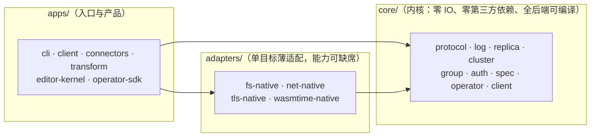

# moonflux — MoonBit 全栈流式计算平台

> **正式立项**：2026-09-15 · **项目目录**：`~/workspace/moonflux` · **对标参考**：[Fluvio](../fluvio) · **组件资产**：[mbel](../mbel)（动态规则引擎）、[mbel-orch](../mbel-orch)（函数分发设计参考）· **状态**：P0–P13 全部达成，门禁 31 步全绿（[路线图与进度](docs/project-roadmap.md)）

## 这是什么

**moonflux 是一个用 MoonBit 全栈开发的流式计算平台，与 Fluvio 具备同等的能力与地位。**

- **全栈 MoonBit**：从内核（编解码 / 线协议 / 存储 / 复制状态机 / 权限表）到系统集成（网络 / TLS / wasmtime 宿主）、从 CLI 到 Web 拖拽编辑器，单一语言贯穿；换来三样东西——native 与 WASM 双形态可移植、沙箱与内存安全、AI 辅助开发效率。
- **能力对等**：分区提交日志、follower 拉取复制与集中提名选主、消费组与托管偏移、版本化线协议、沙箱化可编程算子、动态表达式规则、连接器框架、TLS + 认证授权、可视化编辑器。
- **与 Fluvio 的关系**：Fluvio 是**对标系统与设计参考**（架构研究、能力基准、语义参照），**不是宿主、不是依赖**；对标语义逐条建账验证（[兼容性矩阵](docs/compatibility-matrix.md)）。

**名称**：**Moon**Bit × **Flux**（流）。

## 核心主张

1. **一内核多后端**：同一份内核编译为 Native 服务端、WASM 沙箱算子、浏览器客户端三种形态；依赖方向 `core ← adapters ← apps` 由 MoonBit `supported_targets` 的依赖 fail-fast 在**编译期**强制（报告 4.5）。
2. **内核是纯计算**：零 IO、零第三方依赖（仅 `moonbitlang/core`）、无 panic 解析、时钟与随机注入——确定性重放与故障重放的前提（AGENTS.md §5）。
3. **动态性内建**：mbel 表达式作为消费路径的动态规则，改规则秒级生效、免编译免重启；表达式函数集是版本化资产，发布期拦截错误（决策 10/27）。
4. **对标为主、移植可选**：以 Fluvio 为设计参考自建同等能力；代码级移植（Rust→MoonBit）若能显著加速实现，经「MoonBit 语境合理性」四检后可用（AGENTS.md §1.1），验收门槛与自建一致。
5. **分阶段达成、门禁推进**：每个能力面以**可证伪的门禁**收口（故障注入、对拍、拒绝路径断言），不以"看起来能跑"代替（AGENTS.md §2）。

## 快速开始

```bash
moon build --target native          # 单二进制：_build/native/debug/build/apps/cli/cli.exe

cli.exe serve --data-dir d --listen 127.0.0.1:19420 &
cli.exe pipeline apply -f demo.json --data-dir d
cli.exe produce --topic events --file in.txt --remote 127.0.0.1:19420
cli.exe consume --topic events --remote 127.0.0.1:19420
```

五分钟跑通、最小集群、消费组、函数集、TLS + 认证、故障排查——见 **[实用文档](docs/user-guide.md)**。

## 架构一瞥



箭头 = **依赖方向**（`core ← adapters ← apps`），违规在 `moon build --target X` 直接失败；运行时数据流见[架构总览](docs/architecture.md) §1。

三种服务端（`serve` / `spu` / `sc`）是**同一个单线程事件循环**：accept → poll → 逐帧分发 → flush，绝不阻塞在单个对端上（P13 后三者同形）。复制是 follower 拉取原始帧（字节一致）；水位 `HW = min(LEO)` 只前进；放置与提名是控制面的**状态**、随心跳应答下发；控制面从不拨号数据节点。完整阐述（协议、存储不变量、复制、安全、算子、验证体系）见 **[架构总览](docs/architecture.md)**。

## 能力与范围

能力清单（每项的状态与门禁证据）见 **[功能矩阵](docs/feature-matrix.md)**。与 Fluvio 逐条对标语义的验证状态见 **[兼容性矩阵](docs/compatibility-matrix.md)**。

| 能力域 | 一句话现状 |
| :--- | :--- |
| 数据面 | 分区日志、段滚动/索引/retention、崩溃恢复 ✅；compaction ⏳（待键语义） |
| 复制与集群 | follower 拉取、逐分区水位/选主、分歧回归、资产下发 ✅；镜像 ⏳ |
| 消费语义 | 重放、提交读开关、消费组（至少一次、世代围栏）✅；事务 ⏳ |
| 可编程 | 表达式 + 函数集 + wasm 算子沙箱（双预算、fail-closed）✅；ABI v2 ⏳（设计稿） |
| 接入与协议 | 帧协议 v2、多路复用、WS、认证/授权/TLS（含节点间）✅；MQTT/Kafka 连接器 ⏳ |
| 产品面 | CLI、PipelineSpec、Web 编辑器 ✅；多语言 SDK / K8s ⏳（K8s 有意排最后） |

## 文档导航

| 想了解 | 去哪里 |
| :--- | :--- |
| 怎么构建、怎么用、怎么排障、五个实战示例 | [`docs/user-guide.md`](docs/user-guide.md) |
| 架构为什么是这个形状、代码在哪 | [`docs/architecture.md`](docs/architecture.md) |
| 现在能做什么、什么状态 | [`docs/feature-matrix.md`](docs/feature-matrix.md) |
| 做到哪一步了、接下来做什么 | [`docs/project-roadmap.md`](docs/project-roadmap.md) |
| 与 Fluvio 对标语义的验证状态 | [`docs/compatibility-matrix.md`](docs/compatibility-matrix.md) |
| 在 Fluvio 参考仓库作业的规则 | [`docs/fluvio-reference-guide.md`](docs/fluvio-reference-guide.md) |
| 立项的技术依据（Fluvio 全景剖析） | [`docs/fluvio-moonbit-evaluation.md`](docs/fluvio-moonbit-evaluation.md) |
| 给 agent 的工程纪律（必读） | [`AGENTS.md`](AGENTS.md) |

## 资产索引

| 资产 | 位置 | 说明 |
| :--- | :--- | :--- |
| **项目规约** | [`AGENTS.md`](AGENTS.md) | 项目章程：金规则 7 条 / 内核红线 / 验证流程 / 事件循环与安全纪律 / 不做清单 / 文档规范（§10） |
| **架构总览** | [`docs/architecture.md`](docs/architecture.md) | 分层与包清单 / 事件循环 / 协议 / 存储 / 复制与控制面 / 安全 / 算子 / 验证体系 |
| **实用文档** | [`docs/user-guide.md`](docs/user-guide.md) | 构建 / 快速开始 / CLI 参考 / 集群与消费组 / 安全配置 / 存储运维 / **实战示例（5 个）** / 故障排查 |
| **功能矩阵** | [`docs/feature-matrix.md`](docs/feature-matrix.md) | 能力清单的单一真相：功能 × 状态 × 证据入口 |
| **路线图与进度** | [`docs/project-roadmap.md`](docs/project-roadmap.md) | 进度管理的单一真相：阶段详情 / 里程碑台账 / 排期 |
| 兼容性矩阵 | [`docs/compatibility-matrix.md`](docs/compatibility-matrix.md) | 每个对标语义的验证状态与证据入口（图例单一真相） |
| CLI 命令工具规划 | [`docs/cli-roadmap.md`](docs/cli-roadmap.md) | 命令面现状盘点 + 对标 Fluvio CLI 的分阶段映射（决策 13） |
| 算子 ABI v2 设计稿 | [`docs/operator-abi-v2-scalar.md`](docs/operator-abi-v2-scalar.md) | 不可信标量函数的沙箱路线（只设计不实现，决策 28） |
| 算子沙箱取证 | [`docs/p2-wasm-host-spike.md`](docs/p2-wasm-host-spike.md) | wasmtime 进程内宿主的探针实证与落地实录 |
| 立项评估报告 v1.6 | [`docs/fluvio-moonbit-evaluation.md`](docs/fluvio-moonbit-evaluation.md) | 七章：Fluvio 全景 / 功能详解 / 分层路径 / 后端 / mbel / 编辑器 / 结论路线图 |
| 对标参考工作规约 | [`docs/fluvio-reference-guide.md`](docs/fluvio-reference-guide.md) | 在 Fluvio 参考仓库内作业时的 agent 硬规则 |
| 安全面取证客户端 | [`scripts/mfs_probe.py`](scripts/mfs_probe.py) | 独立实现的 MFS 客户端（Python）：安全门禁用它伪造节点命令，断言针对**服务端授权** |
| mbel 表达式引擎 | [`../mbel`](../mbel) | v0.3.3；动态规则层的候选内核（评估见报告第五章） |
| mbel-orch 设计文档 | [`../mbel-orch`](../mbel-orch) | 函数管理与分发平台（设计参考） |

## 代码结构

```
moonflux/
├── AGENTS.md              # 项目规约（章程）：任何任务开始前必读
├── docs/                  # 产品文档（架构/实用/功能矩阵/路线图）+ 对标与设计文档
├── core/                  # 内核：零 IO、零第三方依赖、全后端可编译
├── adapters/              # 单目标薄适配：fs/net/tls/wasmtime-native
├── apps/                  # 入口与产品：cli / client / connectors / transform / editor-kernel / operator-sdk
├── scripts/               # 门禁（gates.sh + e2e-*）与对拍工具
└── web/editor/            # Web 编辑器前端
```

## 关键决策记录

1. **架构对标为主、移植为辅（可选）**：以 Fluvio 为设计参考自建同等能力平台；**允许在能显著加速实现时做代码级移植**（Rust→MoonBit 翻译），须过「MoonBit 语境合理性」四检（AGENTS.md §1.1）；Fluvio 不作为宿主或依赖；每个模块的"移植 vs 自建"决策随该模块立项记入本条；
2. **算子沙箱用经典 core-wasm ABI 语义**（对标 SmartModule 的设计取舍：极小 ABI + 版本化载荷 + 预算治理）；不引入 WIT/组件模型作为首期依赖（报告 1.2.8 / 3.6）；
3. **后端实现顺序：Native 先行**（2026-09-15 修订）——Source/Sink、数据面、客户端都需要**独立的外部读写**（网络 / 文件 / 协议 / MQ / 硬件直采），WASM 沙箱只能做宿主中介的计算、不适合承载连接器；WASM 后置为"数据路径内算子沙箱"形态（P2），JS/wasm-gc（浏览器客户端）最后；**内核的全后端可编译纪律由 CI 矩阵保持**（不依赖 WASM 先行倒逼）。本条修订自报告 4.4 的原始排序（其"WASM 先行"以"扩展层切入"为前提，与全平台定位的前置条件不同；修订注见报告 4.4）；
4. **动态规则内核选型 mbel**：MoonBit 宿主库内嵌；跨语言/沙箱形态用 core-wasm + 薄 ABI（报告 5.3 / 5.4）；
5. **编辑器 spec-first**：先立 PipelineSpec 与 CLI 编译器，UI 只是 spec 渲染器（报告 6.3）；
6. **并行与分布归宿主架构**：计算单元无状态化，"宿主并行 × guest 虚拟"（报告 4.6）。
7. **PipelineSpec 文档格式用 JSON**（2026-09-15）：MoonBit 内核仅依赖 `moonbitlang/core`（无 YAML 解析器），v1alpha1 以 JSON 为规范文档格式；JSON 是 YAML 子集，纯 JSON 语法书写的 YAML 文档天然兼容。YAML 全量解析视需求另立依赖决策；
8. **P0 会话协议为内部帧格式**（2026-09-15）：`serve/produce --remote/consume --remote` 使用 10 字节头 `MFS` 帧封装线协议批帧，仅供 P0 demo；完整版本化协议服务化与多路复用按路线图属 P1，届时替换并纳入对拍矩阵；
9. **P0′ 拓扑的执行形态**（2026-09-15）：`pipeline apply` 持久化 `topology.json`（pipeline 名 + spec 文档），编译为纯函数——重编译即还原拓扑；`pipeline run` 在单进程内顺序执行编译出的拓扑（source→broker→sink）。多进程/远程执行在 P1 协议服务化基础上接管；含 `mbel-p1` 能力标记的拓扑 run 期拒绝执行（可证伪的未实现声明）。
10. **动态规则作用于消费路径**（2026-09-15，P1）：mbel transforms 在 fetch/回放路径逐条执行（对标 SmartModule 的消费侧流处理语义）——历史数据按当前规则重现，这也是「改规则秒级生效」可证伪的关键；规则资产（表达式）随 spec 版本化，`pipeline apply` 时做发布期静态检查（mbel Compile mode：语法/未知函数/未知变量/类型错误全部拦截），运行期 compile-once + Vm 程序缓存复用到每记录。
11. **规则热重载机制**（2026-09-15，P1）：`serve` 每个请求前 stat `topology.json`（纳秒 mtime），变更即重编译换入——`apply` 后无需重启；重载失败保留旧规则并告警（绝不静默、绝不空转）。秒级精度不足会漏检测（秒内两次 apply），故 fs 适配器 mtime 用纳秒。
12. **协议服务化与 SDK 连接抽象**（2026-09-15，P1）：帧协议 v2 = `MFS` magic + 版本 2 + cmd + 请求 id + 长度；会话以 HELLO/WELCOME 握手（主版本不匹配回结构化 `unsupported-version`，v1 时代对端被明确拒绝而非静默断开）；错误帧带稳定错误码。客户端 SDK（`apps/client`）把连接抽象为注入式函数字段（TCP / socketpair），使全流程可进程内单测；多路复用与并发连接仍在后续里程碑（P1 保持顺序会话）。
13. **CLI 命令工具规划**（2026-09-16）：CLI 是产品化入口与 PipelineSpec 的权威执行器，命令面对标 Fluvio CLI 命令面（报告 §2.x 实录）分四批补齐——「现在可做」（topic 管理 / consume·produce 形态补齐 / profile / `pipeline delete` / codec 工具）→ P2 伴随（算子管理雏形，对标 SmartModule）→ P3 控制面（partition / cluster / spu / consumer / benchmark）→ P4（SDK 对齐与插件机制）；规划与勘误清单见 [`docs/cli-roadmap.md`](docs/cli-roadmap.md)，不改变 P2 进行中工作。
14. **算子沙箱宿主选型：wasmtime C API（进程内）**（2026-09-16，P2）：选 wasmtime 而非自研解释器或子进程宿主——它就是本项目对标对象 SmartModule 所用的运行时，语义对齐成本最低；**进程内**（非子进程）保证算子调用与 mbel 同构（同地址空间、注入式接口、无跨进程协议）；以 **dlopen 运行时解析符号**接入（`MOONFLUX_WASMTIME_LIB` 可覆盖路径），因此**不引入链接期依赖**——内核红线只约束 core，但适配层同样保持"能力可缺席"（无 libwasmtime 时只有 wasm 算子不可用，其余功能完好）。**代价与纪律**：shim 手写 C，类型镜像尺寸必须取自真实 `wasmtime.h`（T15 的两个镜像尺寸错位曾导致栈破坏——取证见 [`docs/p2-wasm-host-spike.md`](docs/p2-wasm-host-spike.md)）；上游后台编译曾被 moonspawn 交互触发 panic，故引擎固定 `parallel_compilation=false`。
15. **算子 ABI v1 定稿**（2026-09-16，P2）：guest 侧固定 7 个导出（`mf_op_abi_version` / `mf_op_alloc_input` / `mf_op_init` / `mf_op_process` / `mf_op_output_len` / `mf_op_last_status` / `mf_op_last_error`），**导出名不可配置**（spec 无 `export` 字段——开放只会诱使作者偏离契约）；**缓冲调用协议**：宿主无法伪造 guest 的 Bytes（boxed 指针 + 头部），故由 guest 持缓冲、宿主只传指针，输出长度单独暴露；**载荷即线协议批帧**（`base_offset = -1`，offset 是宿主记账，绝不进沙箱）；**配置走 `mf_op_init`**（spec 的 `config` 对象原样透传，host 不解释——ABI 承诺的配置入口此前空转，P2 打通）。**版本门**：宿主与 guest 的 ABI 版本不一致即拒绝实例化（不允许"尽力而为"）。
16. **WASI-stub 策略：guest 无导入**（2026-09-16，P2）：算子模块以 `--target wasm` 编译但**不得有 import 段**——宿主不提供任何 WASI 实现（`wasmtime_instance_new` 以空导入实例化），因此算子不能做 IO、不能读时钟、不能用随机源；这与内核红线同源（AGENTS §5），也让"算子即纯函数"成为**结构性事实**而非约定。构建门禁 `tools/probe_operator_exports.py` 直接以编译器 WAT 为真相源断言导出面；需要配置或外部行为的算子，通过 init config 与记录字段表达。

17. **复制语义：follower-pull + HW = min(LEO)（2026-09-16，P3）**：副本**主动拉取**（`SYNC_FETCH` 复用 fetch 语义），leader 永不 push；**高水位 = 副本集合（含 leader 自身）各 LEO 的最小值**，只前进不回退（迟到的低 LEO 报告被忽略）；**LRS ≈ ISR 是算出来的而非存起来的**（`core/replica.lrs_members` 按滞后阈值现算：落后即失去投票权、仍继续收记录、追上自动回归）；**数据面无 leader epoch**——不是漏了字段，而是有任期号就成了另一个协议（Raft），对标系统在数据面没有它，故 `Role`/`ReplicaState` 里没有任期。读语义：`ReadCommitted ≤ HW`、`ReadUncommitted ≤ LEO`（默认 Uncommitted，对标事实），**该钳制在 `core/replica` 已实现并有单测，但尚未接到线协议的 FETCH 应答上**（矩阵 #11 记 ⚠️）。
18. **分歧处理（2026-09-16，P3，参考系统未定义、本项目显式定义）**：没有 epoch 可比较尾巴，所以回归副本与本分区新 leader 的分歧必须由规则裁决——**新 leader 的 LEO 是唯一权威**：`local_leo > leader_leo` 即 `truncate_to(leader_leo)`，并把丢弃的记录数/字节数写进日志（绝不静默）。落地还要一条顺序纪律：follower 必须**先问 leader 的 LEO**（`CMD_OFFSET_INFO`，与位置无关）再决定截断或拉取——用 "send me bytes from N" 提问时，N 越过 leader 末端就无法回答，分歧恰恰就是这种情况。
19. **副本集合 ≠ 在线节点集合（2026-09-16，P3）**：placement 持久化（`cluster-state.json`），**已分配但离线的节点留在副本集合里**——这正是"副本死亡时 HW 停住"的语义来源；反过来，节点增减会重塑副本集合并由 follower 自动补数据（**与对标系统的差异留痕**：对标系统明确不做存量再平衡，moonflux 能做，因为追平路径已经存在且被门禁覆盖）。**并发写（矩阵 #8）的 P3 答案**：不给段文件加多写者锁，而是**每个分区同一时刻只有一个 leader**——写入串行化由复制协议保证，节点内仍是单进程串行。
20. **控制面纪律：SC 不主动拨号数据节点（2026-09-16，P3）**：两类进程都是单线程循环（服务请求与做家务交替），因此**互相调用会死锁**（门禁中真实复现：SC 提名时候选正在向 SC 询问，双方各等到超时）。最终形态：**提名是 SC 的一个状态**，随 `CMD_LEADER` 应答下发；候选读到"自己被提名"→ 自己提升 → `CMD_CONFIRM` 回报；SC 只校验"这个分区确实许给过你"。所有节点间调用带 1s 网络超时（忙的节点只能让一次调用失败）。元数据存储**接口可插拔**（`MetadataStore{load,save}`，本地文件为首个后端；**目前只有一个真后端**，K8s CRD 待 P4），元数据带单调版本、重复名/非法名在写入前拒绝；**单 SC 假设显式声明**，第二个写入者以结构化冲突失败而非 last-writer-wins。
21. **节点形态与可观测性（2026-09-16，P3）**：单二进制多子命令落地为 `serve`（全在一体，向后兼容）/ `spu`（数据节点 + 向 SC 报到）/ `sc`（控制面）/ `topic create|list|delete` / `cluster nodes|status|leader|offsets`。**存活是推导的**：表里只记 `last_seen`，离线由时钟推出，转换只报一次（level-triggered，不是每 tick 的日志流）。工程细节留痕：macOS 的 `SO_RCVTIMEO` **不作用于 accept**（改为 `poll()` + accept 的 shim）；`@env.now()` **是毫秒**（按纳秒再除一次会把 3 秒超时变成 3000 秒）；长驻节点重定向的 stdout 是块缓冲（新增 `fflush` 后的 `note()`，否则集群事件在进程运行时读不到、被信号杀掉时全丢）。

22. **浏览器传输：同端口 WebSocket 网关（2026-09-17，P4）**：浏览器不能开 TCP，因此 `serve --ws` 在**同一端口**嗅探前 4 字节——HTTP 走 RFC 6455 升级，否则把字节还给帧路径。协议一个字节没变（WS 二进制帧里装的还是 `MFS`），**网关只是传输**：握手、SHA-1/Base64、掩码校验（拒绝未掩码的客户端帧——接受它是代理投毒口子）、分片重组、ping/pong 都在传输层，之上的帧编解码与命令分发与 TCP 路径完全共用。非 upgrade 的 HTTP 请求得到带原因的 400。
23. **客户端内核化（2026-09-17，P4）**：帧编解码与会话状态机搬进 `core/client`（纯计算、全后端可编译），`apps/client` 只剩原生传输构造器。**理由**：浏览器要用 CLI 用的同一份客户端逻辑，而不是第二份实现。代价与边界（实测）：`pub using` 是源码级结构（不能写在 moon.pkg）、能再导出类型与函数但**不能**再导出枚举构造器、且**不能给外部类型定义方法**——因此传输构造器是自由函数（`@native.tcp(...)`），需要构造器的调用方直接 import 内核包。内核侧还提供 `Conn::memory_pair()`（内存双工对），于是客户端自身的 12 项测试在 wasm-gc 上也能跑。
24. **Web 编辑器 = spec 的渲染器（2026-09-17，P4）**：`apps/editor-kernel` 编译到 **js** 目标 + 静态页 `web/editor/`；页面拥有像素与 socket，内核拥有 spec/校验/拓扑/协议。**"图 → spec"只在内核里发生一次**（`build_spec`），所以改 UI 不会悄悄改格式；校验复用 `core/spec`、拓扑复用 `core/pipeline`、应答解析复用 `core/client`。为什么不是 wasm-gc：wasm-gc 模块的 `Bytes`/`String` 是自己 GC 堆里的引用类型、不导出线性内存、无宿主胶水 ⇒ JS 无法构造入参（实测导出签名如此）；js 目标才是浏览器原生调用约定，wasm-gc 的可编译性由矩阵保持。协议为此补了 `CMD_APPLY_PIPELINE`（部署动词），服务端复用静态检查 + 落盘 + 既有热重载。**该缺口已于 P5 T32 修复**：`serve` 改为 poll 驱动的事件循环，浏览器长连接与多个 CLI 客户端可以同时在场（P4 门禁的断言阶段现在就在浏览器连接打开时通过）；`spu`/`sc` 仍是有意单连接（对端已知且少），已在代码中注明。

25. **并发由事件循环提供，不是线程（2026-09-17，P5）**：`serve` 的 accept-处理-关闭循环改为 `ConnectionHub`（`apps/cli/hub.mbt`）——poll 所有连接，只推进有数据的那个；**半个帧留在缓冲里等下一轮**，写侧按 socket 可写性排空（`send_some` 返回 0 即"满了，下一轮再写"），因此一个只连不读或只写不读的对端都不能拖慢别人。适配层为此新增 `set_nonblocking` / `recv_some` / `send_some` / `poll_readable`，其中**"would-block ≠ EOF ≠ 错误"三者可区分**是正确性前提（有单测钉住）。**不引入线程/async**：节点仍是"服务 + 定时家务"的单线程循环（AGENTS §1.2）。**慢客户端策略**：outbox 超 8MiB 判定对端不读并带日志断开（不能让它吃内存）。**`spu`/`sc` 仍有意单连接**（对端已知且少：控制面 + 该分区 follower 轮流拉取），已在代码注明而非默默不同。
26. **跨语言与工具链的三条实测事实（2026-09-17，P4/P5 期间）**：js 目标里 **`Int64` 是 BigInt**（传 number 会在内核内抛异常并静默中断调用方——浏览器编辑器踩过）、**`Bytes` 是 `Uint8Array`**；**wasm-gc 模块无法被 JS 直接调用**（其 `Bytes`/`String` 是自身 GC 堆内的引用类型、不导出线性内存、无宿主胶水），因此要给浏览器 API 就用 `is-main` + `link: { "js": { "exports": [...] } }` 编译到 js（库包不产出 js 制品）；`pub using` 只能在源码里、可再导出类型与函数但**不可**再导出枚举构造器，且**不可**为外部类型定义方法（传输构造器因此是自由函数）。这些是工具链事实而非偏好，写进 AGENTS 的纪律块以避免重复踩。

27. **函数集 = 版本化规则资产（2026-09-17，P6）**：mbel 的表达式体自定义函数以**资产**形态进入平台——一份 JSON 文档部署到节点（`function-set create|get|list|delete`，协议命令 22–25），集合带**单调 revision**，spec 的表达式节点按**名**引用（`$.spec.transforms[i].functions`），apply 时解析并绑定：解析到的 revision 写进 `topology.json`，更新集合**必须 re-apply** 才生效。**与算子体系治理同构**（工件化 / 版本化 / 发布期校验 / 预算 / fail-closed），区别只在运行时位置（宿主侧 mbel vs wasmtime 沙箱），而这个区别由**信任边界**决定：函数集是经评审的平台资产（**不可信标量函数的终态是决策 28 的 ABI v2**，本路径不得被当作沙箱用）。**校验分两层并留痕**（实测，ticket 36 §评估校核）：*资产级* = 名字白名单 + 结构 + 纯度（mbel 的名字/参数/函数体规则以注册委派给 mbel 为唯一权威）；*类型* = 只覆盖被引用闭包——mbel 按调用点推断参数类型，"整集合类型校验"不可得，故不承诺。**纯度**：拒绝 `now`（`builtin/time.mbt` 中唯一读宿主时钟者；`date`/`duration` 是字符串解析、`timezone` 裁到 UTC），文本 token 扫描、宁可误拒。**语法面实测**：顶层表达式用三元 `?:`，`if {}` 块只在函数体内合法（Vm 编译阶段拒绝）——门禁两侧都钉。**两个工程发现**：深递归错误文本约 4.4 KB/次，错误出口统一截断到 `apps/transform.MAX_ERROR_CHARS`；`node.mbt` 的 HELLO 曾把*帧*版本号当*协议主版本*发送（`serve` 校验时暴露，已修）。
28. **ABI v2 标量调用设计稿（2026-09-17，P6；只设计不实现）**：不可信标量函数的路线是 ABI v1 的**加法扩展**——7 个批导出不动，新增可选标量导出（`mf_op_scalar_abi_version` / `mf_op_eval`），宿主侧按 `{函数名 → 模块, 预算}` 注册表逐调用执行，request 首版为 JSON `{"fn","args"}`；确定性仍由 guest 无导入**结构性**保证。**触发条件**：出现"用户提交的标量函数"需求（多租户扩展）。设计、开放问题与不实现声明见 [`docs/operator-abi-v2-scalar.md`](docs/operator-abi-v2-scalar.md)；**本里程碑不实现 ABI v2、不做 mbel-in-guest、不做函数集集群分发、编辑器不加函数集 UI**。

29. **多分区 = 复制的单元（2026-09-17，P7）**：控制面早已逐分区放置/选主，本里程碑把**数据节点**补上——`HostTable` 按 `(topic, partition)` 持有宿主，每个宿主的 `ledger`/`leader`/`replicas` 相互独立，因此**水位、故障、换主、分歧都以分区为单位**：一个静默成员只让它所在的那些分区的水位停滞，其它分区照常推进（门禁第 3 腿就是这条）。**放置随心跳应答下发**（与"提名随 CMD_LEADER 应答"同构，决策 20）：节点不发明放置；应答未到而请求先到时，用 `CMD_LEADER` 按需兜底一次——那是延迟，不是第二套规则。**退化自放置**：当应用管道指向的主题**没有任何声明**（或没有控制面）时，节点自持该主题的 partition 0——这是 P7 之前的隐式行为，现在写下来并注明（有声明时永远以控制面为准）。**每分区 LEO 随节点记录上报**：记录载荷尾部**加法**一节（旧解码器不校验读尽、新解码器缺段得当空表，故不加帧版本号）；`NodeRecord.leo` 保留为兼容字段（=应用主题 partition 0 的 LEO）。**写入只认 leader**：非宿主与跟随者都结构化拒绝并附 leader 地址。**分歧截断退到帧边界**：`core/log.truncate_to_boundary` —— leader 的 LEO 可能落在本副本的某帧**内部**，而日志不存半个批（`truncate_to` 会拒绝），于是切到前一帧边界并由复制重新拉取：代价是一次重拉，不是一条记录。
30. **节点间调用改为"协作式阻塞"（2026-09-17，P7，实测驱动）**：多分区把节点间调用从"星形"（跟随者→leader）变成"环"（每个节点既跟随又领导），同步阻塞调用于是让三个节点互相听不见——**实测**：SC 应答 18ms，而一次 `cluster offsets` 要 1.0–1.5s，复制持续超时重试，甚至因周期长于 3s 存活超时而被控制面判死。四步修复，都留了痕：①`spu` 的数据端口改用 P5 的 `ConnectionHub`（多连接、单线程），且 **accept 超时 = 循环 tick（50ms）而非心跳周期**（阻塞式 accept 让每次 poll 都花掉一个超时，这是 1.4s 里的主要成分）；②**每分区每 tick 一次调用**：把"先问 leader 的 LEO 再拉"合并为一次 `SYNC_FETCH`（应答本就带回 leader 的末端与水位，发散也因此可判），ACK 仅在**有新闻**时发；③**协作式等待**：`peer_call` 在等对端应答时继续服务自己的连接（非阻塞 socket + poll + 泵），把"失聪窗口"从"一次调用的长度"降到"一次 poll 的间隔"——这是环状拓扑能跑通的关键；④转移方向上的失败被当作**重试**而非故障（复制是收敛的，下一个 tick 再来），失败**只报一次**（首次失败 + 状态迁移），不刷屏。**后续已做**：段索引/retention（P8，决策 31）；**持久复制连接**（P10）——每分区一条长连接（握手一次、每轮一请求一应答），任何错误即丢链接、下一轮重拨（超时的请求可能留下在途应答，把它读成下一条的答案是静默的协议污染）；"一个请求在途"是它成立的前提（单线程）。可证伪的门禁断言不是"更快"，而是**结构事实**：一轮又一轮复制没有再次拨号（`e2e-p7-partitions.sh` 的 link 腿）。

31. **存储：段是磁盘的单位，索引是加速器，删除要有下界（2026-09-17，P8）**：分区日志 = **一串段**（`topics/<topic>/partition-N/<20位 base>.log`，注入式 `SegmentStore{open_segment, list, open_index, remove}`）。**不变量**：段边界永远是帧边界；base 严格递增、中间空段 = 空洞 → **拒绝**而不是修补；只有最后一段可能带撕裂尾（恢复只扫它）；**空尾段在 open 时丢弃**（"建段"与"首次 append"之间崩溃的语义）。**滚动在写入之前判断**（"这段满了，开下一段"）——不是风格选择：`serve` 每个请求重开日志，而"写后再滚"留下的空尾段会被下一次 open 按崩溃语义丢掉，阈值因此**永远不生效**（P8 实测复现）。**索引**（`<base>.idx`，`MFI1` + base + 条目 + **CRC**）是加速器而**不是真相**：缺失/截断/校验不过/锚点非单调/越界，一律回退全扫——两条路径必须逐字节一致（门禁用"删掉所有 `.idx` 再读"来钉）。封存（滚动时）才写索引；最后一段本来就要扫（恢复），顺便重建并写回，被 kill 也能自愈。**retention 只删整段**，且要求 `段末 ≤ floor`——`floor` 是**应用的判断**（本项目的已提交前缀：leader 用它自己的 HW，独立 broker 用自己的 LEO），内核绝不猜"哪些数据没人要了"；策略默认关闭（`MOONFLUX_RETAIN_BYTES`/`_MS` 显式开启），每次删除都报告段 base/记录数/字节数与新的可读起点；删完之后的更老读得到**结构化拒绝**（"没了"≠"空"）。**followers 不跑 retention**（保留它们已有的），时间口径由应用传入（内核不读时钟）。

32. **消费组：至少一次、世代围栏、分配随心跳下发（2026-09-17，P9）**：参考系统**没有**消费组，所以语义按本项目的需要定义，但形状沿用既有风格：**控制面即协调者**（唯一知道"谁持有什么"的地方），**成员存活是推导的**（与节点同一超时：静默即离开、离开只报一次），**分配随心跳应答下发**（与放置、提名同构——状态走在成员本来就要发的那个通道上），**世代（epoch）是成员集合的世代**：只有"谁持有什么"变化才换代（重复上报不换），任何提交都带它，**过期即拒**（`ERR_GROUP`）——换主期间的旧属主不能覆盖新属主的进度。**分配是纯函数**（range：成员按 id 排序、分区切连续段），同一成员集合永远同一结果，所以再平衡可复现可评审。**语义声明**：至少一次（提交发生在处理之后），**不声称**恰好一次；再平衡窗口内两个成员**可能短暂同时读同一分区**（成员要等下一条心跳才知道换代），门禁因此断言的是"稳定后不交叠 + 投递无缺口（重复允许）"。**与 retention 合流**：下界从"已提交前缀"变成 `min(HW, 最慢消费组的提交偏移)`，但**从未提交的组不算"落后"**（它还没开始），因此不阻碍删除——消费晚于删除会得到结构化 `OffsetOutOfRange`（标准答案），而不是静默空读。**落盘**：偏移与世代存 `groups.json`（原子写），损坏即 fail——静默重置别人的消费进度不是可恢复的意外。**成员侧**：`consume --group G [--member M] [--follow] [--commit-ms N]`（提交按间隔而非按记录；空闲也要心跳，否则被清扫），`group list|describe|commit` 三个运维动词（describe 的滞后由 CLI 向各分区 leader 观测；commit 与成员走同一请求、受同一围栏，没有特权路径）。

33. **预算的强制口径是 fuel，墙钟只做观测（2026-09-17）**：矩阵 #14 一直挂着一个 ⚠️"墙钟超时是声明的 hint，未接线"。接线之前先问了一个更基本的问题：**该不该接线**。答案是不该——墙钟门禁会让**同一批数据**在机器繁忙时失败、空闲时通过，这与 AGENTS §5 的重放红线直接冲突（"不可重放的预算不是预算"）。因此把承诺改成事实：**强制 = 记录数（内核）+ fuel（宿主，确定性、无时钟）**；**观测 = 墙钟**——宿主在每次调用后测量耗时（`OperatorInstance.last_call_ms`，测量发生在 adapter 层，那里允许读时钟），超过档位阈值（`call_timeout_hint_ms`）只产生一个**报告**（`over_time_hint`）：run 路径打一行告警、`operator verify` 打印一次空批耗时、`operator describe` 明说这三个数字是 report-only。**演进**：若将来确实需要"杀掉一个跑太久的算子"，正确形态是 fuel 调参（确定性）或把算子移出数据路径，而不是引入一个会让重放不确定的时钟门禁。

34. **资产权威在控制面，节点是缓存（2026-09-17，P11）**：集群里 `pipeline apply` 与 `function-set create` 此前都是**逐节点**的（每个集群门禁都对每个 spu 各做一次），这是多节点使用的真实摩擦。现在：**控制面持有集群的期望管道与函数集**，`pipeline apply --remote <sc>` 发布到集群（SC 侧做**同一套发布期校验**——坏 spec 不落盘、不成为期望态）；**心跳只带修订号**，节点发现修订前进才拉文档（几 KB 的文档不该每 500ms 走一趟），在**本地编译**（编译是纯函数 ⇒ 同文档同拓扑）、本地校验（函数集按需从控制面拉取，节点仍自己过一遍发布期检查——控制面是权威不是唯一守门人）、本地落盘并热重载。**三条纪律**：① **pull 而非 push**（SC 不主动拨号数据节点，决策 20 的延续）；② **修订不回退**（本地修订更高意味着"控制面还没追上"，不是"该退回"；门禁用"把 SC 的文档改回修订 1 再重启"来钉）；③ **失败即保留**（拉取/校验/编译任一步失败都保留在跑的管道，且**每个修订只报一次**——一个每 500ms 重复的告警就是没人再看的日志）。单机口径不变：`serve` 无控制面时自己 apply（`cluster_revision` 缺省 0 = 非集群托管）。

35. **安全面：认证在握手期、授权是闭合表、TLS 双向可配且校验是默认（2026-09-17，P12）**：① **认证**——凭据在握手期交换（`CMD_AUTH=35`，HELLO/WELCOME 之后、任何业务命令之前），三处服务端（数据 hub、`serve` 会话、SC 控制端口）一律"认证前不服务"，未认证 `ERR_AUTH_REQUIRED=9`、越权 `ERR_FORBIDDEN=10`（分开"先说你你是谁"与"不是你"）；token 比较**常数时间**（`==` 会在首个不同字节返回，足以用秒表逐字节恢复）；**默认关闭但启动明示**（`authentication DISABLED (...): every connection is trusted`）——静默的安全模式本身就是漏洞。② **授权**——`permit(role, cmd)` 是**闭合显式表**（未列出的命令对非 Root 一律拒绝：新增命令忘分类时失败关闭，而不是悄悄开一扇门），角色 `Root/ReadWrite/ReadOnly/Node`，其中 **Node 单独成组**：能伪造 `SYNC_ACK` 就能推动所有 committed read 依赖的高水位，能伪造 `REGISTER` 就能往"最小值定义水位"的副本集合里塞幽灵副本（门禁实测了这个后果）；**权限判定在每个分发入口一处、且在解析载荷之前**（门禁断言错误码恰为 10，而不是载荷错误）。③ **TLS**——OpenSSL 经 dlopen 垫片接入（无链接期依赖），`@net.Stream` 接口让明文与 TLS 成为同一接口的两个构造器（hub、复制链接、控制调用共用一份代码）；**客户端一律 `VERIFY_PEER` + `SSL_set1_host`**：OpenSSL 客户端默认 `SSL_VERIFY_NONE`，装了 CA 却不要求校验照样握手成功——那比不做 TLS 更糟，因为它看起来是成功的（第一版就是这么错的，门禁因此断言**拒绝**而非连通）；服务端握手**有界**、失败即关套接字；出站调用有**读写期限**（TLS 会话没有 SO_RCVTIMEO，"节点不得挂住节点"必须由期限保证）。④ **节点间**同样认证 + TLS：`spu`/`sc` 用同一套 flags 既服务又出站（`PeerLink{token, tls}` 贯穿控制调用、领导视图、确认、复制链接），控制面的五条 CLI 路径全部改为携带该 link——**不认证的控制调用被删除**（留一个"忘记带凭据"与"故意不带"长得一样的 helper 是陷阱）。⑤ **凭证只做参数，内核不读环境**：库若自己读凭据文件，它的每个嵌入者都会替它做一个它没做的安全决定。

36. **控制面也是 poll 驱动的一条循环（2026-09-17，P13）**：P12 留下的边界——控制面一次只服务一条连接，一个"连上不说话"的探测者能把节点挤出存活窗——按数据面的既有形态解决：`sc` 改用 `ConnectionHub`（`dispatch_control_frame` 逐帧分发 + hub 的握手/认证），于是**三种服务端（`serve` / `spu` / `sc`）是同一个循环形状**。执行中两件事被门禁改写，都留痕：① **"每轮至多一次阻塞握手"是错的**——限制"每轮等几次"改不了"等"本身，沉默连接占着 backlog 的位置，真实客户端仍被队头阻塞饿死（门禁三次运行：drain 全红 / 每轮一次红 / 不等待绿）。正解是**步进式握手**：`adopt` 只 attach，连接进入 `TlsHandshake` 阶段，每轮由 `step_handshake` 推进一步（非阻塞 socket 上 `SSL_accept` 立即返回 want-read/want-write），期限到了才丢弃——沉默对端从此只值"每轮一次立即返回的调用"，`MAX_HANDSHAKES_PER_ROUND` 这类预算**不需要存在**。② 门禁顺带逼出两个**既有真 bug**：`SyncLink::connect` 在握手期不泵（注释理由是"我们还没有在途请求"，但漏了**你等 WELCOME 时正是别人在等你的节点**）——三个节点环上同时拨号就互相等死，`sample` 采样显示节点 100% 时间卡在这里；以及垫片用 `send()` 写而没有忽略 SIGPIPE，**对端在 poll 与 write 之间消失就能杀掉整个服务端**（退出码 141，日志无 panic）。两条都修了：握手期也泵（顺带删掉从无调用者的 `redial`），垫片进程级忽略 SIGPIPE 让写失败变成调用点本来就在处理的 `EPIPE`。**判据的进化**也记一笔：P13 门禁腿 1 断言的不是"看起来还行"，而是**三个症状计数器**（`is offline` / `leader of` / `offering`）在探针窗口前后不变——误判离线本身就是代价，而选举与提名是它留下的痕迹；腿 4 是反例腿（kill 一个节点后**必须**仍然打出 offline），防止"不再误判"退化成"不再检测"。

---

*本 README 由项目立项日生成（2026-09-15），2026-09-17 重构为综合介绍（决策 37）：进度管理移至 [`docs/project-roadmap.md`](docs/project-roadmap.md)。重大变更请同步「关键决策记录」。*
