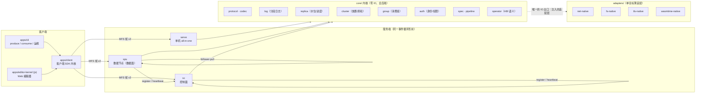
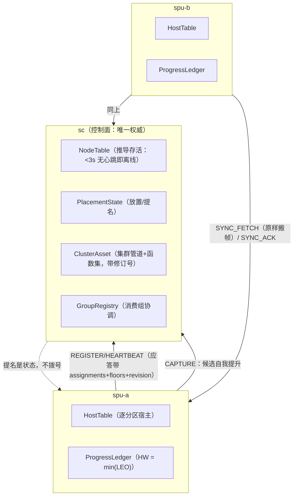

# moonflux 架构总览

> **定位**：面向工程师的系统架构说明——分层与包结构、事件循环模型、线协议、存储、复制与控制面、安全面、算子沙箱，以及"为什么是这个形状"。**规约依据**：AGENTS.md §1（金规则）、§3（目录与包结构）、§5（内核红线）；**边界声明**：本文描述的是**已实现并经门禁验证**的架构，设计意向与对标语义的验证状态分别见 [`feature-matrix.md`](feature-matrix.md) 与 [`compatibility-matrix.md`](compatibility-matrix.md)；对标事实的技术依据见立项评估报告 `fluvio-moonbit-evaluation.md`（下称「报告」）。
>
> **日期**：2026-09-25 · 覆盖 P0–P17 的架构形状 + P21/P24 的安全面与轮转小节（决策 1–48 中被本文引用者）；P18–P20、P22–P23、P25–P26 的行为细节以 [`feature-matrix.md`](feature-matrix.md) 与 [`user-guide.md`](user-guide.md) 为准

## 1. 一屏总览

moonflux 是一个用 MoonBit 全栈开发的流式计算平台：分区提交日志、follower 拉取复制、集中提名选主、消费组、版本化线协议、沙箱算子、动态表达式规则、TLS + 认证授权，CLI 与 Web 编辑器同端口服务。**一内核多后端**：同一份内核编译到 native（服务端/CLI）与 wasm-gc（浏览器客户端/测试）。



三条读法：

1. **依赖只有一个方向**：`core ← adapters ← apps`，由 MoonBit `supported_targets` 的依赖 fail-fast 在**编译期**强制（AGENTS.md §1 规则 2）。内核被迫需要某平台能力 = 该能力该上移到 adapters 的设计信号。
2. **内核是纯计算**：零 IO、零第三方依赖（仅 `moonbitlang/core`）、无 panic 解析、时钟与随机注入（AGENTS.md §5）。这是确定性重放与四后端可编译的前提。
3. **传输可注入**：内核与客户端内核只见 `Conn`（三个函数字段）与 `@net.Stream`；TCP、socketpair、WebSocket、TLS 都是**同一接口的构造器**，不是分支。

## 2. 分层与包清单

```
core/        内核（不声明 supported_targets ⇒ 全后端）
├── codec        LEB128 / 字节序 / Reader-Writer 原语
├── protocol     线协议批帧 + CRC（P0 对拍基线）
├── log          分区日志：偏移分配、恢复、分段、索引、retention、压实（P14）
├── spec         PipelineSpec v1alpha1 解析与校验（主题名白名单的唯一真相）
├── pipeline     拓扑编译（spec → 纯函数链）
├── operator     算子 ABI v1 语义 + 预算 tier（记录数上限）
├── replica      复制语义：HW = min(LEO)、LRS、提名/自降
├── cluster      控制面模型：放置、调和、选举的纯函数
├── group        消费组：成员推导、世代围栏、range 分配
├── client       客户端内核：帧编解码、会话状态机、Producer/Consumer
└── auth         身份 / 角色 / 闭合权限表 / 常数时间比较（P12）

adapters/    薄适配层（每包声明单目标）
├── fs-native        文件系统（日志段、元数据落盘、mtime 纳秒热重载）
├── net-native       TCP/poll/socketpair（errno 语义化；SIGPIPE 已驯服）
├── tls-native       OpenSSL（dlopen 垫片，无链接期依赖）
└── wasmtime-native  wasmtime 进程内宿主（算子沙箱）

apps/        入口与产品（按目标打包）
├── cli              单二进制多子命令（serve / spu / sc / produce / …）
├── client           native 传输（TCP / socketpair / TLS 构造器）
├── connectors       Source/Sink 框架与内置连接器
├── transform        mbel 表达式执行器（动态规则层）
├── editor-kernel    浏览器编辑器内核（js 目标）
├── operator-sdk     算子 guest SDK（wasm 目标）
├── operator-upper / operator-fixture / operator-identity
└── vectortool       协议 golden 向量工具（对拍用）
```

每包的公开接口以 `.mbti` 生成文件为准（`moon info`）；对外接口未变的重构以 `.mbti` 无 diff 为证（AGENTS.md §4）。

## 3. 事件循环：一个形状贯穿三种服务端

`serve`（单机 all-in-one）、`spu`（数据节点）、`sc`（控制面）是**同一个循环**：

```mermaid
sequenceDiagram
    participant Loop as 单线程循环
    participant Hub as ConnectionHub
    participant H as 逐帧分发器
    loop 每一轮（tick 是空闲上限，不是睡眠）
        Loop->>Hub: poll_once(handler)
        Hub->>Hub: poll（listener + 全部连接）一次等所有事
        Hub->>Hub: accept 就绪的待接入（TLS 只 attach 不等待）
        Hub->>Hub: 步进 TLSHandshake 连接（每轮一步，期限到了才丢）
        Hub->>Hub: 读就绪者 → 完整帧交给 H
        H->>H: 认证检查（P12）→ permit(role, cmd) → 分发
        Hub->>Hub: 写回应答，丢掉死连接
        Loop->>Loop: housekeeping（心跳/清扫/调和）
    end
```

这个形状是四条纪律的产物，每条都有实测事故背书（详见各纪律块的"为什么"）：

- **谁都别等**：等待必须"步进"而不是"阻塞 + 期限"。P13 用三次运行证明"每轮至多 N 次阻塞握手"仍然错——限制等几次改不了等本身，沉默连接占着 backlog 位置照样饿死真实客户端（README 决策 36）。
- **等待要等在 poll 上，一次等完所有事**：listener 与连接同在一个 poll 集。曾经 accept 先于连接 poll、且 accept 自带整 tick 期限——一个恰好在 flush 后发出下一请求的对端（一切请求-应答客户端）每请求坐穿整个 accept 窗口：**每请求一 tick 的恒定税**，P17 基准实测 ~200 ms（与载荷无关；ticket 75）。修后本地铁环回从 ~202 ms 降到 ~0.1 ms。
- **泵贯穿所有等待**：任何"等对端"的循环都要在等待中服务自己的连接——**包括复制握手的第一次 WELCOME**。漏掉它，三节点环上同时拨号就互相等死（`sample` 采样显示节点 100% 时间卡在 `SyncLink::connect`，ticket 64）。
- **写不能杀进程**：net 垫片进程级忽略 SIGPIPE，写向消失的对端得到 `EPIPE`——调用点按"这条连接死了"处理。

代码入口：`apps/cli/hub.mbt` 的 `ConnectionHub::poll_once`（一次 poll / accept 就绪者 / 步进 / 读 / 服务 / 写）、`apps/cli/node.mbt` 的 `dispatch_data_frame` 与 `dispatch_control_frame`、`apps/cli/serve.mbt` 的会话分发。

## 4. 线协议与会话

帧 v2（`core/client/protocol.mbt` 的 `encode_frame`）：

```
"MFS" | 版本(1B)=2 | cmd(1B) | 请求 id(u32be) | 载荷长度(u32be) | 载荷
```

- **会话**：HELLO（载荷 = 协议主版本 1）→ WELCOME →（要求认证时）`CMD_AUTH=35` → 业务帧。主版本不匹配回结构化 `unsupported-version`；认证前不服务任何命令。
- **命令面**（`core/client/protocol.mbt` 的 `CMD_*` 常量，1–35）：数据面 PRODUCE/FETCH/FETCH_COMMITTED/OFFSET_INFO/SEGMENTS；控制面 REGISTER/HEARTBEAT/NODES/LEADER/CONFIRM、TOPIC_*、FUNCTION_SET_*、CLUSTER_PIPELINE_*；复制 SYNC_FETCH/SYNC_ACK；消费组 GROUP_*（27–31）；安全 AUTH。
- **错误码**稳定（`ERR_*`），区分"先说你是谁"（9）与"不是你"（10）。
- **加法扩展**是兼容策略：节点记录的逐分区 LEO、心跳应答的 assignments/floors/revision 都走**可选尾段**，新旧两侧互读不炸（README 决策 29）——不为加字段 bump 帧版本。
- **第二实现即对拍**：`scripts/mfs_probe.py`（Python）独立实现同一帧格式；`apps/vectortool` + golden vectors 把编码钉死（`scripts/crosscheck-protocol.sh`）。

**载荷预算（P15）**：一条记录、一个批次、一帧、一轮复制各有明确的字节上限，且**所有上限同源**——`@protocol.MAX_BATCH_BYTES`（16 MiB）是唯一真相，hub 的收发缓冲、消费窗口（`FETCH_WINDOW_BYTES`）、复制窗口（`REPLICATION_WINDOW_BYTES` = 1 MiB，按 tick 循环 + 2s 对端期限反推）都是它的派生。**生产分批**：`Producer::send` 与本地 `produce` 用同一套 `split_batches`（4 MiB/批），偏移在到达序上连续，故一次发送仍报一个区间；单条 key/value 超 4 MiB 由**生产者**按名拒绝。**读取按字节封顶且"至少一条/一帧"**（`read_bounded` / `read_raw_bounded`）——让读者无法前进比让解码器拒绝更糟。**fetch 应答尾段带 `scan_end`**：窗口会被字节截断、规则还会过滤，只有服务端知道"分区到头了"与"这一窗满了"的区别，所以消费者按服务端给的落点推进，而不是用"返回条数 < 请求条数"猜。传输侧的另一半同样重要：**接收缓冲按轮 join**（逐读复制会让收 17 MiB 变成 19 GB memcpy），**超限记日志再关连接**（此前 8 MiB 的写死上限让 8.7 MiB 的 produce 变成一行日志都没有的 `connection reset`）。

传输栈：`@net.Stream`（接口：`fd/recv_some/send_some/pending/set_nonblocking/close`）之下是明文 TCP 或 TLS 会话（`adapters/tls-native`，OpenSSL dlopen，机器无 libssl 只失去 TLS 不失去服务端）；之上客户端内核只认 `Conn{send, recv_exact, close}`。出站调用一律带读写期限（TLS 会话没有 `SO_RCVTIMEO`，"节点不得挂住节点"由期限保证，README 决策 35）。

客户端 `Conn::recv_exact` 的实现纪律值得单列：一次读必须**追加到已收前缀之后**（`apps/client::fill_exact`）。此前每次 recv 都写回缓冲区起点，任何多段到达的应答都只剩最后一段——7 MiB 的 fetch 因此报 `bad fetch reply`，而错误消息指向解码器，不指向真正的破坏者（P15 修，脚本化分片来源的单测钉住）。

## 5. 存储层

**布局**：`<data-dir>/topics/<topic>/partition-N/<20位base>.log`（批帧串联）+ `<base>.idx`（稀疏索引）+ 元数据（`metadata.json` 主题与函数集、`topology.json` 已应用管道、`groups.json` 消费组偏移、`node.json` 节点身份、`auth.json` 凭据表）。

**内核不变量**（`core/log`，全部有测试与门禁钉着，AGENTS.md §2 P8 行）：

- 段边界永远是**帧**边界；base 严格递增，中间空段 = 空洞 → 拒绝；
- **滚动在写入之前判断**（"这段满了，开下一段"）——`serve` 每请求重开日志，写后滚的空尾段会被崩溃语义吞掉，阈值永远不生效（实测过）；
- 只有最后一段可能带撕裂尾；恢复把尾部截到最后一个完整帧并**报告**（`RecoveryReport`，绝不静默）；
- **索引是加速器不是真相**：缺失/截断/CRC 不过/锚点异常一律回退全扫，两条路径逐字节一致；
- retention 只删整段、只删 `floor` 以下（`floor` 由应用给：leader 用 HW，独立 broker 用自己的 LEO，消费组地板取 `min`），删完的更老读得到结构化 `OffsetOutOfRange`——"没了"≠"空"；
- **压实（P14）删记录但不搬记录**：v2 帧内偏移是位置语义（基址 + 序号），所以压实以「连续偏移段」为最小重帧单位——被取代的记录直接消失，存活记录保留原偏移；`read` / `read_raw` / 索引 / 段汇总 / 截断一律信任 `batch.base_offset` 并容忍帧间空洞（`read_raw` 经 `base_offset` 报告落点，复制据此 `skip_to` 跨洞，只许向前）；
- 压实只动「段末 ≤ floor」的封存段（floor 同 retention：leader 用 ledger 水位，follower 用 **leader 最近报告的水位**），整段被淘汰时**删除该段**（空段是存储拒绝的洞），日志末端永远是最后一个实际保留帧的末端；每次删除逐段报告，第二遍是空报告（幂等是构造性质）；
- 时钟永远是调用方注入的（`roll_due(now, …)` / `apply_retention(floor, now, …)` / `apply_compaction(floor, now, …)`）。

**复制即字节搬运**：follower 拉取的是 leader 日志的**原始帧**（不是重编码），所以 follower 的段文件与 leader 逐字节一致（`scripts/e2e-p8-storage.sh` 的逐段 cmp 腿）；**压实之后这条要求每个副本各自压实**（floor 相同 ⇒ 字节相同，`scripts/e2e-p14-compaction.sh` 腿 6），只有 leader 压实会让副本保留已删记录、故障切换后复活旧键。

**打开日志是进程级的缓存，不是每请求的动作**（P16，`apps/cli/logcache.mbt`）：`open_partition_log` 命中即复用，因为"打开"实际要做的是恢复尾部（扫最后一段）并重建活动段的锚点——每请求做一次就是 O(段长)/次，12 MiB 段 + 512 记录/轮的复制会因此把节点拖到错过心跳窗（控制面判离线，P15 实测）。两条不变量让它安全：**缓存是唯一持有者**（没有任何调用点跨调用持有句柄，所以淘汰只是策略），**一个进程一个写入者**（append / roll / truncate / skip_to / 压实 / 保留都经同一句柄，句柄自己维护 `segments`/`next_offset`，故无需失效）。上限由 `MOONFLUX_LOG_CACHE`（默认 128，LRU）控制——客户端可以任意命名主题，没有上限就是 fd 耗尽；每次真实打开往 stderr 记一行 `opened topic[p] (log end N, M segment(s))`，这既是运维可见性也是门禁的结构计数器。

## 6. 复制与控制面



要点（语义权威在 `core/replica` / `core/cluster`，门禁见 `scripts/e2e-p3-*.sh` 与 `e2e-p7-partitions.sh`）：

- **水位**：`HW = min(副本集合各 LEO)`（含 leader 自己），只前进不回退；LRS 由滞后阈值现算，不是存储的状态；**没有 leader epoch**——分歧回归按"新 leader 的 LEO 是唯一权威"截断（`truncate_to_boundary` 退到帧边界）并报告丢弃。
- **复制单元是分区**：数据节点按 `(topic, partition)` 宿主（`HostTable`），水位、故障、换主、截断都逐分区；一个静默成员只停它持有的分区（`e2e-p7-partitions.sh` 的隔离腿）。
- **控制面不拨号数据节点**：放置与提名都是**状态**，随心跳应答下发；按需查询走 `CMD_LEADER` 一次兜底。候选自我提升后 `CMD_CONFIRM` 回报；旧 leader 回归自降并追平。
- **选主失败关闭**：候选耗尽 → 分区无 leader（写入得到"谁是 leader"的明确拒绝），不存在"先写着再说"。
- **资产权威在控制面**：`pipeline apply --remote <sc>` 发布集群期望态（SC 过同一套发布期校验）；心跳只带修订号，节点**拉取**文档、本地编译（纯函数 ⇒ 同文档同拓扑）、本地校验函数集、失败保留在跑管道且每修订只报一次；修订**不回退**（README 决策 34）。
- **消费组**：控制面即协调者；成员存活与节点存活同一口径（推导，静默即离开）；分配（range，纯函数）随心跳应答下发；**世代围栏**——任何提交带 epoch，过期即拒；偏移持久化于 `groups.json`（原子写，损坏即 fail）；语义至少一次（README 决策 32）。

## 7. 安全面

**模型**（`core/auth` + README 决策 35）：身份 = 凭据表中的名字；角色四档 `Root / ReadWrite / ReadOnly / Node`；`permit(role, cmd)` 是**闭合显式表**（未列出的命令对非 Root 拒绝）；token 比较常数时间；**节点命令单独成组**（REGISTER/HEARTBEAT/SYNC_*/CONFIRM/LEADER/资产拉取）——能伪造 `SYNC_ACK` 就能推动所有 committed read 依赖的高水位。

**接线**：凭据在握手期交换（HELLO/WELCOME 之后任何命令之前）；三处服务端（hub 会话、数据端口、控制端口）都是"认证前不服务"；权限判定在**每个分发入口一处、且在解析载荷之前**。默认无认证（`auth.json` 不存在），但启动**明示**当前模式。

**TLS**：服务端 `--tls-cert/--tls-key`（配 `--tls-ca` + `--tls-require-client` 即双向）；客户端 `--tls-ca` 出现即启用并**强制校验**（`VERIFY_PEER` + `SSL_set1_host`）——"装了 CA 却不校验"比不做 TLS 更糟，因为它看起来是成功的。节点进程同一套 flags 既服务又出站（`PeerLink{token, tls}`）。

**一个 OpenSSL 细节值得单列**（P15 修）：错误队列是**线程局部且粘滞**的，所以每次 SSL 操作前必须 `ERR_clear_error()`（垫片里的 `clear_error()`）。否则一次失败握手留下的错误会让下一次 `SSL_get_error` 把健康的 WANT_READ 报成 `SSL_ERROR_SSL`——表现为"坏客户端试过之后，好客户端的第一次读就失败"，而错误消息还指向读取本身。`SSL_ERROR_ZERO_RETURN` 同样不是错误，它是干净的关闭。

**已知边界**（有意不藏）：SASL 未做——自有面的凭据以 token-over-TLS 交付，明文+认证的组合由启动警告明示（P24），挑战-响应式机制在强制 TLS 之下不新增保护；**无重启轮转已交付（P24）**——证书与凭据表按 mtime 监视热重载。细粒度 ACL 与审计日志已随 P21 交付。

## 8. 可编程层

**算子沙箱**（P2，`core/operator` + `adapters/wasmtime-native` + `apps/operator-sdk`）：

- ABI v1 = 7 个固定导出（`core/operator` 中的常量），guest **无导入段**（无 WASI/IO/时钟/随机）——"纯函数"是结构性事实，构建门禁 `tools/probe_operator_exports.py` 以编译器 WAT 为真相源；
- **双预算**：记录数上限（内核）+ fuel 指令上限（宿主，确定性计量）；**墙钟只做观测**（`over_time_hint`），因为不可重放的预算不是预算（决策 33）；
- 失败 fail-closed：trap/拒绝/超预算 → 结构化错误，**半批绝不落 Sink**；
- 语义对拍：同一变换的 native（mbel）与 wasm 实现输出**字节级一致**（`scripts/crosscheck-operators.sh`）；
- 不可信标量函数的路线是 ABI v2（加法扩展，**只设计未实现**，`docs/operator-abi-v2-scalar.md`）。

**动态规则**（P1/P6，`apps/transform` + mbel）：mbel 表达式作为消费路径的 transforms，**作用于 fetch/回放**——历史数据按当前规则重现；`topology.json` mtime 纳秒热重载，改规则秒级生效；mbel 函数集是**版本化规则资产**（`function-set` 命令面 + spec 按名引用 + 发布期静态检查 + 纯度拒绝 `now`），更新必须 re-apply 才换绑（决策 27）。

**信任边界一句话**：函数集是经评审的平台资产（宿主侧 mbel）；不可信代码进 wasmtime 沙箱（guest 算子）；两者治理同构（工件化/版本化/发布期校验/预算/fail-closed），运行时位置由信任边界决定。

## 9. 产品面

- **CLI**（`apps/cli`，单二进制多子命令）：数据面 `produce`/`consume`；集群 `sc`/`spu`/`serve`；运维 `topic`/`cluster`/`group`/`function-set`/`operator`；管道 `pipeline plan/apply/run`。命令面盘点与对标见 [`cli-roadmap.md`](cli-roadmap.md)。
- **Web 编辑器**（P4，`apps/editor-kernel` js 目标 + `web/editor/`）：**spec-first**——编辑器只是 `PipelineSpec` 的渲染器，部署动词是 `CMD_APPLY_PIPELINE`；同一端口 WS 升级（`serve --ws`，4 字节嗅探），浏览器与 CLI 走同一协议（决策 22–24）。
- **管线**：spec → `pipeline plan`（差异预览）→ `apply`（发布期静态检查 + 落盘）→ run/serve 消费路径执行；集群口径 `apply --remote <sc>`。

## 10. 验证体系（架构的执行者）

架构纪律不是注释，是会红的脚本（AGENTS.md §6，`scripts/gates.sh` 一次跑完，**43 步**）：

| 层 | 机制 |
| :--- | :--- |
| 依赖方向 | `moon build --target wasm\|wasm-gc\|js\|native`——方向违规直接编译失败 |
| 内核纯度 | 内核包测试跑双后端（native + wasm-gc）；全后端编译矩阵 |
| 协议/编解码 | golden vectors + 独立 Python 客户端 + `vectortool` 对拍（`crosscheck-protocol.sh`） |
| 语义对拍 | 算子 native vs wasm 字节级一致（`crosscheck-operators.sh`） |
| 分布式行为 | 故障注入门禁（宕机/恢复/分区隔离/选主/分歧回归/水位一致性） |
| 安全面 | 拒绝路径断言（伪造命令、错 CA、无凭据）+ TLS 下复制逐字节一致 |
| 门禁产物 | E2E 脚本测 `moon build --target native` 产出的 **debug** 二进制（`MOONFLUX_EXE` 可覆盖）——门禁测"这次构建"是事实不是巧合 |

## 维护规则

- 架构变更（新包、依赖方向、循环形状、协议扩展）落地时**同步本文对应小节**；行为语义的对标验证状态仍以 [`compatibility-matrix.md`](compatibility-matrix.md) 为唯一真相，能力清单以 [`feature-matrix.md`](feature-matrix.md) 为唯一真相——本文只负责"为什么是这个形状"与"代码在哪"。
- 新增架构决策记 README「关键决策记录」；金规则级变更同时改 AGENTS.md §1。
- 本文引用代码一律 `路径:符号`，不引行号；图示用 mermaid；日期 `YYYY-MM-DD`。
