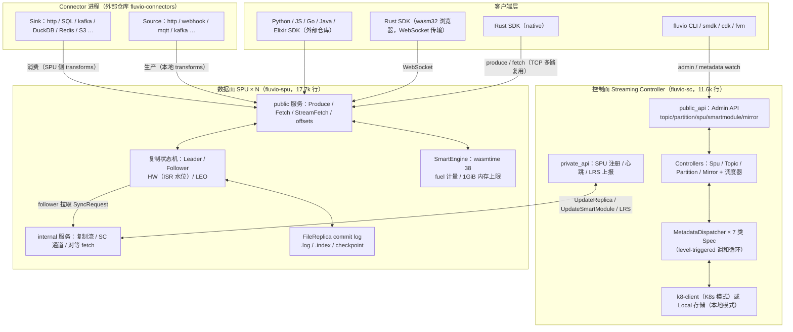
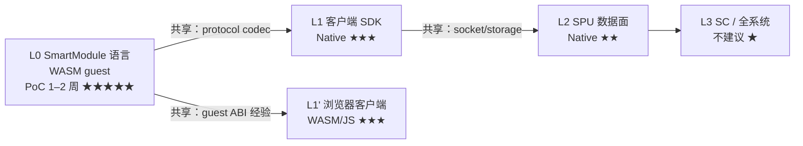
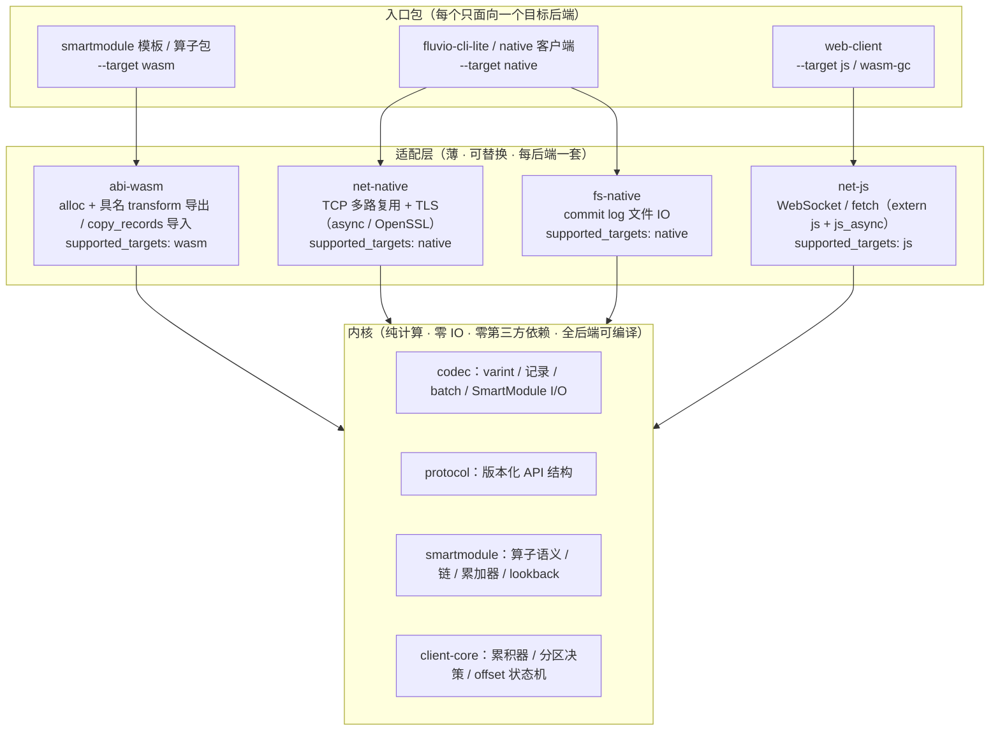
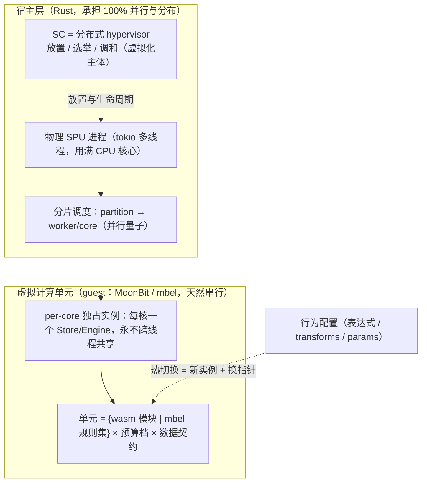
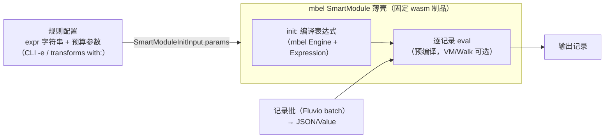

# Fluvio × MoonBit 综合评估报告

> **所属项目**：**moonflux**——MoonBit 全栈流式计算平台，能力与地位对标 Fluvio（`~/workspace/moonflux`）。本报告为 moonflux 的立项评估与架构基线；**Fluvio 为对标参考系统**（非宿主或依赖），报告中"移植/扩展"类表述服务于 moonflux 的分层决策与选型依据——**自建为主、移植可选**：代码级移植按「MoonBit 语境合理性」四检逐模块评估（见项目 `AGENTS.md` §1.1），验收门槛与自建一致
> **评估对象**：[infinyon/fluvio](https://github.com/infinyon/fluvio)（本地仓库 `/Users/dexter/workspace/fluvio`，master 分支，commit `52673942`，crate 版本 0.50.2 / 平台版本 0.18.2-dev-1）
> **评估目标**：Fluvio 项目全景评估（架构 / 库依赖 / 功能 / 数据处理范式 / 场景）+ Fluvio 功能详细说明 + MoonBit 移植可行性（覆盖率 / 架构迁移）+ Native 与 WASM 两种后端的能力差异、边界与投入产出
> **报告日期**：2026-09-15（v1.6：新增第六章 可视化拖拽管道编辑器——现状核对与 spec-first 实现提案；v1.5 新增 4.6 并行化与分布式虚拟化方案；v1.4 新增第五章 mbel 内嵌计算引擎评估；v1.3 新增 4.4/4.5；v1.2 整合 fluvio.io 官方文档；v1.1 新增第二章功能详细说明）
> **证据来源**：代码库实地探索两轮（架构/依赖/生态 + 数据面/管理面功能细节，均核实到文件级）、**fluvio.io 官方文档 5 页（docs v0.18.1，与仓库平台版本对齐）**、MoonBit 官方文档 / 源码（DeepWiki + Web 核验）、委托方前置研究（HTTP/MQ/硬件场景、WASM+MCP、数据流范式分析，其中与代码库证据冲突处已修正）

---

## 执行摘要

**Fluvio 是什么**：一个 ~12.7 万行 Rust 的 K8s 原生分布式流处理平台，控制面（SC，K8s operator 风格）+ 数据面（SPU，commit log 存储 + SC 集中选主复制）+ 自研 Kafka 风格二进制协议。其**范式级差异化**在于把 WASM 计算下推到数据层（SmartModule 在 SPU 的读写路径上执行用户代码），而非像 Kafka 一样只做传输。官方定位为 "lean distributed streaming engine for edge to core stream processing"，主打 Cloud Native / Edge Native / AI Native 三支柱。

**对 MoonBit 移植的总判断**：

| 移植层级 | 内容 | 后端 | 可行性 | 投入 | ROI |
| :--- | :--- | :--- | :--- | :--- | :--- |
| **L0** | MoonBit 作为 SmartModule 编写语言 | WASM | **高** | PoC 1–2 周 | ★★★★★ |
| **L1** | 客户端 SDK | Native | 中 | 2–4 人月 | ★★★ |
| **L1'** | 浏览器/Edge 客户端 | WASM/JS | 中 | 1–2 人月 | ★★★ |
| **L2** | SPU 数据面 | Native | 低–中 | 3–6+ 人月 | ★★ |
| **L3** | SC 控制面 / 全系统重写 | Native | 低 | 12+ 人月 | ★ |

**后端实现顺序与内核策略**（**2026-09-15 立项修订：Native 先行**）：**Native 优先**——Source/Sink、数据面与客户端都需要**独立的外部读写**（网络/文件/协议/MQ/硬件直采），WASM 沙箱只能做宿主中介的计算、不适合承载连接器；**WASM 后置**为"数据路径内算子沙箱"形态（可编程差异化），JS/wasm-gc（浏览器）最后。全部后端仍共用同一个**纯计算内核**（零 IO、零依赖、全后端可编译，由 CI 矩阵保持），MoonBit 工具链的依赖检查强制"内核 ← 适配层 ← 入口"单向结构——详见 4.4（含修订注）与 4.5（一内核多后端设计）。

**动态计算层评估（第五章）**：`~/workspace/mbel`（MoonBit 表达式引擎，零依赖/零 FFI/预算沙箱/三后端已验证）作为"配置即规则"的纯表达式求值层**可行性高**；推荐嵌入形态：MoonBit 宿主用**库内嵌**，跨语言/Fluvio 用 **core-wasm + 薄 ABI 适配**（即"动态 SmartModule 薄壳"：规则作为配置随 params 传入，一份 wasm 制品服务所有规则）；瓶颈在工程成熟度（单作者/11 天/无 CI 门禁）而非架构。

**并行化与分布式虚拟化**：建议采用"**宿主并行 × guest 虚拟**"（4.6）——SC/SPU 保持 Rust 承载并行与分布（并行量子 = 分区，虚拟化主体 = SC 放置，调度单位 = 虚拟 SPU），MoonBit/mbel 计算单元保持**无状态**（累加器/offset/身份等状态全部宿主化），单线程因此不再是障碍；per-core 独占实例为默认、process-per-core 兜底长任务，双重约束（fuel/预算 + 宿主墙钟超时）保底。

**产品化缺口（第六章）**：拖拽式可视化管道编辑器在 Fluvio 生态中**不存在**（最接近的 SDF Studio 仅"只读拓扑图 + 指标"，且属外部 SDF 项目）；建议按 **spec-first** 落地——P0 先定 `PipelineSpec` 并以 CLI `fluvio pipeline apply/plan` 编译为现有资源（旁路路线，不碰 SC 内核），P1 起加 Web 画布；表达式节点用 mbel 实现"拖完即生效"的差异化。

**三条最重要的证据修正**（相对委托方前置研究）：

1. **Fluvio 的 SmartModule 接口不是 WIT / 组件模型，而是经典 core-wasm ABI**——宿主只提供一个导入函数 `copy_records`，guest 只需导出 `alloc` 和一个具名 transform 函数。这比前置研究假设的"通过 WIT/组件模型集成"路径**更简单**，MoonBit 的 WASI p1 链接支持已确认存在，L0 路径无语言工具链障碍。
2. **MoonBit 的异步运行时（moonbitlang/async v0.21.3）官方明确标注实验性**，且为**单线程协作式调度**（非"线程池"），TLS 为 OpenSSL C 库绑定（非纯语言实现）。"Native 已具备生产级能力"应修正为"能力面已具备、运行时成熟度尚属实验"。
3. **Fluvio 的复制协议不是 Raft，而是"SC 集中提名 + SPU 自我提升确认"的协作协议**（官方 replica-election 文档确认，详见 1.2.6）：LRS ≈ Kafka ISR、最小滞后候选 ≈ clean leader election，但**没有 leader epoch**。数据面移植复杂度低于 Raft 型系统，但控制面耦合更深——这强化了"整体重写不划算、分层切入才合理"的结论。

**一句话结论**：MoonBit 进入 Fluvio 生态的正确姿势是**先做 SmartModule 的一等编写语言（WASM 后端、沙箱纯计算单元），再做 Native 客户端 SDK**；SC/SPU 本体的整体移植在当前 MoonBit 生态成熟度下投入产出为负，不建议。

---

# 第一章 Fluvio 项目全景评估

## 1.1 项目概况与成熟度

| 指标 | 数值 |
| :--- | :--- |
| 代码规模 | ~126,700 行 Rust（877 个 `.rs` 文件；crates/ 下 ~124k 行） |
| Workspace 成员 | 55 个（crates/ 下 ~45 个 crate、7 个示例、2 个发布工具、2 个测试连接器） |
| 版本 | crate 0.50.2；平台版本 0.18.2-dev-1（0.18.1 于 2025-06-30 发布） |
| 工具链 | Rust 1.93.0 固定（rust-toolchain.toml），edition 2024，无声明 MSRV |
| 测试 | 570 个 `#[test]` 函数、71 个集成测试文件、自研 e2e 框架 + bats CLI 冒烟套件、criterion 基准 |
| CI/CD | 17 个 GitHub workflows；发布目标含 x86_64/aarch64-linux-musl、armv7、apple-darwin、windows-gnu、android（Zig 交叉编译） |
| 工程治理 | CHANGELOG（keep-a-changelog）、CONTRIBUTING/DEVELOPER/RELEASE、cargo-deny 许可证审计、git-cliff、无 proptest |

**官方定位**（fluvio.io docs v0.18.1，2025-07-09 更新，与仓库平台版本对齐）：三大支柱——**Cloud Native**（声明式管理、K8s 原生、自愈、水平扩展）、**Edge Native**（宣称 37 MB 单二进制可运行于 ARM64 IoT 设备、快速冷启动、纳秒级处理延迟——**厂商自报口径，无公开方法论，未核验**）、**AI Native**（面向智能应用的数据生命周期与长时管道编排、流处理与物化的声明式 API）。客户端 SDK 官方口径为 Rust / Python / JavaScript / SQL（SQL 能力归外部 SDF 项目）。

**成熟度判读**：这是一个**生产级、单语言（Rust）monorepo**，具有工业级工程治理。最大的 crate 依次为 fluvio-spu（17.7k）、fluvio-sc（11.6k）、fluvio 客户端（10.4k）、fluvio-cluster（7.7k）、fluvio-protocol（7.6k）。项目仍在活跃迭代（异步运行时近期从自研切到 tokio 封装，TLS 从 openssl 迁往 rustls），**任何移植都存在持续的"跟随上游演进"成本**。

## 1.2 架构维度

### 1.2.1 总体架构



**通信拓扑**（官方架构文档口径一致）：SC 与 SPU 为**松耦合的独立服务**，各自可重启/升级/扩容而不中断流量；对外 API（TLS）分控制面（管理 SPU/topic/副本等集群对象生命周期）与数据面（producer/consumer 数据访问）两类；内部 API 用于 SC↔SPU 与 SPU↔SPU 协调。客户端 → SC 公开端口（单条 TCP 连接上多路复用 admin 调用与 metadata watch）；客户端 → 各 SPU 公开端口（`SpuSocketPool` 连接池，数据永远直连分区 leader，不经 follower 转发）。

### 1.2.2 控制面：Streaming Controller（SC）

- **三种运行模式**：Local（单机）、K8s、只读（`crates/fluvio-sc/src/start.rs`）。
- **管理 7 类元数据 Spec**：Spu、Partition、Topic、SpuGroup、SmartModule、TableFormat、Mirror（`crates/fluvio-sc/src/core/context.rs`）。
- **核心机制是 Kubernetes operator 模式的"level-triggered 调和循环"**：每个 Spec 一个 `MetadataDispatcher`（来自 `fluvio-stream-dispatcher`），持续从元数据源（K8s client 或本地存储）拉取并 watch 到内存本地存储；再由 SpuController（心跳 90 秒过期）、TopicController、PartitionController + PartitionReducer（选主）、RemoteMirrorController 等控制器做期望态/实际态调和。**即使在本地模式下也运行完整的 operator 逻辑**。官方对控制面的描述与代码一致："Inspired by Kubernetes, uses declarative programming with eventual consistency"。
- **两个服务端口**：public_api（客户端管理面，带 `fluvio-auth` 的 RBAC 授权）与 private_api（SPU 注册 `RegisterSpuRequest`、LRS 状态回流 `UpdateLrsRequest`）。
- **K8s 集成是真实的 operator**：管理 StatefulSet/Service（SPG），CRD + Helm charts（`k8-util/helm/`），CI 在 k3d/minikube 上跑 e2e。

### 1.2.3 数据面：SPU

三个长生命周期组件（`crates/fluvio-spu/src/start.rs`）：

1. **public 服务**：Produce、Fetch、StreamFetch（服务端推送式连续消费）、consumer offset API、StartMirror；
2. **internal 服务**：服务 SC 与对等 SPU（follower/镜像的 fetch-stream、consumer offset KV）；
3. **ScDispatcher**：与 SC 的常连接——注册、接收 `UpdateSpu/UpdateReplica/UpdateSmartModule/UpdateMirror`、周期上报 LRS（leader-replica-status）。

副本变更由 `control_plane/message_sink.rs` 应用，动态创建/销毁 leader 与 follower 状态机。官方文档对 SPU 的表述：接收 producer 数据、发送给 consumer、本地存储副本、并行承担多个流的 leader/follower 职责、**利用全部 CPU 核心**（多线程——与 MoonBit async 单线程的对照见 3.3）。

### 1.2.4 存储引擎：commit log（fluvio-storage，7.3k 行）

Kafka 式分区提交日志，**无 RocksDB/LSM**：

- `FileReplica` = 活跃 `MutableSegment` + 不可变 `SharedSegments`（`.log` + `.index` 启动扫描）+ HW checkpoint 文件 + retention `Cleaner`；
- 核心抽象 `ReplicaStorage` trait（`create_or_load / read_partition_slice / write_recordset / update_high_watermark`）——**SPU 对存储 trait 泛型**（`GlobalContext<S>`），测试可用内存实现替换；
- `OffsetInfo {hw, leo}`：hw 为已复制水位（`ReadCommitted` 读到 hw），leo 为日志末端（`ReadUncommitted`）；
- **零拷贝**：官方文档确认"single-writer, multi-reader with zero-copy writes"与"zero-copy IO 从磁盘直达网络"——代码对应 `read_partition_slice` 返回 `AsyncFileSlice`；
- 消息**不可变且有序**：官方保证同一副本上的写入按序持久化；
- 消费偏移以 KV 形式存在 `consumer-offset` 内部 topic 上（`LogBasedKVStorage`，KV-on-a-log 分层）。

### 1.2.5 复制协议：非 Raft 的"集中式大脑"

这是 Fluvio 架构最有辨识度的取舍（`crates/fluvio-spu/src/replication/`）：

- **没有 leader epoch/term**（代码与官方文档双向确认），数据面不做自主选主——**SC 的 PartitionController 计算副本集与 leader**，经 `UpdateReplicaRequest` 下发（协议细节是"SC 提名 + 候选 SPU 自我提升确认"，见 1.2.6）；
- Leader 侧 `LeaderReplicaState` 维护每 follower 的 `OffsetInfo`，按 ISR 法定数量计算高水位 `compute_hw`（官方表述："leader 从副本 LEO 最小值计算新 HW"）；
- **follower 拉取式同步**（非 leader 推送）：每个 follower 的 `FollowGroupController` 复用 fetch-stream API 向 leader 发 `SyncRequest`，自适应退避，60 秒周期对账；官方 replica-election 页确认"由 follower（而非 leader）发起连接"；
- LRS 状态流回流 SC，闭合调和环；
- epoch 仅存在于**元数据层**（`fluvio-stream-model` 的 `DualEpochMap`），用于 watch 流的变更检测，与数据面无关。

**移植含义**：数据面状态机比 Raft 型系统（如 Redpanda、NATS JetStream）简单，但 SC↔SPU 控制耦合更深——SPU 无法脱离 SC 语义独立移植验证。

### 1.2.6 副本分配与选主：官方文档 × 代码交叉验证

> 本节整合官方 `replica-assignment` 与 `replica-election` 两页文档，并与代码发现逐条对勘。

#### A. 副本分配（Replica Assignment）——不是"水平扩展"，是"创建时的均衡铺开"

**先回答两个常见误读**：
1. **它不是水平扩展机制**——该页讲的是"topic 创建时，副本如何在**既有** SPU 集合上均衡分布"；SPU 层面的水平扩展（加机器）在 K8s 模式下由 SPG → StatefulSet 承担（见 2.10.4），本地模式即多起进程。
2. **它不涉及 K8s 调度细节**——StatefulSet/Helm 不在此页范围；分配算法完全是 SC 侧的内存计算。

三种分配方式：

| 方式 | 机制 | 要点 |
| :--- | :--- | :--- |
| **CRA**（Computed Replica Assignment） | 轮询 + 间隙（gap-enabled）分配，输入四元组：SPU 列表、分区数、副本因子、ignore-rack 标志 | 例：4 SPU / 15 分区 / 3 副本 → p0=[0,1,2]、p1=[1,2,3]…；**跨 topic 创建记忆游标**（"下次从上次结束的索引继续"），使连续创建的 topic 整体保持均衡 |
| **CRA + 机架感知** | 三阶段：构建按机架分组的 SPU 矩阵 → 对角线读取成 SPU 序列 → 生成副本映射 | 机架 = 物理机架或云可用区；**硬性前提**：全部 SPU 必须定义 rack，且各机架 SPU 数量相等才均衡；机架不等时大机架吸收更多副本，**大机架断电会把 leader 重分布压垮小机架**（官方明确警告） |
| **MRA**（Manual） | JSON 文件手工指定（`fluvio topic create --replica-assignment ./file`），语义等同 Topic Status 中的 replicaMap | 校验：分区 id 从 0 连续无空洞、副本数组等长/元素唯一/正整数；支持 **validate-only 干跑** |

代码侧对应：TopicSpec 的 `Computed/Assigned` 两形态（2.2.1）、调度器 `crates/fluvio-sc/src/controllers/scheduler/partition.rs`（`ReplicaPartitionMap`）。

**关键边界：新增 SPU 不会触发存量 topic 副本的自动重平衡**。分配算法只在创建/加分区时运行（官方文档口径"triggered by topic creation"；代码侧 `UpdateTopicAction` 亦只有 AddPartition/AddMirror，无重平衡动作）——Kafka cruise-control 式的存量再分布在 Fluvio 中不存在，扩容后想利用新 SPU 只能新建 topic 或手工迁移。

#### B. 副本选主（Replica Election）——结构上确实类似 Kafka，但有三点实质差异

官方协议是 **"SC 提议、SPU 确认"的协作式选举**：

1. SC 检测 SPU 离线 → 找出受影响的全部副本集，状态置 **Election**；
2. SC 从 LRS 中挑选候选：**滞后最小（lag behind previous leader 最小）的 follower**；
3. 找到候选 → 状态 **CandidateFound**、通知各 follower、启动等待响应定时器；**候选 SPU 尝试将 follower 副本自我提升为 leader**——提升成功才回通知 SC；失败则沉默，定时器到点换下一个候选；
4. 提升成功 → 状态 **Online**、更新 LRS、其余 follower 重连新 leader 同步；候选耗尽 → 状态 **Offline**；
5. 离线 SPU 回归 → Offline 的副本集重跑上述流程；**旧 leader 回归时检测到新 leader，自行降级为 follower**（不争抢）。

**LRS（Live Replica Set）≈ Kafka ISR**：leader 维护 LRS；滞后 follower 被移出 LRS 后**失去选举资格但仍继续接收记录**，追上后自动回归（恢复资格）；HW 由 leader 按副本 LEO 最小值推进。

**与 Kafka 的对位与差异**（官方页未提 Kafka，以下为结构对比）：

| 维度 | Kafka | Fluvio |
| :--- | :--- | :--- |
| 集中协调者 | Controller（自身经 ZK/KRaft 选主） | SC（SC 自身高可用由部署层解决，如 K8s 多副本） |
| 领导权决定 | Controller 单方面宣布 | **SC 提名 + 候选 SPU 自我提升并确认**（两段式） |
| 候选偏好 | clean leader election（干净副本优先） | 最小滞后 follower（等价思路） |
| 同步集 | ISR（滞后移出/追上回归） | LRS（语义几乎一致） |
| leader epoch | 有（epoch-based truncation） | **没有**（文档与代码双向确认）——follower 截断正确性依赖水位对账，是移植/兼容验证的重点语义 |
| 连接方向/拓扑 | follower pull | follower pull；**每对 SPU 至多 2 条 TCP** |
| 消费默认隔离 | — | 默认 **UNCOMMITTED**（延迟优先于确定性持久性，见 2.4.2） |

#### C. 文档 × 代码差异备忘（评估可信度时有用）

- 官方 architecture/overview 页写"leader 接收数据后**转发**副本给 follower"——**简化表述**：代码与 replica-election 页一致，实际是 follower 发起连接并拉取（`SyncRequest`）；
- 官方 overview 页写 SPU 间用内部 API "**to elect leaders**"——**不精确**：选主由 SC 驱动（提名），SPU 只做自我提升确认；
- 代码独有（文档未覆盖）：SPU 心跳 90 秒过期、follower 60 秒周期对账、`SpuController` 的调和细节、epoch 只存在于元数据层。

### 1.2.7 通信协议：自研 Kafka 风格二进制协议

- **不是 serde、不是 flatbuffers、也不是 Kafka 线协议兼容**——`crates/fluvio-protocol/src/lib.rs` 明言"使用 Kafka 协议格式编码"；API key 0（Produce）/1（Fetch）借用了 Kafka 编号，但 schema 完全自研；
- 帧格式：长度前缀 + header（api_key/api_version/correlation_id）+ 版本化结构体；字段级 `#[fluvio(min_version/max_version)]` 属性、varint、`RawRecords(Bytes)` 零拷贝透传；
- 编解码由 **proc-macro**（`fluvio-protocol-derive`：`Encoder/Decoder/RequestApi/FluvioDefault`）生成——**协议 crate 的"心脏"是宏系统**；
- `MultiplexerSocket`（`crates/fluvio-socket/src/multiplexing.rs`）：单条 TCP 上按 correlation ID 多路复用多条请求/响应与流式通道；
- API key 空间：SC 公开（18、1001–1006）、SPU 公开（0、1、1002–1008、2000+）、SC↔SPU 内部、SPU 对等复制共四套。

### 1.2.8 WASM 运行时：SmartModule（fluvio-smartengine，2.7k 行）

**这是全项目对 MoonBit 最重要的一节**，事实如下（均有文件级证据）：

| 维度 | 事实 |
| :--- | :--- |
| 运行时 | wasmtime **38.0.4** + wasi-common 38.0.4（WASI Preview1，stdio 直通宿主）；`consume_fuel(true)` |
| 接口形态 | **经典 core-wasm ABI，全仓库无 `.wit` 文件、无 wit-bindgen、无 `wasmtime::component`** |
| 宿主导入 | 唯一 Fluvio 导入：`copy_records(ptr, len)`（按函数名扫描模块导入发现，忽略模块命名空间）+ WASI p1 stdio |
| guest 导出 | `alloc(len)->i32`、`memory`、恰好一个 C-ABI transform `(ptr, len, version)->i32`，命名为 `filter/map/filter_map/array_map/aggregate` 之一；可选 `init`、`look_back` 钩子 |
| 载荷编码 | Fluvio 自研二进制 codec：`SmartModuleInput/Output`、`SmartModuleAggregateInput/Output`、`SmartModuleInitInput` |
| 执行粒度 | **批级**（整个记录 batch 进出），非逐条 |
| 资源治理 | fuel 计量（默认 `i64::MAX/2`，每次调用前补充；**无墙钟超时**）；线性内存上限默认 1GiB（`crates/fluvio-types/src/defaults.rs:57`，可配 `smart_engine.store_max_memory`） |
| 链式执行 | `SmartModuleChainInstance`：N 个模块实例共享一个 wasmtime `Store`，输出接输入 |
| 调用位置 | ① SPU fetch/StreamFetch 路径（服务端）；② SPU produce 路径（`apply_smartmodules`）；③ 客户端进程内（`producer.with_chain()`）；④ Source 连接器本地执行 transforms；⑤ topic 去重编译为带 lookback 的 Filter 调用 |
| 无 SmartModule 时 | 完全旁路，SPU 走零拷贝文件片段——**WASM 是可选下推，不是必经路径** |
| 算子集 | derive 宏支持 7 种：`filter/map/filter_map/array_map/aggregate` + `init/look_back` 钩子；**无 flat_map**（前置研究有误）；线协议另有已废弃的 `Join/JoinStream` 与现行 `Generic`（connector/topic transform 所用） |
| SDK 现状 | **仅 Rust**（`SmartModuleSourceCodeLanguage` 枚举只有 `Rust` 一个变体）；smdk 默认构建目标 **wasm32-wasip1**（`--nowasi` 退回 wasm32-unknown-unknown）；27 个官方示例 |

官方对 SmartModule 的口径与代码一致："WebAssembly-powered customization"，沙箱执行、内联快速计算、语言无关开发（"language-agnostic development"——与"ABI 极小、任何能产 wasm 的语言都能写"的代码事实呼应，但目前只有 Rust SDK）。

**关键推论**：由于 ABI 面极小且不依赖 WIT/组件模型，**任何能产出 wasm32-wasip1 模块的语言都可以成为 SmartModule 语言**，门槛只在两点——实现 Fluvio 二进制 codec 的编解码 + 提供约定的导出函数。这为 MoonBit 留出了一扇完全打开的门。

### 1.2.9 架构模式盘点（移植时的"隐性规范"）

1. Level-triggered 调和循环无处不在（每个守护进程 = `select!` 循环 over store 监听 + 定时器 + 错误退避）；
2. Spec/Status + epoch 跟踪本地存储（`DualEpochMap`）驱动 watch 流；
3. 宏驱动的服务分发（`api_loop!` / `call_service!`）——统一、版本化、多路复用的 RPC over 裸 TCP；
4. 零拷贝管线（`AsyncFileSlice` / `RawRecords` / `FileRecordSet`）；
5. 存储与测试的 trait 插件化；
6. WASM 边缘计算（SmartModule 双路径：服务端 + 客户端）；
7. 集中式"大脑"复制（SC 提名选主）换取极简数据面。

## 1.3 库依赖维度

### 1.3.1 三层依赖结构

Fluvio 的依赖不是"标准 Rust 生态"一层，而是三层，**移植评估必须把三层都算进去**：

| 层 | 代表依赖 | 版本 | 使用广度 | 移植含义 |
| :--- | :--- | :--- | :--- | :--- |
| **开源第三方** | tokio（经 fluvio-future 封装）、serde/serde_json、rustls、clap、ureq、flate2/lz4_flex/snap/zstd、mimalloc、octocrab | tokio 1.34 / rustls 0.23（默认 aws-lc-rs）/ clap 4 / lz4_flex 0.11.6 | serde 覆盖 32/45 个 crate | MoonBit 需逐项找等价物（见 1.3.3） |
| **Infinyon 自研（仓库外）** | fluvio-future、k8-client、k8-config、k8-types、k8-diff、fluvio-helm、flv-tls-proxy、fluvio_ws_stream_wasm | fluvio-future 0.8.3（27 个 crate 使用）、k8-client 14.0 | 贯穿 SC/客户端/集群管理 | **这部分源码不在本仓库**，却是 SC 与 K8s 模式的必要条件；移植 = 一并重写 |
| **本仓库自研** | fluvio-protocol（+derive）、fluvio-socket、fluvio-storage、fluvio-service、fluvio-stream-model/dispatcher、smartengine | — | 核心引擎 | 移植的主要工作量所在 |

### 1.3.2 值得注意的"没有"

- **没有 flatbuffers / protobuf**：数据面是自研 codec，元数据是 serde JSON/YAML/TOML——移植时序列化面比想象的小；
- **没有 Kafka 线协议兼容**（无 kf-protocol 等 crate）：Fluvio 不吃 Kafka 客户端；
- **没有 MQTT/Kafka 客户端依赖**：生产连接器全部外置在 fluvio-connectors 仓库，本仓库只有框架 + 测试连接器；
- **没有 metrics/prometheus crate**：指标是自研的，经 Unix socket 暴露；
- **HTTP 客户端是同步的 ureq**（rustls + native-certs），不是 reqwest/hyper/axum 生态；
- **无声明 MSRV、无 proptest**，async 测试不用 `#[tokio::test]` 而用自研 fixture。

### 1.3.3 关键依赖 × MoonBit 对应物对照

| Fluvio 依赖 | 作用 | MoonBit 对应物（经核验） | 缺口等级 |
| :--- | :--- | :--- | :--- |
| tokio（多线程异步运行时） | 全部并发 | `moonbitlang/async` v0.21.3：**实验性**、native 仅 Linux/macOS、**单线程协作式**、结构化并发/可取消 | 🔴 高 |
| rustls（纯 Rust TLS） | 客户端/服务端 TLS | async 库的 `tls` 模块 = **OpenSSL C 库绑定** | 🔴 高（供应链/合规差异） |
| k8-client 14.0 | K8s operator | **无** | 🔴 高（SC 的硬门槛） |
| wasmtime 38 | SmartModule 宿主 | **无宿主型 WASM 运行时**（C FFI 绑 wasmtime C API 理论可行） | 🔴 高（对 L2/L3） |
| serde + derive | 元数据序列化 | core 库 `Json/ToJson/FromJson` + `derive(ToJson)` | 🟡 中（无 YAML/TOML 等价物） |
| fluvio-protocol-derive（proc-macro） | 协议编解码生成 | MoonBit 有 derive 体系，但无 proc-macro 级自由代码生成；可手写编解码 | 🟡 中 |
| bytes / AsyncFileSlice | 零拷贝 | `Bytes`（不可变）/`Buffer`；**无 OS 级零拷贝文件片段等价物** | 🟡 中（L2 性能关键） |
| clap | CLI | 无成熟等价物 | 🟡 中（仅 CLI 层） |
| lz4/zstd/gzip/snap | batch 压缩 | 需 C FFI 绑定或纯实现 | 🟡 中 |
| cargo / cargo-generate | smdk/cdk 工具链 | moon / mooncakes 工具链异构 | 🟡 中（L0 构建适配） |
| Buffer 大小端 / LEB128 varint | 协议编解码原语 | ✅ core 库原生具备（`write_leb128`、`_be/_le`） | 🟢 低 |

**判读**：Fluvio 的依赖构成对移植是"哑铃型"——纯计算/序列化层（绿灯）和系统生态层（红灯）两端都清晰，中间的宏与零拷贝（黄灯）决定性能上限。

## 1.4 功能维度（总览）

用户可见功能面概览如下，**逐项详细说明（配置项、默认值、CLI 语法、语义边界）见第二章**：

- **数据面**：Topic/Partition 管理（分区、副本、保留策略、压缩、去重、镜像映射）、批式生产（攒批/压缩/投递语义/分区路由）、服务端推送式消费（三种 Offset 语义、托管消费偏移）、记录与批格式（key/value/headers/时间戳、批级压缩）；
- **可编程层**：SmartModule 五类算子 + init/look_back/参数、链式 transforms、五处调用点（consume/produce/SDK/connector/topic 级）、smdk 开发套件与 Hub 分发；
- **管理面**：Admin API（8 类资源 × list/watch/create/delete/update 能力矩阵）、集群生命周期（本地/K8s/只读三模式、预检、升级、诊断）、SPU/SPG 管理、多环境 profile；
- **企业能力**：TLS + 三级 RBAC（x509 身份）、集群间单向镜像（edge→home 方向拓扑）、Unix socket 指标、producer 基准工具、TUI 表格渲染（TableFormat）；
- **二进制矩阵**（8 个）：fluvio、fluvio-run、fluvio-test、fluvio-channel、smdk、fluvio-benchmark、cdk、fvm，外加外部插件机制（`fluvio-<cmd>`，hub/cloud/connector 命令即外置插件）。

## 1.5 数据处理范式维度

### 1.5.1 范式定位：数据流编程（Dataflow Programming）

Fluvio 的 Dataflow = **有向图**：节点是计算算子（Source / SmartModule transforms / Sink），边是事件流（Fluvio topic 分区 log）。映射关系：

| 数据流编程概念 | Fluvio 对应物 |
| :--- | :--- |
| 图（拓扑） | Dataflow（本仓库内为声明式 `TransformationConfig` 链；完整数据流图在外部 SDF 项目） |
| 计算节点（算子） | SmartModule：`filter/map/filter_map/array_map/aggregate` + `init/look_back` |
| 边（数据流动） | Fluvio topic：分区 commit log（传输 + 持久化 + 复制一体） |
| 状态 | 聚合累加器（宿主持有、随调用线程化）+ lookback 历史回看 + consumer offsets（流表二象性的"表"） |
| 背压 | fetch `max_bytes` 上限 + 批积累器 + follower 同步水位 |

同范式系统：Apache Flink（流式数据流）、Kafka Streams、Unix 管道（pipe-and-filters）、响应式编程。Fluvio 的差异点：**K8s 原生控制面** 与 **WASM 算子下推**。官方文档的类比：Topic ≈ 数据库表（如流式 "Sent Message" 事件的 Chatroom 表），Partition 把负载分布到多个 SPU。

### 1.5.2 Fluvio 的范式级创新：WASM 计算下推

与"传输层 + 外部计算"（Kafka + Streams/Flink）不同，Fluvio 把用户计算**编进数据路径本身**：

- **服务端下推**：SPU 的 fetch/produce 路径内联执行 SmartModule（filter/map/aggregate/去重），数据不出 SPU 即被裁剪/转换——对带宽敏感与多租户场景是结构性优势；
- **客户端下推**：同一套 SmartModule 可在生产者进程内先执行，节省网络；
- **沙箱保障**：fuel 计量 + 内存上限 + 无墙钟超时的取舍，使不可信代码可安全下推——这正是"平台即算力市场"（SmartModule Hub）的技术前提。

### 1.5.3 SDF 澄清（重要边界）

前置研究提及的"SDF（Stateful Dataflow）组件管理 SQL 表和键值文档"**不在本仓库**——SDF 是 InfinyOn 的独立项目（fluvio.io/sdf、stateful-dataflows-examples 仓库，beta 阶段；官方 Quickstart 结尾亦指向 SDF 做富管道/窗口/富化）。本仓库内最接近的是：SmartModule 链式执行 + `TransformationConfig` 声明式配置 + `TableFormatSpec`/`kv` 存储原语。**评估"移植 Fluvio"时不应把 SDF 的算子/SQL 引擎计入工作量，但应在路线图中留出互操作观察点。**

### 1.5.4 一致性与投递语义

at-least-once 为默认投递语义（ISR 水位确认 + 副本拉取 + LRS 回流），可选 at-most-once（fire-and-forget）；读隔离分 ReadCommitted（到 HW）/ReadUncommitted（到 LEO，**官方文档确认默认为 UNCOMMITTED——延迟优先于确定性持久性**）；消费偏移外部化存储于内部 topic。**没有 Exactly-Once 事务 API、没有 Kafka 式消费组协调/再均衡**（消费偏移按三元组独立保存，见 2.4.4）、没有 leader epoch（见 1.2.6）、没有 Raft 线性一致性读——**语义复杂度低于 Kafka/KRaft 与 Flink checkpoint 体系**，这是移植工作量的正向因素。

## 1.6 场景维度

| 场景 | Fluvio 的匹配点 | 边界/短板 |
| :--- | :--- | :--- |
| **数据管道 / ETL** | Connector 框架 + SmartModule transforms + Hub 生态（官方 Quickstart 即演示 HTTP source → transforms → topic 全链路） | 生产连接器数量与 Kafka Connect 生态仍有差距 |
| **K8s 原生流处理** | 真 operator + CRD + Helm + StatefulSet 编排，本地/集群双模式 | 深度绑定 K8s 也意味着非 K8s 部署的额外成本 |
| **边缘计算 / 端侧过滤** | 官方 Edge Native 定位（宣称 37 MB 单二进制/ARM64，厂商口径未核验）+ SmartModule 沙箱 + 客户端进程内执行 + 镜像的单向 edge→home 拓扑 | 纳秒延迟等性能口径为厂商自报、无方法论；主发布矩阵为 Linux-musl/macOS（Windows 在 CI 仅 check/test） |
| **实时数据服务** | StreamFetch 服务端推送 + 多分区消费 | 无 SQL/物化视图（SDF 承担，尚未 GA） |
| **多集群数据同步** | Mirroring（home/remote 控制器，单向复制） | 单向、无 update、镜像认证尚未实现（TODO） |
| **AI / Agent 数据面（延伸）** | 见 1.6.1 | 前瞻性场景 |

### 1.6.1 场景延伸：WASM + MCP（AI Agent 工具链）

整合委托方前置研究，Fluvio/MoonBit 与 MCP（Model Context Protocol）的结合可归纳为四种模式：

1. **MCP 供数 → WASM 实时计算**：Agent 经 MCP 工具取数（如传感器 API），交给 WASM 沙箱模块做移动平均等流式计算（如 shack-wasm-interpreter 类 MCP 服务器）；
2. **WASM 计算 → MCP 写回**：沙箱内完成聚合，结果经 `tools/call`（如 `set_storage`）持久化（mcp-wasm-poc 类项目）；
3. **WASM 作为 MCP 服务器的安全沙箱**：MCP 服务器以 `execute_code` 工具在无网络/无文件系统的 WASM 沙箱内执行不可信代码（tool-sandbox-mcp 类）；
4. **WASM 组件化的 MCP 服务器**：整个 MCP 服务器编译为组件模型组件，跨 Wasmtime/Spin/浏览器运行。

**与 Fluvio 的拼接点**：Fluvio 提供传输与持久化（边），MoonBit SmartModule 提供沙箱计算（节点），MCP 提供 Agent 工具接口（入口/出口）——三者组合即"AI 原生数据管道"：Agent 通过 MCP 订阅 Fluvio topic、下推 MoonBit 算子做在线特征加工。**该场景对本报告的直接影响**：它进一步抬高 L0（MoonBit SmartModule）路径的战略价值，因为同一套 MoonBit WASM 技能栈同时覆盖流处理算子与 MCP 沙箱计算两个方向。

---

# 第二章 Fluvio 功能详细说明

> 本章从用户/产品视角逐项说明 Fluvio 的功能：配置项、默认值、CLI 语法、语义与边界。所有数值均核实自代码；2.1 的命令流程实录自官方 Quickstart（文件路径见附录）。

## 2.1 快速上手路径（官方 Quickstart 实录）

官方 Quickstart 用 8 步走完"安装 → 本地集群 → 收发 → 外部数据源 → WASM 转换 → 组合管道"，本身就是 Fluvio 产品能力的最短闭环：

```bash
# ① 安装：fvm 版本管理器 + stable 通道 CLI（文件位于 ~/.fluvio/bin；Windows 建议 WSL2）
curl -fsSL https://hub.infinyon.cloud/install/install.sh | bash

# ② 本地集群（Cloud 集群另行见 Cloud 文档）
fluvio cluster start

# ③ Topic 与收发
fluvio topic create quickstart-topic
fluvio produce quickstart-topic          # 交互式：输入 hello world! 回车 → 每条回显 Ok!，Ctrl+C 退出
fluvio consume quickstart-topic -B -d    # 回放历史（-B 从头；-d 读完退出）
                                         # 注意：不带参数时默认从末端开始等待新记录

# ④ HTTP Source 连接器（Hub 下载 ipkg → cdk 部署 → 查看状态 → 消费）
cdk hub download infinyon/http-source@0.3.8
cdk deploy start --ipkg infinyon-http-source-0.3.8.ipkg -c quotes-source-connector.yml
cdk deploy list                          # http-quotes  Running
fluvio consume quotes                    # 每 3 秒轮询到的 JSON 名言流

# ⑤ SmartModule（Hub 下载 jolt → 消费端 transforms 链式转换）
fluvio hub smartmodule download infinyon/jolt@0.4.1
fluvio smartmodule list                  # 确认模块已加载（~589.3 KB）
fluvio consume quotes --transforms-file transforms.yaml -T=2   # jolt shift 提取字段，-T=2 取末尾两条

# ⑥ 连接器 + SmartModule 组合管道（transforms 内嵌于连接器配置，数据到达时已转换）
cdk deploy start --ipkg infinyon-http-source-0.3.8.ipkg -c string-quotes-source-connector.yml
fluvio consume string-quotes             # 已是转换后的纯文本流

# ⑦ 清理
cdk deploy shutdown --name http-quotes && cdk deploy shutdown --name string-quotes
fluvio topic delete quotes / string-quotes / quickstart-topic
```

**要点**：`fluvio hub smartmodule list/download`、`cdk hub download` 等命令均经由外部插件机制（hub/cdk CLI）调用 InfinyOn 云端注册表；Quickstart 结尾把"更丰富的分层管道（富化、窗口）"指向外部 SDF 项目——与本报告 1.5.3 的边界澄清一致。

## 2.2 数据模型：Topic 与 Partition

### 2.2.1 TopicSpec 全部配置项

| 字段 | 线协议版本 | 类型 / 默认 | 说明 |
| :--- | :--- | :--- | :--- |
| `replicas` | — | `ReplicaSpec`（三选一） | 副本放置策略（见 1.2.6-A：Computed 自动分配 / Assigned 手工映射 / Mirror 镜像） |
| `cleanup_policy` | v3+ | `Segment(SegmentBasedPolicy { time_in_seconds })` | 目前**唯一**清理策略 = 按时间保留；默认 7 天，最小 10 秒 |
| `storage` | v4+ | `{ segment_size, max_partition_size }` | 段大小默认 1 GiB（最小 1 KiB）；分区容量默认 100 GB（最小 2 KiB 且 ≥ 段大小）。**官方文档确认：时间与容量两个条件同判、以段为粒度清理；建议两者合计覆盖磁盘不超过 80%，否则磁盘满会停止接收消息** |
| `compression_type` | v6+ | 默认 `Any` | `None / Gzip / Snappy / Lz4 / Any / Zstd`；`Any` = 由 producer 决定 |
| `deduplication` | v12+ | `Option<Deduplication>` | 服务端去重（见 2.7） |
| `system` | v13+ | `bool` | 内部系统 topic 标记（CLI 用 `-s/--system` 查看/强制删除） |

**副本放置三种模式**（`ReplicaSpec`）：

- `Computed(TopicReplicaParam { partitions, replication_factor, ignore_rack_assignment })`——由 SC 调度器自动分配（默认分区数 1、副本数 1；`ignore_rack_assignment` 关闭机架感知，机架感知算法细节见 1.2.6-A）；
- `Assigned(PartitionMaps)`——手工指定每分区副本列表（`PartitionMap { id, replicas: Vec<SpuId>, mirror? }`）；校验规则：分区 id 从 0 连续无空洞、各分区副本数一致、SPU id 唯一非负（与官方 MRA 文档一致）；
- `Mirror(MirrorConfig)`——镜像 topic（Remote/Home 两形态，见 2.8）。

**容量与限制**（`crates/fluvio-types/src/defaults.rs`）：单 batch ≤ 2 MB（`STORAGE_MAX_BATCH_SIZE`）、单请求 ≤ 33 MB（超限报 `BatchTooBig`/`BatchExceededSegment`）、ISR 最小副本数默认 1。**Topic 命名**：小写字母/数字/连字符、首尾须字母数字、≤255 字符。

### 2.2.2 Topic 声明式配置（YAML）

```yaml
# fluvio topic create <topic> -c topic.yaml
version: 0.1.0
meta: { name: my-topic }
partition:
  count: 3
  replication: 2
  ignore-rack-assignment: false
retention: { time: 2m, segment-size: 2.0 KB }   # time 为 humantime 格式
compression: { type: Lz4 }
deduplication:
  bounds: { count: 100, age: 1m }
  filter: { transform: { uses: fluvio/dedup-bloom-filter@0.1.0, with: {...} } }
```

### 2.2.3 分区状态机与观测

- **PartitionStatus**：`resolution`（Offline 默认 / Online / LeaderOffline / ElectionLeaderFound / OutOfStorage）、leader 与各副本的 `ReplicaStatus { spu, hw, leo }`（`leader_lag = leader.leo − replica.leo` 可直接观测副本滞后——正是 1.2.6-B 选主"最小滞后候选"依据的同一数据）、存活副本数 `lsr`、分区大小、base_offset、删除中标记；
- **TopicStatus**：`resolution`（Init / Pending / InsufficientResources / InvalidConfig / Provisioned / Deleting）+ 副本映射 + 失败原因（`reason`）——**资源不足时能明确报告 InsufficientResources，而不是静默挂起**；
- CLI：`fluvio topic list`（含 RETENTION/COMPRESSION/DEDUPLICATION/STATUS/REASON 列）、`fluvio topic describe`、`fluvio partition list`（LEADER/REPLICAS/RESOLUTION/SIZE/HW/LEO/LSR/FOLLOWER OFFSETS 列）。

### 2.2.4 Topic 的可变更范围（重要边界）

`UpdateTopicAction` **只有两种**：`AddPartition { count }`（`fluvio topic add-partition -c N`，等待新分区 provision，10 秒超时）与 `AddMirror`。**创建之后不可修改 replication factor、retention、压缩、去重等参数**——变更需删 topic 重建。这也是 1.2.6-A"无存量重平衡"结论的另一面：新分区会用新 SPU 集合计算，老分区不动。

## 2.3 生产功能（Producer）

### 2.3.1 全部配置项与默认值（`TopicProducerConfig`）

| 配置 | 默认 | 说明 |
| :--- | :--- | :--- |
| `batch_size` | 16,384 B | 单批累计上限，满即发 |
| `max_request_size` | 1,048,576 B | 服务端单请求处理上限 |
| `batch_queue_size` | 100 | 每分区待发批队列；满时 `send()` 背压阻塞 |
| `linger` | 0 ms | 发送前等待（攒批窗口） |
| `partitioner` | SipHash 轮询 | 见 2.3.2 |
| `compression` | None | 与 topic 级压缩不兼容时**producer 初始化直接失败**（而非静默降级） |
| `timeout` | 1500 ms | 服务端处理单批最大时长 |
| `isolation` | ReadUncommitted | ReadCommitted = 等 ISR 复制提交后才响应 |
| `delivery_semantic` | AtLeastOnce(默认重试策略) | 见 2.3.3 |
| `smartmodules` | `[]` | 客户端进程内执行的 SmartModule 链 |
| `callback` | None | 批完成回调（字节数/记录数/分区/耗时） |

### 2.3.2 分区路由

- **带 key**：`SipHash(key) % partition_count`——同 key 恒定落同一分区（保序的粒度是 key）；
- **无 key**：原子计数器**在当前可用分区内轮询**（`PartitionAvailabilityTracker` 每秒刷新可用分区集，避开离线分区；新增分区自动纳入，无需重建 producer）；
- **指定分区**：`SpecificPartitioner`（SDK `set_specific_partitioner` / CLI `-p <id>`，镜像场景亦用）。

### 2.3.3 投递语义与重试

- `AtMostOnce`：fire-and-forget，不等响应、无重试；
- `AtLeastOnce(RetryPolicy)`：等待确认 + 失败重试；默认策略：最多 4 次重试、初始退避 20ms、上限 200s、总超时 300s、**指数退避**（另有 FixedDelay / FibonacciBackoff 可选）；
- **失败语义**：某分区 producer 出错后，后续 `send()` 直接返回该错误，直到显式 `clear_errors()`——错误不会静默丢失。

### 2.3.4 发送 API 与 CLI

- SDK：`send(key, value)` 入积累器即返回 `FutureRecordMetadata`，`.wait()` 得 `{ partition_id, offset }`；`flush()` 冲刷并等待全部确认；
- CLI：`fluvio produce <topic>`，stdin 每行一条；`--key-separator ":"` 启用 `key:value` 格式（无分隔符行跳过并告警）；`--key <k>` 全部同 key；`-f <file>` 按行读文件；`--raw` 整个输入作单条二进制记录；批处理/压缩/语义 flags 同 2.3.1；`--delivery-semantic at-most-once|at-least-once`（默认后者）；SmartModule flags 见 2.6.3。

## 2.4 消费功能（Consumer）

### 2.4.1 Offset 模型（三种，无时间戳起点）

内部枚举仅 `Absolute(i64) / FromBeginning(i64) / FromEnd(i64)`：

| 构造 | 语义 |
| :--- | :--- |
| `Offset::absolute(n)` | 绝对 offset（≥0） |
| `Offset::beginning()` / `from_beginning(n)` | 从**最早仍保留的记录**起（retention 删除后起点会移动）+n |
| `Offset::end()` / `from_end(n)` | 从最新末端（LSO，last stable offset）倒数 n；**默认起点即 end** |

解析结果被 clamp 到 `[start_offset, last_stable_offset]`；若指定了托管 consumer id，FromBeginning/FromEnd 改为相对**已保存的消费偏移**计算。**没有 from_timestamp 变体**（不能按时间戳定位）。

### 2.4.2 消费模型：服务端推送

客户端发 `StreamFetchRequest { topic, partition, fetch_offset, isolation, max_bytes, smartmodules, consumer_id }`，SPU **持续推送**批响应（无需轮询）；会话结束回传 `UpdateOffsetsRequest` 清理。`disable_continuous`（CLI `-d`）则只读存量记录后退出（先查 offset 边界再 `TakeRecords`）。

消费配置要点（`ConsumerConfigExt`）：`max_bytes`（默认 ~1 MB，可用环境变量 `FLV_CLIENT_MAX_FETCH_BYTES` 覆盖）、`isolation`（默认 ReadUncommitted，**官方文档明确"默认向消费者发送 UNCOMMITTED 消息"——延迟优先于确定性持久性**；ReadCommitted = 只读到 HW，即已复制提交的记录，且官方提示未提交读在多种故障场景下"无法确定性存活"）、`smartmodule: Vec<SmartModuleInvocation>`、`offset_consumer`、`offset_strategy`、`offset_flush`（默认 10s）、`retry_mode`（Disabled / TryUntil(n) / TryForever，builder 默认 TryUntil(100)）。

### 2.4.3 分区选择与流语义

- `PartitionSelectionStrategy`：`All(topic)`（全部分区）或 `Multiple(Vec<(topic, partition)>)`（显式列表）——**没有 Regex/Hash 策略**（key 路由只发生在 producer 侧）；
- `ConsumerStream` = 标准 Rust `Stream<Item = ConsumerRecord>`；多分区流 `select_all` 合并，**跨分区不保证顺序**；
- `ConsumerRetryStream`（`Fluvio::consumer_with_config` 默认返回）：断线自动重连、记住 `next_offset_to_read` 以绝对 offset 续读、指数退避（系数 1.1，1s–30s）。

### 2.4.4 消费偏移：有托管存储，但没有消费组

- **存储**：内部 topic `consumer-offset`（分区 0），KV 结构：key = `(topic, partition, consumer_id)` 三元组，value = `{ offset, modified_time }`，每 100 次变更刷盘；
- **API**：Fetch / Update / Delete（`fluvio consumer list` / `fluvio consumer delete <id> [-t topic] [-p partition]`）；
- **管理策略** `OffsetManagementStrategy`：`None`（默认，不保存）/ `Manual`（显式 commit + flush）/ `Auto`（每条自动 commit、按 `offset_flush` 周期 flush、drop 时 flush）；客户端维护 seen/committed/flushed 三个单调游标；
- **关键边界：Fluvio 没有 Kafka 式 consumer group 协调与再均衡**——多个消费者共用同一 consumer id 即可实现"组"语义，但分区分配完全由应用自行管理。

### 2.4.5 消费 CLI

`fluvio consume <topic>`：起点（互斥）`-B/--beginning`、`-H/--head <n>`、`-T/--tail <n>`、`--start <n>`（默认 end）、终点 `--end <n>`（含）；范围 `-p/--partition`（可重复）、`-A/--all-partitions`、`-m/--mirror <cluster>`；行为 `-d`（读完退出）；输出 `-k/--key-value`、`-F/--format '{{key}} {{value}} {{offset}} {{partition}} {{time}}'`（RFC3339）、`-O/--output dynamic|text|binary|json|raw|table|full_table`、`--truncate`；fetch `-b/--maxbytes`、`--isolation`；SmartModule 见 2.6.3；托管偏移 `-c/--consumer <id>`（CLI 内置 Auto 策略，flush 间隔 2s，退出时提交）。

## 2.5 记录与批格式（用户可见语义）

- **Record**：`key`（可选，varint 长度前缀字节串）/ `value`（必填）/ `headers` / 时间戳 = 批基准时间 + delta（无时间戳时 `-1`）；
- **ConsumerRecord**：附加绝对 `offset`、`partition`——消费端能拿到完整三元组定位；
- **Batch**：`base_offset`、CRC 校验、`last_offset_delta`（`last_offset = base_offset + last_offset_delta`）、producer id/epoch/sequence 字段（格式占位，当前未用作幂等）；**压缩以批为单位**（算法编码在 attributes 位段，一批一压缩）；
- **大小限制**：单记录受批 2 MB / 请求 33 MB 约束（见 2.2.1）；
- **有序性保证**（官方口径）：同一副本上的消息写入按序持久化（单写多读 + 零拷贝）。

## 2.6 SmartModule 功能全景

### 2.6.1 五类算子的精确语义

| 算子 | 签名（概念） | 语义 |
| :--- | :--- | :--- |
| `filter` | `(record) -> bool` | 保留/丢弃整条记录 |
| `map` | `(record) -> (Option<key>, value)` | 一进一出，可改 key/value |
| `filter_map` | `(record) -> Option<(Option<key>, value)>` | map + 可选丢弃（0 或 1 条输出） |
| `array_map` | `(record) -> Vec<(Option<key>, value)>` | 一进多出（**最接近 flat_map 的能力，但名字就叫 array_map**） |
| `aggregate` | `(accumulator, record) -> accumulator` | 有状态聚合；累加器由**宿主持有**、跨调用线程化 |
| `init`（钩子） | `(params) -> ()` | 初始化（类型化参数经 `#[derive(SmartOpt)]`） |
| `look_back`（钩子） | — | 声明需要历史记录回看：`Lookback::Last(n)`（最近 n 条）或 `Lookback::Age { age, last }`（时间窗）——SPU 会先从分区日志回放历史记录喂给模块 |

参数传递：CLI `-e key=value`（可重复）/ connector `with:` / SDK `SmartModuleExtraParams`。

### 2.6.2 五种调用方式（同一套模块）

| 调用点 | 执行位置 | 配置来源 |
| :--- | :--- | :--- |
| `fluvio consume --smartmodule / --transforms` | **SPU fetch 路径** | `SmartModuleInvocation { Predefined(name) 或 AdHoc(gzip wasm), kind, params, lookback }` |
| `fluvio produce --smartmodule …` | SPU produce 路径 | 同上 |
| SDK `producer.with_chain/with_filter/with_map/…` | **客户端进程内** | 代码构建（producer 侧不支持 lookback） |
| Connector `transforms:` | Source 在连接器进程内；Sink 在 SPU 上 | `Connector.toml` |
| Topic 级 dedup | SPU produce 路径 | TopicSpec.deduplication 编译为 Predefined Filter + lookback（见 2.7） |

### 2.6.3 声明式 transforms 配置（YAML/JSON）

```yaml
# fluvio consume --transforms-file transforms.yaml（官方 Quickstart 用例；-t 为短选项）
transforms:
  - uses: infinyon/jolt@0.4.1      # SmartModule FQDN
    lookback: { last: 10, age: 12s }  # 可选
    with:                            # 参数（标量/JSON 均可）
      spec: '[{"operation":"shift", ...}]'
```

CLI 亦支持 `--transforms-line '<json>'` 内联单步（可重复，组成链）；produce、smdk test、connector 配置共用同一格式。

### 2.6.4 生命周期：smdk 与 Hub

- **`smdk generate <name>`**：cargo-generate 模板；`--sm-type filter|map|array-map|aggregate|filter-map`、`--project-group`、`--with-params`、`--sm-public`；
- **`smdk build`**：目标 **wasm32-wasip1**（`--nowasi` 退回 wasm32-unknown-unknown），profile `release-lto`；
- **`smdk test`**：**本地**经 `SmartModuleChainBuilder` 直接跑构建产物——输入 `--text/--stdin/--file`（JSON 记录）、`-e` 参数、`-t` transforms、`-r/--records` lookback 回看条数；不依赖集群即可测试；
- **`smdk load`**：读 `SmartModule.toml` + wasm 产物，gzip 压缩后注册到 SC（`admin.create`）；`--dry-run` 仅校验；
- **`SmartModule.toml`**：`[package] name/group/version/apiVersion/description/license/visibility(private|public)` + `[[params]]`（名称/描述/optional）——params 元数据会被 `smdk generate` 生成、被 Hub 消费；
- **命名与存储**：FQDN `group/name@version`（如 `infinyon/jolt@0.4.1`），SC 内 id 为 `name-group-version`；wasm 载荷 gzip + base64 存储，**list/watch 只回传 summary（字节数），不搬运模块**；
- **Hub**：包格式 `.ipkg` + `package-meta.yaml`（名称规则：小写字母数字 + `: - _`）；访问令牌 V3/V4（经 `fluvio-cloud` CLI 获取）；`fluvio hub publish/download` 为**外部插件**（fluvio-hub-cli，不在本仓库；官方 Quickstart 的 `fluvio hub smartmodule list/download`、`cdk hub download` 即经此路径调用 InfinyOn 云端注册表）；
- CLI 管理：`fluvio smartmodule create <name> --wasm-file <path>`、`list`（FQDN + 字节数）、`watch`、`delete`、`test`（复用 smdk 测试逻辑）。

### 2.6.5 可观测

每个 SmartModule 链暴露指标：`bytes_in / records_out / records_err / invocation_count / fuel_used / cpu_ms`（按模块名分维度）。

## 2.7 服务端去重（Deduplication）

配置：`deduplication.bounds.count`（必填，非零）+ `bounds.age`（可选）；`filter.transform.uses` 默认 `fluvio/dedup-bloom-filter@0.1.0`，`with` 传参。SPU 将其编译为 `Predefined` Filter 调用，lookback = `{ last: count, age }`——**去重本质是"带布隆过滤器 SmartModule 的 lookback 消重"**，是 SmartModule 下推的一个内建应用。CLI：`fluvio topic create --dedup --dedup-count 5 --dedup-age 5s`；**前置条件**：集群需预装 dedup-bloom-filter 模块，否则创建报错。

## 2.8 镜像与多集群（Mirroring）

### 2.8.1 概念与方向

**Home = 中心集群，Remote = 边缘集群**；方向术语：home 视角 `to-remote`/`from-remote`，remote 视角 `to-home`/`from-home`。**每条镜像链路单向**——remote 作为拉取目标时，向该 topic 生产会被直接拒绝（错误码 `MirrorProduceFromRemoteNotAllowed` / `MirrorProduceFromHome`），**没有双向同步**。

### 2.8.2 建立流程

1. home：`fluvio remote register <name>`（创建 `MirrorSpec::Remote`）；
2. home：`fluvio remote export <remote_id> -f file.json [--cert --key]`（生成连接元数据；**集群启用 TLS 时证书必填且 CN 必须等于 remote_id**）；
3. 边缘：`fluvio home connect -f file.json`（创建 `MirrorSpec::Home { public_endpoint, client_tls }`）；
4. home：`fluvio topic create <t> --mirror` / `-m/--mirror-apply file.json`（远程集群数组）/ `--home-to-remote`（home 为源向外推）；`fluvio topic add-mirror` / `add-partition`；
5. 边缘：`fluvio consume <topic> -m <remote-cluster>` 从镜像消费。

### 2.8.3 内部协议与状态

- SC 层：Admin API `Mirroring(1005)` 的 `MirrorConnect`——home 应答 topic specs + SPU 端点供 remote 拉取；
- SPU 层：`StartMirror` API 后进入镜像协议（`SyncRecords`/`UpdateEdgeOffset`），**remote SPU 主动从 home SPU 拉取**；home 侧 60 秒周期调和、跟踪 remote LEO；
- 可观测：`fluvio remote list` / `home status`（SC/SPU 配对状态、last_seen、错误详情）；`MirrorStatus.connection_status: Online|Offline`，配对状态含 Waiting/Successful/Failed/Disabled/Unauthorized。

### 2.8.4 边界

单向强制（见 2.8.1）、`MirrorSpec` **无 update 操作**、镜像链路认证在 spec 中仍是 TODO（TLS 有、应用层鉴权未实现）。

## 2.9 Admin API 与资源能力矩阵

**6 个管理 API key**：`ApiVersion(18)`、`Create(1001)`、`Delete(1002)`、`List(1003)`、`Watch(1004)`、`Mirroring(1005)`、`Update(1006)`。

| 资源 | list/watch | create | delete | update |
| :--- | :--- | :--- | :--- | :--- |
| Topic | ✅ | ✅（支持 dry-run） | ✅ | ✅（仅 AddPartition/AddMirror） |
| Partition | ✅（list） | ❌（随 topic 创建） | ❌ | ❌ |
| SPU（托管） | ✅（list） | ❌ | ❌ | ❌ |
| Custom SPU | ✅ | ✅ | ✅ | ✅ |
| SPU Group（spg） | ✅ | ✅ | ✅ | ✅ |
| SmartModule | ✅ | ✅ | ✅ | ✅ |
| TableFormat | ✅ | ✅ | ✅ | ✅ |
| Mirror | ✅ | ✅ | ✅ | ❌ |

`FluvioAdmin` 客户端：`create(name, dry_run, spec)`、`delete/force_delete`（force 可删 system 对象）、`update(key, action)`、`all/list/list_with_params`、`watch::<S>()`（summary 流，不搬 wasm）、缓存的 `watch_topics/watch_partitions/watch_spus`。错误为结构化 `ApiError`（TopicAlreadyExists、TopicInvalidName、SmartModuleNotFound 等带友好文案）。

## 2.10 集群生命周期与运维

### 2.10.1 安装模式（`fluvio cluster start`）

| 模式 | 说明 |
| :--- | :--- |
| `--local` | SC+SPU 本地进程，元数据在本地磁盘 |
| `--local-k8` | 进程本地，元数据在 K8s |
| `--k8`（默认路径） | 全部在 K8s（Helm app chart + sys chart） |
| `--read-only <path>` | SC 从元数据文件只读服务 |
| `--sys-only` | 仅装/升 sys chart |

常用参数：`--spu <n>`（默认 1）、`--spu-storage-size`（默认 10 Gi）、`--rust-log`、K8 侧 `--chart-version/--image-version/--namespace/--group-name/--use-k8-port-forwarding` 等。

### 2.10.2 预检（`fluvio cluster check`，支持 `--fix` 自动修复）

- **K8 模式**：K8s 版本、Helm 版本、`kubectl auth can-i` 三项 RBAC 权限（Service/CRD/ServiceAccount）、sys chart 状态、是否已安装；
- **本地模式**：无残留 `fluvio-run` 进程、无本地残留配置、升级路径的平台版本匹配；
- **注意：不做端口探测**。

### 2.10.3 其他生命周期命令

`status`（K8s 可达性 → SC 可达性 → SPU 在线数 → topic 列表，逐步 pass/fail）、`shutdown`（仅本地；拒绝 Cloud）、`delete`（--k8/--sys 选择 chart，--force）、`upgrade`（**备份并恢复全部元数据**（7 类 spec）、拒绝变更安装类型）、`resume`（从数据目录重启本地集群）、`diagnostics`（打包：日志、K8 对象（pod/pvc/svc/sts/CRD）、SPU 磁盘用量、系统信息 → `diagnostics-<ts>.tar.gz`）。

### 2.10.4 SPU/SPG 管理

- **自定义 SPU**（进程外 SPU 接入集群）：`fluvio cluster spu register -i <id> -p <public host:port> -v <private host:port> [-r rack]`（创建 CustomSpuSpec）+ `unregister`/`list`——这是"非 K8s 托管 SPU"（如边缘裸机/树莓派）接入集群的官方通道；
- **SPG**（K8s StatefulSet 组，**即 SPU 水平扩展的载体**，呼应 1.2.6-A）：`spg create <name> -c/--replicas [--min-id] [--rack] [--storage-size]`；`SpuConfig` 可配 rack、`in_sync_replica_min`、存储、环境变量。

### 2.10.5 Profile 系统

`~/.fluvio/config` 管理多环境：`profile add <name> <addr>`、`switch`、`rename`、`delete`、`sync k8|local`（从集群自动生成 profile）、`export -O toml|json|yaml`（供外部应用；拒绝导出文件型 TLS 证书，仅 inline）。

## 2.11 安全功能

### 2.11.1 授权三级策略（SC 侧）

| 策略 | 行为 | 用途 |
| :--- | :--- | :--- |
| Root | 全放行 | 本地开发默认 |
| ReadOnly | 放行全部读 + **CustomSpu 全部操作**，拒绝其他 Create/Update/Delete | `fluvio cluster start --read-only` |
| Basic RBAC | JSON 策略文件：Role → ObjectType → Action（`"Read:user1"` 形式的 ActionUrn，Create/Read/Update/Delete/All） | 生产 |

身份链：**x509 客户端证书 CN → scope 绑定文件映射到 Role → 策略判定**。鉴权对象 8 类（Spu/CustomSpu/SpuGroup/Topic/Partition/SmartModule/TableFormat/Mirror），镜像的 Update 按远程集群 id 实例级判定。

### 2.11.2 TLS

- 客户端配置支持 Inline 与 Files 两种证书形态（domain/key/cert/ca_cert 四件套）；
- `fluvio cluster start --tls` 需六件套全填（--domain/--ca-cert/--client-cert/--client-key/--server-cert/--server-key）；
- **flv-tls-proxy**：SC 公开端口的 TLS 终结前置代理，x509 认证在连接建立时于代理层完成；
- 镜像流量 TLS 嵌在 Home spec 中随导出文件分发。

## 2.12 可观测性与配套工具

- **客户端指标**：producer/consumer 各自的 records/bytes 原子计数器 + SmartModule 链指标；设 `FLUVIO_METRIC_CLIENT_DIR` 后经 Unix socket `fluvio-client-<pid>.sock` 输出 JSON；
- **SPU 指标**：Unix socket JSON：`{ spu: { inbound, outbound, smartmodule } }`（连接器/客户端侧的记录与字节活动）；
- **没有 Prometheus 端点、没有 Web Dashboard**——可观测面 = socket JSON + `cluster diagnostics` + 日志（**对接企业监控体系需要自建采集**）；
- **`fluvio benchmark`**：producer 基准（吞吐 records/s + **延迟直方图 avg/max**），全参数矩阵（batch/linger/压缩/记录大小/生产者数/分区/副本），自动建 topic、可保留；consumer 基准隐藏未发布；
- **TableFormat**：把 JSON topic 记录渲染为**终端实时表格**（`fluvio consume -O table/full_table`）；spec 定义列（JSON key_path、宽度、对齐、颜色、主键）；目前 input_format 仅 JSON。

---

# 第三章 MoonBit 移植可行性评估

## 3.1 MoonBit 能力基线（经核验的事实）

| 能力域 | 核验结论 | 成熟度 |
| :--- | :--- | :--- |
| **语言核心** | 值类型/模式匹配/结构化错误（`raise/try/suberror`，零成本错误路径）/trait | 稳定 |
| **核心库** | `Bytes`/`FixedArray`/`Buffer`（大端/小端/LEB128 varint）/`HashMap`/`Array`/JSON（`derive(ToJson)`） | 稳定 |
| **构建目标** | `wasm / wasm-gc / js / native / llvm / all`；**wasm 目标带 WASI 链接**（`-wasi`、`wasi_snapshot_preview1`） | 目标本身稳定 |
| **WIT / 组件模型** | 经 `wit-bindgen moonbit` 工作流支持（WIT → 生成绑定 → `moon build --target wasm` → `wasm-tools` 组件化），有官方教程 | 可用（对 Fluvio 当前非必需） |
| **Native C FFI** | `extern "C" fn` + `cc-link-flags` + `native-stub` + `moonbit.h`（引用计数契约） | 可用 |
| **异步（moonbitlang/async v0.21.3）** | TCP/UDP socket + DNS、TLS（**OpenSSL 绑定**）、HTTP 客户端/服务器（HTTPS/代理）、WebSocket 客户端/服务器、aqueue/信号量/条件变量、进程/信号/文件监视；结构化并发（任务组 + 粘性取消） | **实验性（官方 WARNING：API 将变）**；native 仅 Linux/macOS；**单线程协作式调度** |
| **esp32 / 硬件** | 委托方研究称有 GPIO/SPI/LCD/FreeRTOS 绑定与 C 级性能 | **未能独立核验**（GitHub 探测 404/限流）；且与 Fluvio 移植无交集 |

> 基线判读：**"纯计算 + WASM 产出"这条腿是稳的；"系统编程（网络/文件/TLS/多线程）"这条腿还是实验性的。** 前置研究中"Native HTTP 已生产可用"的表述应据此降级为"能力具备、运行时实验"。委托方研究中的"WASM 体积比 Rust 小 30%""FFT 超 Rust 33%"为公开基准声称，本次未复核，采信为方向性参考。

## 3.2 移植对象分解与覆盖率矩阵

按"代码量覆盖"（而非功能覆盖）拆解 12.7 万行：

| 模块簇 | LOC | 核心内容 | 对 MoonBit 的硬依赖 | 可移植性 | 预估工作量 |
| :--- | :--- | :--- | :--- | :--- | :--- |
| fluvio-protocol（+derive 1.8k） | 9.4k | 二进制 codec、版本化 API 框架 | 无（core 库原语齐备） | 🟢 高 | 1–2 人月（含编解码正确性测试） |
| sc/spu/controlplane schema、stream-model/dispatcher | ~15k | Spec/状态/epoch 图/派发 | protocol + JSON | 🟢 高（纯数据+逻辑） | 2–3 人月 |
| fluvio-smartmodule（guest SDK） | ~2k | guest 侧 ABI + 输入输出类型 | protocol 子集 | 🟢 高 | **2–6 周（L0 核心）** |
| fluvio-socket | 2.5k | TCP 多路复用 | async socket（实验性） | 🟡 中 | 1 人月 |
| fluvio-storage | 7.3k | commit log/索引/checkpoint | async fs + 大文件 IO | 🟡 中 | 2–3 人月（性能另计） |
| fluvio（客户端） | 10.4k | producer/consumer/admin/sync | socket + TLS + 协议全量 | 🟡 中 | 2–4 人月（L1） |
| fluvio-spu | 17.7k | 复制状态机 + 三类服务 + smartengine 接线 | 上述全部 + 生产级调优 | 🟠 低–中 | 3–6+ 人月（L2） |
| fluvio-smartengine（宿主） | 2.7k | wasmtime 宿主、fuel/内存治理 | **WASM 宿主运行时（缺失）** | 🔴 低 | C FFI 绑 wasmtime：2–3 人月且高风险 |
| fluvio-sc + cluster + k8 | ~19k | 控制面 + K8s operator + Helm | **k8-client 等价物（缺失）** | 🔴 低 | 4–6+ 人月（L3，需先自研 k8s client） |
| CLI/工具链/测试框架 | ~20k | clap 生态、smdk/cdk、570 测试 + e2e + bats | 工具链异构 | 🟠 低–中 | 3–4 人月 |

**覆盖率结论**：
- **今日即可高保真移植**的纯计算层约 **25k 行（~20%）**：protocol + schema + stream-model + smartmodule guest——这一层恰是所有层级的公共底座；
- 加上客户端（L1）约 **35k 行（~28%）**可覆盖，但受 async/TLS 成熟度制约；
- SPU/SC/工具链全量（L3）是 **12+ 人月**量级的工程，且不含跟随上游演进的持续成本。

## 3.3 关键技术缺口（按杀伤力排序）

1. **异步运行时成熟度**：moonbitlang/async 官方标注实验性且 API 会破坏性变更；**单线程协作式**——Fluvio/tokio 是多线程运行时（官方架构文档明确 SPU "utilize all CPU cores"，多线程多核是官方背书的硬指标），SPU 的 IO 密集+计算下推混合负载在单线程模型下的吞吐天花板需要基准验证；多核利用需等 MoonBit 并行能力成熟。**这是 L1/L2 的头号风险，但完全不阻碍 L0**（SmartModule 在宿主线程内同步执行）。
2. **TLS**：Fluvio 客户端默认 rustls（aws-lc-rs），MoonBit 侧是 OpenSSL C 库绑定——功能可达，但引入系统依赖与供应链/合规差异（FIPS、静态链接、musl 交叉等 Fluvio 已趟过的路要重趟）。
3. **K8s 生态**：k8-client 14.0（含 CRD/operator 语义、watch/diff、memory client 测试设施）在 MoonBit 侧完全空白——**L3 的硬门槛**，工作量可能超过 SC 本体。
4. **WASM 宿主运行时**：MoonBit 无 wasmtime/wasmer 宿主等价物。L2 若要 SmartEngine，唯一路径是 C FFI 绑 wasmtime C API（wasmtime 官方 C API 覆盖度有限，fuel/ResourceLimiter 等高级特性是否可及需验证）。
5. **协议代码生成**：fluvio-protocol 的版本化字段/宏生成在 MoonBit 侧需手写或外部生成器；SC/SPU API 有 20+ 个版本化请求/响应结构，样板量大且易错（好在可对拍 Rust 实现做 golden 测试）。
6. **零拷贝**：`AsyncFileSlice`/`Bytes` 引用计数切片在 MoonBit 无直接等价；SPU 高吞吐路径可能被迫退化为拷贝语义——性能风险点。
7. **GC 与实时性**：MoonBit（引用计数/GC 混合）对比 Rust 无 GC——SPU 的 P99 延迟抖动需实测；SmartModule 场景不敏感（批级、有 fuel 预算）。

## 3.4 分层迁移路径（架构迁移）



- **L0（首选，WASM 后端）**：MoonBit 编写 SmartModule。工作 = ①Fluvio 二进制 codec 的 `SmartModuleInput/Output/AggregateInput/InitInput` MoonBit 实现（core 库的 Buffer/LEB128/大小端已覆盖原语）；②入口包装：导出 `alloc` + 具名 transform（C-ABI `(i32,i32,i32)->i32`）+ 导入 `copy_records`；③构建适配（产出 wasm32-wasip1 兼容模块，`moon build --target wasm` 的 WASI 链接已确认存在）；④用 `fluvio consume --smartmodule-path` 端到端验收。**不需要 WIT/组件模型**（Fluvio 未用），也不需要 async。风险集中在：模块是否满足 wasmtime 38 + wasi-common p1 的链接校验、以及 guest 内存写回的对齐语义——均为 PoC 一周内可证伪的点。
- **L1（Native 后端）**：协议 codec 全量 + MultiplexerSocket + TLS（async 库 OpenSSL 绑定）+ producer 累积器/consumer 流。验收 = 与 Rust 客户端跨语言收发一致。硬依赖 async 库 API 趋稳。
- **L1'（WASM/JS 后端）**：复刻 Fluvio 既有先例——Rust 客户端已有 wasm32 浏览器目标（WebSocket 传输）。MoonBit 的 JS/wasm 目标 + `fetch`/WebSocket 能力适配此路径，工作量约 1–2 人月，且与 L0 技能栈高度复用。
- **L2（Native 后端）**：storage + 复制状态机 + SPU 三服务。**前置条件**：MoonBit async 转稳定、基准证明单线程调度可接受（或多线程成熟）、零拷贝替代方案验证。即便一切顺利，3–6 人月起步，且需长期与上游 SPU 演进赛跑——**只建议作为"性能验证/战略备份"立项，不建议作为交付承诺**。
- **L3（Native 后端）**：SC + K8s operator + 集群管理。k8s client 自研 + wasmtime 宿主 + 协议宏三重缺口叠加，12+ 人月，且产出物始终是"Fluvio 的影子实现"——**投入产出为负，明确不建议**。

**混合架构建议（最优解）**：**Rust 宿主 + MoonBit guest**。Fluvio 本体（SC/SPU/宿主引擎）保持 Rust；MoonBit 从 SmartModule（L0）进入，向客户端 SDK（L1）延伸。这样 MoonBit 的优势（WASM 产出、开发体验、AI 辅助、算子表达）全部落在它的长板上，而系统编程短板由 Rust 兜底——与 Fluvio"SmartModule 即扩展生态"的产品哲学完全同构。

## 3.5 投入产出与风险总表

| 路径 | 投入 | 直接产出 | 战略收益 | 主要风险 |
| :--- | :--- | :--- | :--- | :--- |
| L0 PoC | 1–2 周 | 一个可运行的 MoonBit SmartModule | 证明 MoonBit 可进入 Fluvio 生态；为 MCP 沙箱场景同栈铺路 | wasmtime 38 链接兼容性（PoC 即可证伪） |
| L0 SDK 化 | +4–6 周 | mooncakes 上的 SmartModule SDK（全算子 + lookback/init + 文档 + 对拍测试） | SmartModule Hub 的第二语言生态 | Fluvio codec 版本演进（SMARTMODULE_TIMESTAMPS_VERSION=22 等）的跟随成本 |
| L1 | 2–4 人月 | Native 客户端 SDK | 语言生态入口；MoonBit 服务端叙事的敲门砖 | async API 破坏性变更；TLS 供应链差异 |
| L1' | 1–2 人月 | 浏览器/Edge 客户端 | 边缘与前端接入；与 Fluvio 既有 wasm 客户端对位 | WebSocket/TLS 语义对齐 |
| L2 | 3–6+ 人月 | MoonBit SPU（验证性质） | 性能上限数据；对 MoonBit 系统编程能力的实测背书 | 单线程吞吐、GC 抖动、零拷贝缺失、上游赛跑 |
| L3 | 12+ 人月 | 全系统克隆 | 无差异化收益 | k8s/wasmtime 宿主/宏三重缺口；永久跟随成本 |

## 3.6 对前置研究的证据修正清单

| # | 前置研究表述 | 代码库/核验证据 | 修正 |
| :--- | :--- | :--- | :--- |
| 1 | "利用 moonbit-component-generator / WIT/组件模型将 MoonBit 集成进 Fluvio" | 全仓库无 `.wit`、无 wit-bindgen、无 `wasmtime::component`；接口是 core-wasm ABI（`copy_records` 导入 + `alloc`/具名导出） | **路径更简单**：无需 WIT 工具链；但需自实现 Fluvio 二进制 codec 的 guest 侧编解码 |
| 2 | "SmartModules 如 filter、map、flat-map" | 算子为 filter/map/filter_map/array_map/aggregate + init/look_back；**无 flat_map**；线协议 Join/JoinStream 已废弃 | 算子清单以 2.6.1 为准 |
| 3 | "SDF（Stateful Dataflow）组件管理 SQL 表和 KV 文档" | SDF 是外部独立 beta 项目，不在本仓库 | 移植范围不应计入 SDF；本仓库内只有链式 transform 配置 |
| 4 | （未提及）复制协议形态 | 非 Raft：**SC 提名 + SPU 自提升确认**（官方 replica-election 文档确认）、LRS ≈ ISR、**无 leader epoch**（详见 1.2.6） | 数据面移植难度低于 Raft 型；控制面耦合更深；无 epoch 是兼容验证重点 |
| 5 | "moonbitlang/async 基于 epoll/kqueue 和线程池" | README：Linux epoll/macOS kqueue 为轮询器；**单线程协作式**任务组；库整体标注**实验性** | Native HTTP 等"生产可用"应降级为"能力具备、运行时实验"；多线程是未竟项 |
| 6 | "官方已提供 moonbitlang/esp32 包" | GitHub 探测 404/限流，**未能独立核验** | 报告中保留为"用户研究提供、未核验"；对 Fluvio 移植结论无影响（Fluvio 无硬件连接器） |

**功能详查同时修正初版报告的两处表述**（初版探索的以讹传讹）：①Offset 无 `from_timestamp`，只有 Absolute/FromBeginning/FromEnd 三种（2.4.1）；②分区选择策略只有 All/Multiple，无 Hash/Regex（2.4.3）。

---

# 第四章 Native 与 WASM 后端能力评估

## 4.1 能力矩阵（以 Fluvio 需求为坐标系）

| 能力 | MoonBit Native | MoonBit WASM | Fluvio 需求方 |
| :--- | :--- | :--- | :--- |
| TCP 客户端/监听 | ✅ async socket（实验性） | ❌ 无自主网络（JS 目标有 fetch/WebSocket） | SPU/SC 服务、客户端连接池 |
| HTTP 客户端 | ✅（HTTPS/代理，实验性） | ⚠️ JS 后端 fetch；wasi socket 非默认路径 | Hub、连接器（http source/sink） |
| HTTP 服务器 | ✅（实验性） | ❌ | 连接器 webhook、监控面 |
| WebSocket | ✅ 客户端+服务器（wss） | ⚠️ 依赖宿主 | 浏览器客户端（既有 Rust wasm 先例） |
| TLS | ⚠️ OpenSSL C 库绑定 | ❌（宿主代理） | 全链路 |
| 文件系统 | ✅ async fs | ⚠️ WASI p1 受限子集 | commit log、索引、checkpoint |
| C FFI | ✅ `extern "C"` + stubs | ❌（只有 wasm ABI） | 压缩库、wasmtime 宿主、OpenSSL |
| 并发模型 | 单线程协作式 + 任务组 + 可取消 | 实例内串行（宿主侧 fuel 计量） | SPU 高并发 IO（官方口径：利用全部 CPU 核心） |
| 部署形态 | 独立二进制（多平台交叉） | 模块嵌入宿主（wasmtime/浏览器/Spin） | SC/SPU/CLI vs SmartModule |
| 成熟度 | async 层实验性，编译目标稳定 | wasm 目标为语言第一公民，稳定 | — |

## 4.2 边界：映射到 Fluvio 的真实执行路径

1. **SPU fetch/produce 路径的 SmartModule —— WASM 的精确命中区**：输入输出都是编码 batch、无网络/无文件/无时钟需求、有 fuel 预算与内存上限、批级粒度——**沙箱纯计算单元的定义性场景**，MoonBit WASM 后端的全部短处（无网络、无 FS）在此无关，全部长处（WASM 第一公民、小体积、快冷启动、AI 辅助开发）在此兑现。
2. **连接器进程 —— Native 的命中区**：Source 连接器 = 外部协议客户端（HTTP/MQTT/Kafka）+ Fluvio 生产者 + 本地 SmartModule 执行——需要完整网络栈与客户端 SDK，只能 Native。
3. **浏览器/Edge 客户端 —— WASM 的既有先例**：Fluvio 自己已把 Rust 客户端编译到 wasm32 走 WebSocket（`fluvio_ws_stream_wasm`）——**"WASM 纯计算 + 宿主网络"模式在 Fluvio 不是假设，是已部署事实**。MoonBit 复刻此路径（L1'）技术上是同构的。
4. **SC/SPU 本体 —— Native 独占**：TCP listener、文件日志、TLS、多核（官方口径 SPU 利用全部 CPU 核心）——当前 MoonBit Native 能力面够不着，成熟度也够不着。
5. **MCP 沙箱 —— WASM 的延伸命中区**（见 1.6.1）：与 SmartModule 同一技术栈（沙箱计算 + 宿主接口），MoonBit 一次投入双场景复用。

## 4.3 层级 × 后端 ROI 矩阵

| 目标 | 推荐后端 | 投入 | 收益 | 不可行替代方案的原因 |
| :--- | :--- | :--- | :--- | :--- |
| SmartModule 编写 | **WASM** | 1–2 周 PoC | 语言生态入口、开发体验、双场景（流算子+MCP）复用 | Native 后端做 SmartModule 无意义（目标是给 wasmtime 宿主消费） |
| 浏览器客户端 | **WASM/JS** | 1–2 人月 | 边缘接入、既有先例对位 | Native 无法进浏览器 |
| 服务端 SDK | **Native** | 2–4 人月 | 生态入口、服务端叙事 | WASM 无监听能力 |
| SPU | **Native** | 3–6+ 人月 | 性能验证 | WASM 无文件/监听/多路复用基础 |
| SC | **Native** | 4–6+ 人月 | —（不建议） | 同上 + k8s 缺口 |

## 4.4 后端实现优先顺序与难易度推荐

> **⚠ 项目修订（2026-09-15，moonflux 立项后）**：后端顺序修订为 **Native 先行**——**数据源（Source）与数据汇（Sink）需要独立的外部读写能力（网络 / 文件 / 协议 / MQ / 硬件直采），WASM 沙箱不能自主 IO、只能做宿主中介的计算**；连接器与数据面是平台的第一梯队能力，因此承载它们的 Native 必须先行。WASM 保留为"数据路径内算子沙箱"的形态（可编程差异化），在 Native 闭环之后落地；**内核的全后端可编译纪律由 CI 矩阵从第一天保持**（不再依赖"WASM 先行"来倒逼约束）。本节 4.4.1–4.4.4 的原始排序与分析**保留为评估记录**——其"WASM 先行"结论以"L0 作为扩展层切入"为前提，与 moonflux 全平台定位的前置条件不同；难易度标尺（4.4.1）与工作量判断仍然有效。

### 4.4.1 难度标尺

| 等级 | 含义 | 判定依据（映射到本报告已核验事实） |
| :--- | :--- | :--- |
| ★☆☆☆ 低 | 无网络/无异步/无平台依赖；纯 ABI + 内核；前置条件为零 | WASI 链接已确认、guest ABI 仅 3 个符号（`alloc`/transform/`copy_records`）、无需 async |
| ★★☆☆ 中低 | 需要平台 IO，但由宿主 API 承担，或仅涉文件操作 | 浏览器/Node 的 WebSocket/fetch 由 JS 宿主提供（`extern "js"` + `@async.js_async`）；无自研网络栈 |
| ★★★☆ 中高 | 需自研网络路径：TCP 多路复用 + TLS + 异步语义 | 依赖**实验性** async 库、TLS 为 OpenSSL 绑定、单线程协作式调度 |
| ★★★★ 高 | 上述全部 + 自研存储/复制状态机 + 性能门禁 | 零拷贝无等价物、多核缺失（官方口径 SPU 用满 CPU 核心）、与上游持续赛跑 |

### 4.4.2 推荐顺序与难度总表

| 优先 | 交付物 | 后端 | 难度 | 前置条件 | 内核复用 | 验收标准 |
| :--- | :--- | :--- | :--- | :--- | :--- | :--- |
| **P0** | SmartModule 算子库 + guest SDK | **WASM**（`--target wasm` + WASI p1） | ★☆☆☆ | 无 | codec 子集 + 算子语义 | `fluvio consume --smartmodule-path` 与 Rust 版输出**逐字节**对拍一致 |
| **P1** | Native 离线层：协议工具（codec 校验/编解码 CLI）、单二进制打包 | **Native** | ★★☆☆ | 内核全量 codec | 全量 codec/protocol | 能解析真实协议样本；产出可交叉编译的 native 单二进制 |
| **P1.5** | Native 客户端 SDK（TCP 多路复用 + TLS） | **Native** | ★★★☆ | P1 + async 库 API 冻结窗口 + TLS 方案验证 | + client-core 状态机 | 与 Rust 客户端跨语言互操作（produce/consume/admin）全绿 |
| **P2** | 浏览器/Edge 客户端 | **JS / wasm-gc** | ★★☆☆–★★★☆ | P1.5 内核稳定 + WebSocket 适配 + async 的 JS 覆盖度核验 | 全量复用 | 浏览器内收发消息（对位 Fluvio 既有 wasm 客户端） |
| **P3** | SPU 原型（验证性立项） | **Native** | ★★★★ | P2 + 存储/复制状态机 + 性能门禁 | + storage/replication 状态机 | 基准落入 Rust SPU 可接受带内；否则止步 |

> P1 与 P1.5 拆两段的原因：Native 后端的最难点是网络与并发（async 实验性 + TLS 绑定 + 单线程），先用"**无网络工具**"把 native 打包链路（编译/链接/多平台二进制）与内核 native 化验证掉，再引入 async/TLS；这样 Native 的风险被切成两段独立可证伪的小步。

### 4.4.3 三条排序原则

1. **前置依赖最少者先行**：WASM SmartModule 零前置（不需要 async/TLS/文件 IO），而其余全部后端都依赖"内核全量协议"这一共同前置；
2. **证伪最快者先行**：P0 PoC 一周内即可证伪全部高风险假设（wasmtime 38 + wasi-common p1 链接兼容、codec 字节级正确性、guest 内存写回语义）；
3. **难点后置且集中**：Native 的硬骨头（网络/异步/TLS/并发）集中在同一后端，等内核经 WASM 后端验证后再啃；JS/wasm-gc 因"IO 由宿主承担"反而比 Native 简单（★★☆☆），可在内核稳定后低成本复制，故排在 Native 客户端之后、SPU 之前。

### 4.4.4 为什么 WASM 必须先于 Native（技术理由，而非仅 ROI）〔**已由本节修订注取代**：立项后改为 Native 先行〕

SmartModule 的运行语义——**批级执行、fuel 计量、无网络/无文件、单实例内同步调用**——与"纯计算内核"的假设**完全同构**：内核在 WASM 后端不需要任何妥协或条件分支。反过来，Native 后端承载的正是内核刻意不碰的部分（IO/异步/并发）。**先做 WASM，等于用约束最紧的后端把内核"逼"到正确形状**；若先做 Native，平台依赖很容易被无意引入内核（"反正先跑起来"），之后再剥离的成本远高于一开始就用 WASM 的零 IO 约束钉死边界。这与 4.5 的 fail-fast 机制形成双重保障：结构上有工具链强制，时序上有"最紧约束先行"。

## 4.5 内核设计：一内核、多后端、稳定皮实

### 4.5.1 目标形态



仓库结构示意（一个 moon 模块，多包）：

```
moonbit-fluvio/
├── core/                     # 内核：全部省略 supported_targets（= 全后端）
│   ├── codec/                # varint / 记录 / batch / SmartModule I/O
│   ├── protocol/             # 版本化 API 结构
│   ├── smartmodule/          # 算子语义 / 链 / 累加器 / lookback
│   └── client-core/          # 累积器 / 分区决策 / offset 状态机
├── adapters/
│   ├── abi-wasm/             # supported_targets: "wasm"
│   ├── net-native/           # supported_targets: "native"
│   ├── net-js/               # supported_targets: "js"
│   └── fs-native/            # supported_targets: "native"
└── apps/
    ├── smartmodule-template/ # --target wasm
    ├── fluvio-cli-lite/      # --target native
    └── web-client/           # --target js / wasm-gc
```

### 4.5.2 MoonBit 机制映射（经核验）

- **`supported_targets`（moon.pkg.json / moon.mod.json）**：声明包可编译的后端集合；省略 = 全后端支持；支持表达式语法（如 `"all-js"` 表示"除 JS 外全部"），旧的数组语法已废弃。
- **依赖图 fail-fast（本设计的关键支点）**：`moon build --target X` 时，**若依赖闭包中任何包不支持 X，构建直接报错**。这把架构纪律变成编译期强制——**wasm 入口的依赖闭包在结构上不可能包含 native 适配层**，"内核被平台 IO 污染"在 MoonBit 中不是代码评审问题，而是"编译不过"的问题。依赖方向因此被强制为单向：`入口 → 适配层 → 内核`，与 4.5.1 的图形状完全一致。
- **文件级条件编译**：文件名前缀（`x.native.mbt` 仅 native 编译）或 moon.pkg.json 的 `targets` 字段（文件名 → 条件表达式，支持 `and/or/not` 嵌套，如 `["and","js","release"]`）——用于适配层内部。
- **函数级条件编译**：`#cfg(target="wasm")` / `#cfg(not(target="wasm"))` / `#cfg(any(...))`——尤其适合按后端切换 FFI 声明（如 `#cfg(target="native")` 的 `extern "C"`）。
- **JS 互操作（P2 可行性的直接依据）**：`extern "js" fn` 内联 JS 函数、`#module("...")` 引入 JS 模块、`@async.js_async` 提供 Promise 双向集成——浏览器 WebSocket/fetch 适配无需自研网络栈。
- **构建验证**：`--target all` 展开为 wasm/wasm-gc/js/native 四目标；CI 对内核包执行四目标编译矩阵 + 至少 wasm 与 native 双目标跑同一套内核测试。

### 4.5.3 六条设计要求（"稳定皮实"的可操作定义）

1. **零依赖内核**：只依赖 core 标准库与内核内部包；不依赖 async、不依赖 C FFI、不依赖任何平台 IO。这条**能被工具链自动检查**（CI 扫描内核包的 deps + fail-fast 规则兜底）。
2. **依赖倒置**：内核定义抽象（`Transport` / `Storage` / `Clock` / `Random` 等 trait），适配层实现、入口包注入；测试用内存实现。与 Fluvio 自身做法同源——SPU 对 `ReplicaStorage` trait 泛型化，测试注入内存存储（1.2.4）。
3. **无 panic 的解析**：协议字节来自不可信网络与磁盘——内核所有解析器返回 `Result`/`suberror`（MoonBit 零成本错误路径），长度/索引/varint 边界全部显式校验；以随机种子做解析路径的模糊自测。
4. **确定性**：内核不读时钟、不用随机源（一律注入），保证"同输入同输出"——这是字节级对拍与故障重放的前提。
5. **字节级对拍 + 版本矩阵**：以 Rust 实现生成 golden vectors，覆盖 SmartModule codec（`SMARTMODULE_TIMESTAMPS_VERSION=22` 等）与协议 API 版本（`GENERIC_SMARTMODULE_API=17`、`CHAIN_SMARTMODULE_API=18` 等）；内核维护一份"兼容性矩阵"，钉住每个 Fluvio 版本的字节行为。
6. **小内核增量长出**：内核按能力包演进——① SmartModule codec 子集（L0 最小闭环）→ ② 记录/批全量 → ③ 全量协议 API → ④ client-core 状态机 → ⑤（预留）storage/replication 状态机。每个能力包独立测试、独立对拍；适配层与内核解耦发版，内核 API 设冻结策略。

### 4.5.4 与 Fluvio 架构的同构性

Fluvio 自身就是"Rust 内核 + WASM guest 适配"：**同一套 SmartModule 语义**在 SPU（wasmtime 服务端）、客户端进程、连接器进程三处执行（1.2.8 的五种调用点）。MoonBit 的"一内核多后端"是同一思想的镜像——内核是算子语义与协议的**单一定义**：WASM 后端把它作为 guest 交给 wasmtime，Native 后端把它作为库放进客户端进程，JS 后端把它编译进浏览器。**"一内核多后端"不是为移植而发明的结构，而是 Fluvio 既有"一套模块、多执行点"模式在 MoonBit 工具链上的自然表达**——这也是它值得作为长期架构、而非一次性 PoC 组织的根本原因。

## 4.6 并行化与分布式虚拟化的建议方案（SC/SPU 不移植的替代路径）

> 本节回应 3.4/3.5 的结论——"SC/SPU 整体移植投入产出为负"之后，**并行化**与**分布式虚拟化**这两项能力应该如何落地。

### 4.6.1 关键判断：并行化与虚拟化的关键不是语言，而是"状态归属"

- 单线程之所以只在 L2+ 成为"致命伤"，是因为 SPU 官方口径要用满 CPU 核心（3.3）；但**决定并行边界的从来不是执行器的线程模型，而是状态的归属**：谁拥有分区数据、leader 身份与 offset，谁就定义并行量子与调度单位。
- Fluvio 自己已经把答案写好了：状态在**分区日志**（数据）与 **SC 元数据**（放置/角色）里 → **并行量子 = 分区；调度单位 = 虚拟 SPU；虚拟化主体 = SC 的放置/选举决策**。
- 由此得到第一设计原则：**让计算单元无状态（或状态由宿主持有），并行与虚拟化交给宿主**。这不是新发明——Fluvio 的 SmartModule 累加器就是宿主持有的（1.2.8），mbel 引擎是纯计算且实例隔离（5.1）。一句话：**无状态是并行化与虚拟化的通行证**；MoonBit 计算单元照此设计，其单线程模型就从"约束"变成"自然形态"。

### 4.6.2 建议架构：宿主并行 × guest 虚拟



**分层职责表**：

| 层 | 职责 | 实现（本项目） | MoonBit 参与 |
| :--- | :--- | :--- | :--- |
| L0 物理 | 机器 / 容器 | K8s node / 裸机 | 无 |
| L1 虚拟节点 | 虚拟 SPU | SPG→StatefulSet；Custom SPU 注册（2.10.4） | 无 |
| L2 并行分片 | 并行量子 | partition → leader SPU；SPU 内 per-partition 任务 | 无（宿主） |
| L3 执行沙箱 | 隔离 + 预算 | wasmtime Store + fuel；mbel Engine + budgets | **计算单元在此** |
| L4 行为虚拟化 | 规则即配置 | mbel 表达式 / transforms / params | 配置（非代码） |

**三条并行轴与取舍**：

| 方案 | 说明 | 判断 |
| :--- | :--- | :--- |
| 跨线程共享实例 | 多线程共用一个 Store/Engine | ❌ 禁止（wasmtime `Store` 非 Send；MoonBit/mbel 单线程实例——mbel 的实例隔离测试反而背书了这条纪律） |
| **per-core 独占实例**（进程内） | 每核一个 Store/Engine，宿主线程池按 partition 分派 | ✅ **默认**；要求计算单元短小（mbel 预编译后 13 ns–16 µs 级，5.1.3），宿主墙钟超时兜底 |
| per-core 独立进程 | 每核一个 worker 进程（MoonBit native 或 wasmtime host），UDS/共享内存通信 | ✅ 长任务、用户提交规则、崩溃域隔离时的兜底 |
| 跨节点分片 | partition / 租户 → 节点 | ✅ Fluvio 原生（SC 放置 + mirroring 联邦） |

**分布式虚拟化的三层**：

1. **拓扑虚拟化**（已有）：SC 把 N 个物理 SPU 虚拟化成 topic/partition/replica 视图；扩容 = SPG replicas 调整（2.10.4），新 topic/新分区自动用到新 SPU；
2. **计算虚拟化**：一个物理 SPU 承载 N 个互不干扰的虚拟计算单元（wasm 沙箱 + fuel + mbel 预算）；单元生命周期由 SC 的 SmartModuleSpec / connector 配置管理；
3. **行为虚拟化**（mbel 落点，5.4）：规则成为可下发、可热切换、可按租户版本的配置——"改行为"不再经过编译与重新部署；
4. **数据联邦**：mirroring 让虚拟集群边界跨越物理集群（edge→home，2.8），计算单元随数据走（Sink 侧 transforms 在远端 SPU 执行）。

### 4.6.3 落地五步

1. **坚守宿主并行**：SC/SPU 保持 Rust（tokio 多线程 + partition 分片），并行/分布/虚拟化 100% 在宿主侧完成；MoonBit 只以 SmartModule guest（4.4 的 P0）与 mbel 薄壳（5.4）形态接入；
2. **定义"虚拟计算单元"规范**：`单元 = {模块或规则集, 预算档, 数据契约, 版本}`——生命周期归 SC、执行归 SPU、绑定关系 = (topic, partition, role)；
3. **状态宿主化**：累加器、offset、leader 身份、会话状态全部宿主托管；guest 侧保持纯函数/纯表达式——这是并行化与数据搬运的前提（现成先例：1.2.8 的宿主持有累加器、1.2.4 的 offset 存储）；
4. **双重约束 + 兜底**：wasmtime fuel + mbel 预算 + **宿主墙钟超时**（两者的超时缺口都由宿主补，见 3.3 与 5.2.2）；长任务与用户提交规则走 process-per-core；
5. **观测按单元归集**：fuel/cpu_ms（1.2.8）与 mbel 预算计数（5.1.3）按虚拟单元维度（租户/规则版本）汇总进 SPU 监控；扩容以"新 topic/新分区"为主（Fluvio 无存量重平衡，1.2.6-A）。

### 4.6.4 重新评估 L2 的触发条件（什么时候该回来）

| 触发器 | 含义 | 对结论的影响 |
| :--- | :--- | :--- |
| MoonBit async 稳定 + **多线程落地** | 单线程障碍消除 | 使 L2 评估"值得重开"，但不自动转正 |
| **函数级 FFI 协处理** | MoonBit native 编为 C-ABI 库，嵌入 Rust SPU 做**纯计算加速段**（如编解码密集路径） | 比"整 crate 移植"现实得多的中间形态，可单独立项评估 |
| Fluvio 采纳 Wasm 组件模型 | MoonBit WIT 工具链直接受益 | 受益点在 guest 侧（L0/L1'），不在 SC/SPU |
| 大规模定制不可避免 | 需要 fork SC/SPU 时 | 那仍是"影子实现"成本——优先上游贡献，而非重写 |

**提醒**：并行化只是 L2 四大缺口之一（另有零拷贝、k8s client、wasmtime 宿主、协议宏生成，3.3）——即使 MoonBit 明天支持多线程，整体结论也不变。本节方案的价值在于：**在不等语言生态的前提下，用宿主侧的正确设计先把并行化与分布式虚拟化拿到手**。

## 4.7 小结

**Native 与 WASM 不是竞争关系，而是 Fluvio 架构中两个不同角色的候选者**：Native 面向"系统组件"角色（SC/SPU/客户端/连接器——需要网络、文件、FFI），WASM 面向"沙箱纯计算单元"角色（SmartModule、Edge 转换、MCP 计算——需要隔离、计量、可移植）。MoonBit 当前的能力分布恰好是"WASM 强、Native 实验"，因此其最优投入顺序与 Fluvio 的角色分层**天然对齐**：先 WASM（L0/L1'），后 Native（L1），再评估 L2。

---

# 第五章 mbel 内嵌计算引擎评估：动态性与可配置性

> **评估对象**：`~/workspace/mbel`（MoonBit 表达式引擎，module `dimon-83/mbel` v0.3.3，Apache-2.0，评估时点 2026-09-15）
> **评估问题**：作为**内部计算引擎**的可行性，以及**嵌入形态**（embedding forms）选择；核心诉求是**增加动态性与可配置性**。

## 5.1 mbel 事实基线

### 5.1.1 定位与形态

mbel 是一个 **MoonBit 原生表达式引擎**，自述服务于"规则引擎、动态配置、低代码平台、工作流编排"。它不是脚本语言、不是工作流引擎——职责边界是**纯表达式求值**：

| 维度 | 事实 |
| :--- | :--- |
| 语言面 | **双 dialect**：standard（expr-lang 风格，typed 语义 + 静态检查 Compile mode）；classic（Jexl/JS 动态语义，**已冻结锁死**，仅修 bug） |
| 执行面 | **双引擎**：Walk（树遍历，默认）与 Vm（26 opcode 字节码，`set_engine` 切换）；三个入口：`eval`（classic）/`eval_expr`（standard Eval）/`eval_expr_checked`（standard Compile，含 `unknown name` 白名单检查） |
| 规模 | 18,014 行（库 12,248 + 测试 5,766）、52 个 `.mbt`；**零外部依赖**（仅 moonbitlang/core），**零 FFI、零 `#cfg`、零 target 限制声明** |
| 多后端 | native / wasm-gc / js **三目标已测试**（wasm-gc 为 preferred，浏览器验证过）；**plain `wasm` 可编译但未宣称/未测试**（存在 665 KB 含 wasi 导入的 CLI 构建产物） |
| 唯一宿主接触面 | `builtin/time.mbt` 的 `now()` → `@env.now()`（时钟读取）——其余全部为纯计算 |
| 成熟度 | v0.3.3；研发周期仅 ~11 天（2026-09-04 → 09-10）、75 commits、**单作者**；**无 CI 测试门禁**（仅 pre-commit `moon check`）；pre-1.0，1.0 门禁挂在 expr 兼容性的 4.4.5 阶段 |

### 5.1.2 嵌入 API 与扩展点（内核能力面）

| 能力 | API（`engine/` 包） |
| :--- | :--- |
| 实例化 | `@engine.new()`（自动装载 56 个内置函数） |
| 求值 | `eval` / `eval_expr` / `eval_expr_checked`（strict）/ `eval_ast`（宿主自建 AST）/ `compile` → `Expression`（**compile-once/eval-many**） |
| 预算 | `set_limits(max_nodes, max_depth, max_steps)`，逐实例；默认 10,000 / 10,000 / 1,000,000，0 表示关闭 |
| 引擎选择 | `set_engine(Walk | Vm)` |
| 宿主函数 | `add_function` / `add_transform`（闭包，动态类型入参） |
| **表达式定义函数** | `add_expression_functions(defs, defaults)`——**函数体 = 表达式字符串**，参数可自动抽取，校验原子化（v0.3.2 新增） |
| 语法扩展 | `add_binary_op` / `add_unary_op` / `remove_op`（逐实例运算符池） |
| JSON 互操作 | `@builtin.json_to_value` / `to_json_string`（`Value` ↔ JSON） |
| 只读工具 | `dump_ast` / `disassemble`（AST 与字节码可视化）、`user_function_params` |

数据进出是**单一 `@ast.Value`**（Bool/Num/Int64/Bytes/Str/Array/有序 Object/Null/Undef），**纯数据环境**——无结构体绑定、无反射、无方法调用；宿主必须把世界序列化成 JSON/Value 递进去，把副作用收回宿主函数。这是"沙箱"的具体含义。

### 5.1.3 验证资产与安全

| 资产 | 内容 |
| :--- | :--- |
| 功能测试 | 235 项 × 3 后端（native / wasm-gc / js） |
| 差分语料 | **3,361 条表达式对拍 JS 原版 Jexl：3,360 条一致**（唯一差异：`8 ^ [2.5]` 1 ulp） |
| 双引擎 parity | 207 条语料在 Walk/Vm 上值与**错误消息**逐字节一致 |
| 参考实现转录 | expr-lang v1.17.8 TestExpr 148/167 行完成（19 行有记录原因的跳过）；TestCheck 107/112；**parser TestParse 143 行未完成（4.4 门禁项）** |
| 安全加固 | commit `d6ba659` 修复五类资源耗尽：用户函数递归（256 层）、range Int64 跨度、源码长度上限、`repeat` 输出上限、深嵌套值守卫（1024 层）；威胁模型明确为"**资源耗尽而非逃逸**"（无 FFI / 无 eval-of-eval / 无反射，逃逸结构性不可能） |
| 性能（wasm-gc / native） | 预编译常量求值 **13.2 / 22.9 ns**；端到端编译+求值 **6.33 / 13.8 µs**；100 元素长谓词 filter：Walk 16.3 / 24.6 µs、Vm 10.0 / 7.60 µs（**Vm 最高 −69%**）；`filter+sum` 聚合 6.09→4.76 / 7.02→4.17 µs；VM 在迭代型负载胜、微负载因固定装配成本略负 |

## 5.2 「动态性 × 可配置性」匹配分析

### 5.2.1 匹配点（mbel 的机制 → 需求）

| 需求 | mbel 机制 | 证据/说明 |
| :--- | :--- | :--- |
| 规则**免编译、免重新部署** | 表达式字符串运行时解析/编译；`Expression` compile-once/eval-many | 端到端编译+求值仅 6.33 µs——"每次启动编译一次"成本可忽略 |
| **配置即扩展** | `add_expression_functions`：新函数完全用表达式字符串定义（含参数自动抽取、env 默认值、原子校验） | 配置包里可以直接写 `{name: "tax", body: "price * rate"}`，无需宿主代码 |
| **每租户/每版本的隔离与热切换** | 引擎实例完全隔离（测试断言实例隔离、500× 确定性、错误后恢复、交错求值） | 惯例：`engine = f(配置版本)`，热切换 = 换指针；旧实例无共享状态 |
| **语法可塑** | 逐实例运算符池（`add_binary_op` 等）+ 宿主函数注册（闭包把宿主能力暴露为函数） | 可用于"业务方言"（如把内部指标名注册为函数） |
| **配置的安全闸门** | standard dialect 的 Compile mode：加载即静态检查（`unknown name` / 类型不匹配报 `invalid operation`，带行列位置） | 配置在**保存/发布时**即可校验，而不是运行到那行才炸 |
| **不同信任级别的差异化管控** | `set_limits` 逐实例 + 硬上限（range ≤1e6、`repeat` ≤1e6、递归 256、嵌套 1024） | 可信配置与用户配置用不同预算档位 |
| **配置试验与校验工具链** | 浏览器 playground（wasm-gc）+ CLI 批量运行 + `dump_ast`/`disassemble` | 配置作者可自助调试；CI 可做回归门禁 |

### 5.2.2 不匹配项与缺口（采用前必须知晓）

| 缺口 | 影响 | 现状 |
| :--- | :--- | :--- |
| **无墙钟超时**；`max_steps` 仅在**分配点**计费（数组/对象/range/slice/filter） | 纯计算型长链（大数运算）主要靠 `max_depth` 兜底；**宿主注册回调的 CPU 不计费，回调必须自律** | 建议外层（宿主/外层沙箱）加超时 |
| 正则能力受限（`matches` 存在但 4.5 阶段才补全正则） | "按正则匹配分流"这类常见配置需求暂不可用 | 路线图 4.5（自写正则或明确 FFI 边界） |
| 时间能力弱（最小 UTC/ISO 子集，无 tzdata、无时间对象运算） | 时间窗口类规则表达吃紧 | 路线图 4.5 |
| 无循环/语句（仅 `let`+`;`、`if/else` 块、表达式体函数）；IS 单线程同步 | 是设计边界而非缺陷：复杂编排应由宿主承担 | 一致性：所有函数表达式体 |
| JSON 数字为 double（>2^53 精度损失）；Int64 运算回绕 | 大整数 ID/金额场景需以字符串传递 | 文档已明示 |
| 无 visitor/patch API | 只能用 mutable AST + `eval_ast` 做事实上的改写通道 | 路线图项 |
| **无 CI 门禁、单作者、11 天历史、无外部消费者**；文档有漂移（getting-started 仍写 0.2.0、mbti 快照过期） | 生产采用需自建验证与版本纪律 | 组织性风险大于技术性风险 |

## 5.3 嵌入形态（Embedding Forms）评估

### 5.3.1 五种形态总览

| 形态 | 机制 | 适用宿主 | 单次求值成本 | 动态性上限 | 集成工作量 | 推荐度 |
| :--- | :--- | :--- | :--- | :--- | :--- | :--- |
| **A. 库内嵌**（in-process） | 宿主程序链接 `@engine` 包，直接调 API | **MoonBit 程序**（native/js/wasm-gc） | **最低**（预编译 13 ns–1.6 µs 级） | 最高（全部扩展点可用） | 低 | ★★★★★（MoonBit 宿主唯一正确答案） |
| **B. WASM guest** | 编译为 wasm 模块，宿主经 C-ABI/glue 调用 | 任意 wasmtime/浏览器宿主（Rust/Python/Go…） | 中（跨界序列化 + 实例策略） | 高（模块热替换/每次传配置） | 中（需 ABI 适配） | ★★★★（跨语言运行时规则的正解） |
| **C. CLI 子进程** | `moon run cmd/main -- "<expr>" '<json>' [vm]` | 任意 | 高（进程启动主导） | 中（每次调用） | **最低** | ★★★（工具位：CI 校验/离线批处理/调试；**不作运行时**） |
| **D. 常驻服务**（需自建） | 自包 loop + socket/HTTP + 实例池；mbel 自身无服务形态 | 任意（多语言统一接入） | 中高（IPC 主导，比 A 高 2–3 个数量级） | 高（集中托管、集中预算） | 中高（含运维） | ★★（延迟敏感场景不推荐；仅在"多语言 + 集中治理"诉求下考虑） |
| **E. 配置包用法**（横切 A/B） | 规则集 + 函数集 + env 打成配置包（playground 的 functions JSON v1 已是雏形） | 随 A/B | — | **最高**（规则、函数均可配置化） | 低 | ★★★★★（与 A/B 组合使用，是"可配置性"的落点） |

### 5.3.2 形态 B 的两个子路径（跨语言宿主的现实约束）

- **B1：wasm-gc 模块直嵌**——playground 已验证（243 KB 单模块、7 个字符串进出的导出函数）。**但**它依赖 `js-string` builtins + 宿主提供 `__moonbit_time_unstable.now` 桩，且字符串按 GC 引用跨界；**在 wasmtime 类宿主中需要运行时开启 GC + js-string builtins 并自备字符串常量导入**——若宿主运行时不可改（如 Fluvio 的 SmartEngine 用 `wasmtime::Config::default()`），此路径受阻。
- **B2：plain wasm + 薄 ABI 适配层**——用 `--target wasm` 产出 core-wasm（证据：可编译，产物含 `wasi_snapshot_preview1` 导入），在 mbel 仓库里新增一个薄适配包（字符串用 ptr/len + 线性内存、导出 C-ABI 函数），即报告 4.5 所称的 `abi-wasm` 适配层模式。**对 Fluvio SmartModule 及一切不可改运行时的宿主，B2 是正路**；验证项是 plain wasm 目标的完整测试覆盖（当前未宣称）。

### 5.3.3 形态选择建议（决策规则）

1. 宿主是 MoonBit 程序 → **A + E**（立即可用，零适配）；
2. 宿主非 MoonBit、需要**运行时热规则**且可控制运行时 → **B1**；不可控运行时（Fluvio 等）→ **B2**；
3. 只需要配置校验/回归 → **C**（注意 CLI 现无设计化退出码，生产化需补 eval 失败非零码）；
4. 多语言组织 + 集中治理、能接受 IPC 延迟 → **D**（最后考虑，且建议先做完 A/B 再评估服务化）；
5. 任何形态都叠加 **E**：把规则与函数作为版本化配置包管理（含发布前 Compile mode 静态检查）。

## 5.4 与 Fluvio 场景的合流：动态 SmartModule 薄壳

这是本次评估与第四章"一内核多后端"的直接交汇点，也是"增加动态性"在 Fluvio 生态中最具体的落法：

**现状缺口**：Fluvio 的 SmartModule 与 connector transforms 都是**编译期**产物——改一条过滤/映射规则要 Rust + smdk 编译 + `load` 注册（分钟级、需 Rust 技能）。**mbel 提供"配置即规则"的动作层**：表达式随 `SmartModuleExtraParams`（CLI `-e` / transforms `with:` / connector 配置）传入，SmartModule 本体是一个**固定的薄壳**——`init` 钩子里编译表达式，逐记录/逐批 eval，同一份 wasm 制品服务所有规则。



- **与编译型算子的关系是互补而非替代**（对标参考场景中即"动态薄壳 vs 已编译 SmartModule"）：热路径重规则仍写编译型算子（性能与语言自由度）；**"经常改的规则"用 mbel 表达式**（秒级生效、免编译免重启）。两层叠加时宿主侧 fuel 计量 + mbel 侧预算形成双闸门。
- **形态映射**：这就是 5.3 的 **B2 形态**（core-wasm + `abi-wasm` 适配 + Fluvio 二进制 codec 解包），与报告 3.4 的 L0 路径、4.5 的适配层结构完全同构——**mbel 恰好是 4.5"一内核多后端"的现成范例**：零依赖零 FFI、三后端已验证、无 target 限制，天然是"内核"材料；它缺的正好是"适配层"（Fluvio ABI、宿主函数桥）。
- **连接器与 MCP**：Source 连接器的 transforms 可加 "expression step"（取数即转换，配置全在 YAML）；MCP 场景（1.6.1）中，工具返回的数据可直接进 mbel 表达式做过滤/映射，与 SmartModule 共用同一套规则资产。

## 5.5 可行性判定与生产化清单

**判定**：作为**纯计算/规则求值内核**，mbel 可行性**高**——它的能力面（表达式语言、双引擎、预算沙箱、JSON 数据进出、表达式定义函数）与"动态性 + 可配置性"的诉求几乎一一对应；且作为 MoonBit 项目它和 4.4/4.5 的路线天然咬合。**作为完整脚本/工作流引擎则不适用**（无循环/IO/状态，这是设计边界）。真正的短板不在架构而在**工程成熟度**（11 天、单作者、无 CI 门禁、无外部消费者），以及少数会打到配置需求的能力缺口（正则/时间/超时）。

**生产化必做清单**（按目标形态取用）：

1. **定 ABI**：MoonBit 宿主直接形态 A；跨语言/Fluvio 走 B2（plain wasm + 薄适配层），并把 plain wasm 纳入三后端测试矩阵之外的第四目标验证；
2. **外层超时**：mbel 无墙钟超时、steps 仅分配点计费——宿主必须加 wall-clock 超时，并约束注册回调的耗时；
3. **补齐规则刚需**：按业务排期 4.5 的时间/正则能力（或宿主以函数形式补位）；
4. **热路径固定模式**：编译一次（`Expression` 或 init 钩子）→ 复用到每记录；迭代型负载选 Vm、微负载留 Walk（数据见 5.1.3）；
5. **实例与配置的版本化**：`engine = f(config_version)`，热切换换指针，回滚即回退版本号（实例隔离已被测试背书）；
6. **配置来源分级预算**：内部/用户/租户三档 `set_limits` + 发布前 Compile mode 静态检查；
7. **CI 门禁补齐**：多后端测试矩阵自动化（当前无 CI gate）+ 语料回归（3,361 差分语料纳入流水线）；
8. **文档纪律**：修正版本漂移（getting-started 的 0.2.0、过期 mbti），把"已验证/未验证"标注成硬事实。

**风险表**：

| 风险 | 等级 | 缓解 |
| :--- | :--- | :--- |
| 单作者 + 无 CI + 11 天历史，接口仍可能破坏性变更（pre-1.0） | 高（对外） | 自有项目可控：冻结采用版本 + 自建门禁；对外发布前完成 4.4/4.5 门禁 |
| 时间/正则缺口打中业务规则 | 中 | 宿主函数补位或加速 4.5；评估具体规则集覆盖率 |
| JSON 数字精度 / Int64 回绕 | 中 | 大整数以字符串传递的约定前置 |
| plain wasm（B2 所需）未测试 | 中 | 纳入第四目标测试矩阵，作为 B2 启动门槛 |
| classic dialect 已冻结（JS 语义怪癖） | 低 | 新规则统一用 standard dialect（typed + Compile 检查） |
| 无超时/回调不计费 | 中 | 宿主超时 + 回调白名单 + 预算分级（清单 2/6） |

---

# 第六章 产品化特性：可视化拖拽管道编辑器

> 本章回答两个问题：① 对标系统 Fluvio 生态有没有可视化、拖拽式的管道编辑工具（现状核对 = 机会验证）？② 作为 moonflux 的一等产品特性与"后期一定要实现"的目标，应该怎么落地（spec-first 实现提案）。

## 6.1 现状核对（证据截至 2026-09）

| 产品层 | 现状 | 证据 |
| :--- | :--- | :--- |
| **Fluvio 本体（本仓库）** | **无任何图形化编辑器/控制台**；管道构建完全依赖 CLI + 声明式配置（`Connector.toml`、transforms YAML、TopicConfig YAML） | 全仓库检索无 dashboard/canvas/drag/editor 代码；`k8-util/dashboard/` 只是接入 **Kubernetes 原生 Dashboard** 的操作说明，非 Fluvio 产品 |
| **Fluvio 的 TUI** | 唯一可视化是终端形态：`fluvio consume -O table/full_table`（TableFormat 实时表格，2.12） | `crossterm` + `tui` 依赖仅服务于 TableFormat |
| **SDF（外部项目，beta）** | 有 **SDF Studio**——官方自述 "the official user interface for Stateful Dataflows"，能力是"**visualize dataflow graphs and view relevant metrics**"：图上有两类节点（topics 与 services）、两种边（灰边 = source/sink 关系、橙边 = 状态对象跨服务引用），点状态对象看表格、右下角 Metrics 按钮；访问方式为 InfinyOn Cloud 网站或自托管 `sdf run --ui` / `sdf deploy --ui`（`--port` 可配） | fluvio.io/sdf/studio |
| **InfinyOn Cloud** | 托管控制台存在（infinyon.cloud/ui），但文档未宣传可视化管道构建能力 | fluvio.io 首页、Cloud 文档 |
| **Connector / SmartModule 管理** | 全部 CLI（`cdk deploy`、`fluvio smartmodule create`、hub CLI，2.6/2.10） | 2.6.4 / 2.10 |

**结论**：拖拽式管道编辑器在 Fluvio 生态中**不存在**。最接近的 SDF Studio 是**只读的拓扑图 + 指标视图**（节点=主题/服务，边=关系），**不能创建、不能编辑、不是拖拽画布**；且它属于外部 SDF 项目而非 Fluvio 本体。同类产品（Node-RED、n8n、Apache NiFi、StreamSets、Kafka 生态的 Conduktor/Lenses/Redpanda Console）都已把"可视化管道构建"作为标配——**这确实是一个真实的产品缺口，且是值得排期的差异化机会**。

## 6.2 市场对位与 Fluvio 的差异化切口

| 参照产品 | 范式 | 可借鉴点 |
| :--- | :--- | :--- |
| Node-RED | 画布节点 + 消息注入 + debug 节点 | 轻量、开发者友好、消息级调试 |
| n8n / Zapier | 触发器 → 动作 | SaaS 目录化集成、低代码心智 |
| Apache NiFi | 流式 ETL 画布 + provenance 血缘 | 数据血缘/审计是刚需 |
| StreamSets / Conduktor / Lenses | Kafka 生态管道 UI | 与连接器、流编织 |
| SDF Studio（本生态） | 只读图 + 指标 | 证明"拓扑图渲染 + `--ui` webserver"在本生态已有先例，缺的只是**编辑** |

**Fluvio 的差异化机会**：把"**拖完即生效**"做成卖点——节点里内嵌 **mbel 表达式**（第五章），规则作为配置随 `params` 下发给"动态 SmartModule 薄壳"（5.4），**保存即生效，无需编译与重新部署**；这是相对 NiFi/StreamSets"改规则要动配置/重启"的结构性优势。再叠加 WASM 沙箱算子与"边缘→核心"拓扑，编辑器的叙事是"从边缘到云的一条可视图"。

## 6.3 实现提案：spec-first 的"编译型"编辑器

### 6.3.1 设计原则：管道 = 声明式 spec（单一真相），编辑器只是渲染器

先把数据模型定下来，UI 后置——这样 CLI / GitOps / Web 三个入口共用同一 spec，"后期实现 UI"的成本从"改数据面"降为"加渲染器"。**这也是"后期一定要实现"现在就该做的第一件事。**

```yaml
# 建议草案（v1alpha1）
apiVersion: fluvio.io/v1alpha1
kind: Pipeline
metadata: { name: order-enrichment, version: 3 }
spec:
  nodes:
    - { id: src,    type: connector.source.http,   config: { endpoint: "..." } }
    - { id: filter, type: transform.expression,     config: { expr: '.amount > 100 && .status == "active"' } }
    - { id: sink,   type: connector.sink.http,      config: { ... } }
  edges:
    - { from: src,    to: filter }
    - { from: filter, to: sink }
  # 节点间隐式创建 topic（也可显式 topic 节点）；版本化 spec 即回滚单元
```

### 6.3.2 编译目标（三层映射）

1. **无状态节点（MVP）**：PipelineSpec → Fluvio 现有资源——topics、connector 部署（cdk + `Connector.toml`）、transforms 配置、SmartModule invocations。**零新运行时**，全部走 2.6/2.9/2.10 已有能力；
2. **表达式节点**：→ **mbel 动态薄壳**（5.4）：表达式随 `SmartModuleExtraParams` 下发、`init` 编译、逐记录求值——"拖完即生效"的关键链条；
3. **有状态节点（二期）**：窗口/join/表 → SDF（外部项目，beta）或 `TableFormatSpec`/KV 原语。

### 6.3.3 控制面扩展：两条路线

- **路线 1（进内核）**：新增 `Pipeline` 元数据 Spec + controller，把 spec 调和（reconcile）成 topics/connectors 资源——与现有 7 类 Spec 的 operator 模式一致（1.2.2），但触及 schema 与版本面（第四章硬规则），且若进上游需先走 `rfc/` 流程；
- **路线 2（旁路，推荐 MVP）**：Pipeline 只是 spec 文件 + CLI 编译器——`fluvio pipeline apply/plan/delete -f pipeline.yaml`，由 CLI 侧把 spec 编译成对现有 Admin API / Connector API 的调用序列（`plan` 输出差异预览）。**不动 SC 内核、不碰线协议**，上线最快、对上游零侵入；稳定后再视需要上收为路线 1 或 K8s CRD。

### 6.3.4 前端形态与 MoonBit 落点

- **Web 画布**：React Flow / Vue Flow / rete.js 类画布；节点面板来自 **Hub 目录**（SmartModule/Connector 包元数据，2.6.4）；配置抽屉 = 表单 + **表达式编辑器**；部署/回滚 = 版本化 spec（类 `kubectl apply` 的 resourceVersion 冲突检测）；运行时叠加 = partition/LRS/lag（数据源：2.2.3 的 `partition list` 字段、Admin watch 流）；
- **MoonBit 在编辑器中的落点**：表达式编辑器内嵌 **mbel 编译到 wasm-gc 在浏览器本地做即时校验与试跑**（Compile mode 静态检查报 `unknown name`/类型错误 + 本地求值预览；playground 已验证 243 KB、7 个导出、无状态调用，5.1.3）——编辑器与后端**共用同一套规则资产**，校验在本地、真值在集群；
- **试运行闭环（差异化功能）**：拉取真实 topic 尾部样本 → 浏览器内 mbel 求值或 SPU 侧 dry-run → 转换前后对照展示；发布前 Compile mode 把关，杜绝坏规则上线。

### 6.3.5 已有积木清单（不用从零开始）

PipelineSpec 可直接站在：`TransformationConfig`（声明式链，2.6.3）、`Connector.toml` 包格式（1.4.3）、`TopicConfig` YAML（2.2.2）、Hub 目录（2.6.4）、Admin watch/status（2.2.3、2.9）、TableFormat 预览（2.12）、SDF Studio 的 `--ui` webserver 先例（6.1）、mbel 浏览器嵌入（5.3 形态 B1）之上。

## 6.4 分阶段路线图（建议）

| 阶段 | 交付物 | 关键点 |
| :--- | :--- | :--- |
| **P0 spec 先行** | `PipelineSpec v1alpha1` + CLI `fluvio pipeline apply/plan/delete -f`（编译为现有资源） | 不碰 SC 内核与线协议；spec 即契约；`plan` 做差异预览；**现在就能做** |
| **P1 编辑器 MVP** | Web 画布：读写 spec、部署、只读运行时状态叠加；首批节点 = http/mqtt/kafka source & sink、expression transform、topic | 复用 Hub 目录；单租户；无状态节点 |
| **P2 试跑与治理** | 浏览器内 mbel 校验/试跑（wasm-gc）、模板库、版本/回滚/审计、RBAC 接入 | mbel 嵌入路径已验证（5.3）；治理对齐 2.11 |
| **P3 有状态与多租户** | SDF 节点（窗口/join/表）、多租户、血缘/provenance | 依赖 SDF GA；此时再评估 spec 上收为 SC Spec / CRD（路线 1） |

## 6.5 风险与前置条件

| 风险 | 缓解 |
| :--- | :--- |
| 新增 Spec 若进上游需走 RFC 流程 | MVP 走路线 2（CLI/旁路），对上游零侵入；贡献上游前先读 `rfc/` |
| 双源真相（UI 与 GitOps 同时改 spec） | spec 单一真相 + 版本号 + 冲突检测；UI 只是读写同一个文件/存储 |
| SDF 非 GA，有状态节点不可用 | MVP 只用无状态节点（connector + mbel 表达式 + topic） |
| 编辑器不是安全边界 | 表达式走 mbel 沙箱 + 预算（5.1.3）；连接器 secrets 走 Connector 包机制（2.6.4） |
| 运行时状态叠加依赖稳定 API | 现有 Admin API + watch + partition status 已足够（2.2.3、2.9） |

**本章小结**：拖拽编辑器在参考系统 Fluvio 生态中是真实缺口（6.1，机会验证成立），对 moonflux 则是**立项即纳入的一等产品特性**；正确顺序是 **spec-first**——先把 PipelineSpec 与 CLI 编译器（P0′）做出来，让"后期实现 UI"变成"加一个渲染器"；而 mbel 的"配置即规则"（第五章）使"拖拽完即生效"成为可能，这是 moonflux 相对 NiFi/StreamSets 的差异化卖点。

---

# 第七章 结论与路线图

## 7.1 总结论

1. **Fluvio 是数据流编程范式的 K8s 原生实现，其护城河是"WASM 计算下推 + operator 控制面 + 自研协议"三位一体**。12.7 万行、工业级治理、活跃迭代——整体重写对任何新语言都是多年级工程。
2. **MoonBit 的语言级潜力（WASM 第一公民、现代类型系统、核心库原语齐备）与 Fluvio 的扩展点（SmartModule guest ABI）高度咬合**，且该 ABI 是极小的 core-wasm 接口（无需 WIT/组件模型/async 运行时），L0 路径没有工具链障碍。
3. **MoonBit 系统编程栈（async/TLS/k8s/多线程）尚处实验期**，决定了 L1 以下路径需要等待或承担跟进成本；**Native 与 WASM 后端应按 Fluvio 的角色分层分别使用**，而非二选一。
4. **最优策略 = "Rust 宿主 + MoonBit guest" 的混合架构**：MoonBit 先成为 SmartModule 的一等语言，再成为客户端语言；SC/SPU 保持 Rust。
5. **动态计算层已有着落**：`mbel`（MoonBit 表达式引擎）可作为"配置即规则"的纯计算层（第五章）——MoonBit 宿主用库内嵌、Fluvio 场景用"动态 SmartModule 薄壳"（core-wasm + 薄 ABI 适配），与已编译 SmartModule 互补；其采用瓶颈在工程成熟度而非架构。
6. **产品化缺口明确、路径已定**：拖拽式管道编辑器在生态内**不存在**（最接近的 SDF Studio 仅只读拓扑图，第六章）；建议按 **spec-first** 分阶段实现——P0 先立 `PipelineSpec` + CLI 编译器（旁路路线、不碰 SC 内核），P1 起加 Web 画布，并用 mbel 表达式节点实现"拖完即生效"的差异化。

## 7.2 分阶段路线图

| 阶段 | 周期 | 交付物 | 通过标准 |
| :--- | :--- | :--- | :--- |
| **P0 PoC** | 第 1–2 周 | 内核 codec 子集 + WASM ABI 适配包 + MoonBit 版 filter/map SmartModule（构建脚本） | `fluvio consume --smartmodule-path ./moon_filter.wasm` 对拍 Rust 版输出一致 |
| **P1 SDK 化** | 第 1–2 月 | mooncakes 包：全算子（filter/map/filter_map/array_map/aggregate + init/look_back）、错误语义、golden 对拍测试矩阵、smdk 兼容文档 | 27 个官方示例中 ≥10 个有 MoonBit 对应实现并通过端到端测试 |
| **P2 客户端** | 第 3–6 月（视 async 稳定化） | Native 客户端 SDK（produce/consume/admin） | 与 Rust 客户端跨语言互操作测试全绿 |
| **P2' Edge**（可并行） | 同期 | 浏览器客户端（WebSocket） | 浏览器内收发消息 |
| **P3 评估** | 第 6–12 月 | MoonBit SPU 原型基准（单线程吞吐/P99/GC 抖动 vs Rust SPU） | 数据驱动决定是否继续；默认止步（并行化/虚拟化的替代路径与重开条件见 4.6） |
| **长期观察** | 持续 | ① moonbitlang/async 稳定化与多线程；② Fluvio 是否采纳组件模型（若采纳，MoonBit 的 WIT 工具链直接受益）；③ SDF GA 后的算子/MCP 融合机会 | — |

> **实现顺序与代码组织**：严格遵循 4.4 的后端顺序（**WASM → Native（分离线/联网两段）→ JS/wasm-gc → 验证性 SPU**），并按 4.5 的"一内核多后端"结构组织仓库——内核先行且全后端可编译、适配层薄且单目标、入口按目标打包；P0 的第一批提交即"内核 codec 子集 + WASM ABI 适配包"，两者同时起步（适配面极小，天然并行）。**可视化编辑器**走独立序列（spec 先行，见第六章 6.4），与 MoonBit 主线可并行推进。

## 7.3 风险清单

| 风险 | 等级 | 缓解 |
| :--- | :--- | :--- |
| moonbitlang/async 破坏性 API 变更 | 高（L1+） | L0 不依赖 async；L1 启动前设版本冻结点 |
| wasmtime 38 + wasi-common p1 对 MoonBit 产物的链接校验不过 | 中（L0，PoC 即证伪） | P0 第一周先行验证；不行则退 `--nowasi` 型（wasm32-unknown-unknown）接口 |
| Fluvio codec 版本演进（当前 SMARTMODULE_TIMESTAMPS_VERSION=22） | 中 | golden 对拍测试钉住版本行为；跟随上游 minor |
| 单线程调度吞吐上限（若做 L2） | 高 | P3 基准门禁；多线程成熟前不承诺 SPU |
| 双语言社区维护成本 | 中 | SDK 为主、镜像实现为辅；避免 fork Fluvio 本体 |
| esp32/基准数字/官方性能口径（37 MB、纳秒延迟）等未核验事实被过度引用 | 低 | 本报告已标注核验状态；决策时以 PoC 实测为准 |

## 7.4 附录：证据与核验清单

**代码库证据（关键文件）**：
- 架构：SC/SPU/服务 `crates/fluvio-sc/src/{start,init,core,controllers,services}/`、`crates/fluvio-spu/src/{start,services,control_plane}/`、调度器 `crates/fluvio-sc/src/controllers/scheduler/partition.rs`
- SmartModule ABI 与执行：`crates/fluvio-smartengine/src/engine/wasmtime/{state,instance,memory,engine,limiter}.rs`、`crates/fluvio-smartmodule-derive/src/{ast,generator/transform}.rs`、`crates/fluvio-smartmodule/src/{input,output,memory}.rs`、`crates/fluvio-spu-schema/src/server/{smartmodule,stream_fetch}.rs`、`crates/fluvio-spu/src/services/public/{stream_fetch,produce_handler}.rs`、`crates/fluvio/src/producer/mod.rs`
- Topic/分区模型：`crates/fluvio-controlplane-metadata/src/topic/{spec,config,deduplication,update}.rs`、`src/partition/{spec,status}.rs`、`crates/fluvio-types/src/defaults.rs`
- 生产/消费：`crates/fluvio/src/producer/{config,partitioning,accumulator}.rs`、`crates/fluvio/src/consumer/{config,mod,stream,retry}.rs`、`crates/fluvio/src/offset.rs`、`crates/fluvio-spu-schema/src/server/consumer_offset.rs`、`crates/fluvio-spu/src/kv/consumer.rs`
- 记录格式：`crates/fluvio-protocol/src/record/{data,batch,batch_header}.rs`
- transforms/去重：`crates/fluvio-smartengine/src/transformation.rs`、`crates/fluvio-spu/src/smartengine/mod.rs`
- Admin：`crates/fluvio-sc-schema/src/apis.rs`、`src/objects/`、`crates/fluvio/src/admin.rs`
- smdk/Hub：`crates/smartmodule-development-kit/src/{generate,build,test,load}.rs`、`smartmodule/cargo_template/`、`crates/fluvio-hub-protocol/src/`
- 镜像：`crates/fluvio-controlplane-metadata/src/{mirror,mirroring}/`、`crates/fluvio-spu-schema/src/server/mirror.rs`、`crates/fluvio-spu/src/mirroring/{home,remote}/`、`crates/fluvio-cli/src/client/{remote,home}/`
- 安全：`crates/fluvio-auth/src/`、`crates/fluvio-sc/src/services/auth/`、`crates/fluvio/src/config/tls.rs`
- 集群/运维：`crates/fluvio-cluster/src/{check,cli/}/`、`crates/fluvio-cli/src/profile/`
- 指标/工具：`crates/fluvio/src/metrics/`、`crates/fluvio-spu/src/monitoring.rs`、`crates/fluvio-smartengine/src/engine/metrics.rs`、`crates/fluvio-benchmark/src/`、`crates/fluvio-controlplane-metadata/src/tableformat/`
- 复制/存储/协议：`crates/fluvio-spu/src/replication/{leader,follower}/`、`crates/fluvio-storage/src/{replica,segments,index}.rs`、`crates/fluvio-protocol/src/lib.rs`、`crates/fluvio-protocol-derive/`、`crates/fluvio-socket/src/multiplexing.rs`
- 依赖矩阵：根 `Cargo.toml`（wasmtime 38.0.4、rustls 0.23、tokio 1.34、ureq 2.9.7 等）与 `Cargo.lock`

**官方文档（fluvio.io docs v0.18.1，与仓库平台版本 0.18.2-dev 对齐）**：
- `/docs/fluvio/overview`——Cloud/Edge/AI Native 三支柱定位；37 MB 单二进制/ARM64、纳秒延迟为厂商自报口径（无方法论）
- `/docs/fluvio/quickstart`——fvm 安装 → 本地集群 → produce/consume → cdk HTTP source → hub SmartModule（jolt）→ transforms 组合管道（详见 2.1 实录）
- `/docs/fluvio/concepts/architecture/overview`——SC/SPU 松耦合、控制面/数据面/内部 API 三层、单写多读零拷贝持久化、时间+容量双保留条件（≤80% 磁盘建议）
- `/docs/fluvio/concepts/architecture/replica-assignment`——CRA 轮询+间隙/机架感知三阶段/MRA 手工；分配由 topic 创建触发（详见 1.2.6-A）
- `/docs/fluvio/concepts/architecture/replica-election`——SC 提名 + SPU 自提升确认、最小滞后候选、LRS≈ISR、无 leader epoch（详见 1.2.6-B）
- **文档 × 代码差异备忘**：overview 页"leader 转发副本给 follower"与"SPU 间选举 leader"为简化/不精确表述，以代码与 replica-election 页为准（1.2.6-C）

**MoonBit 核验来源**：
- moonbitlang/async GitHub README（v0.21.3：实验性警告、native Linux/macOS、单线程协作式、TLS=OpenSSL、HTTP/WebSocket 客户端+服务器、aqueue/信号量/结构化并发）
- MoonBit 官方文档（组件模型教程：wit-bindgen moonbit 工作流；native C FFI：`extern "C"`/`cc-link-flags`/`native-stub`/`moonbit.h`）
- DeepWiki · moonbitlang/moon（构建目标枚举 wasm/wasm-gc/js/native/llvm；`-wasi` 链接与 `wasi_snapshot_preview1`）
- DeepWiki · moonbitlang/core（Bytes/FixedArray/Buffer、大端/小端、`write_leb128`/Leb128、Json/ToJson/FromJson、HashMap、raise/try/suberror）
- DeepWiki · moonbitlang/moon（多后端打包机制：`supported_targets` 表达式语法与依赖图 fail-fast；`targets` 字段文件级条件编译；`--target all` 展开为 wasm/wasm-gc/js/native）
- DeepWiki · moonbitlang/moonbit-docs（`#cfg` 函数级条件编译；JS 后端 FFI：`extern "js"`/`#module`/`@async.js_async` Promise 集成）

**mbel 证据（v0.3.3，评估时点 2026-09-15）**：
- 入口与 API：`engine/engine.mbt`（eval/eval_expr/eval_expr_checked/eval_ast/set_limits/set_engine/add_function/add_binary_op）、`engine/expression.mbt`（compile-once/eval-many）、`engine/userfuncs.mbt`（表达式定义函数 `add_expression_functions`）、`engine/exprapi.mbt`（strict_names 白名单检查）
- 值模型与 JSON：`ast/ast.mbt`（Value 变体）、`builtin/helpers.mbt`（json_to_value/to_json_string/now_ms）
- 引擎与预算：`evaluator/{evaluator,vm,semantics,aggregates,optimize}.mbt`（26 opcode、常量折叠、预算计费点）
- 内置库：`builtin/{builtin,bitwise,time,base64,strutil}.mbt`（56 函数 + 15 固定聚合）
- WASM 嵌入：`playground/web/web.mbt`（wasm-gc、7 导出、stateless per call）、`playground/mbel.wasm`（242,922 B）；`cmd/main/main.mbt`（CLI）
- 验证资产：`tools/`（3,361 表达式差分语料 vs JS Jexl，3,360 一致）、`engine_test/{vm_parity,stability,budget}_test.mbt`、`expr_test/want_table_test.mbt`（expr-lang TestExpr 转录 148/167）、`docs/{parity-contract,coverage-vs-expr,expr-gap-analysis,perf-report}.md`
- 安全加固：commit `d6ba659`（五类资源耗尽修复：用户函数递归/range 跨度/源码上限/repeat 上限/深嵌套守卫）

**未核验项（决策时需实测）**：moonbitlang/esp32 包现状；"WASM 体积小 30% / FFT 快 33%"基准；wasmtime C API 对 fuel/ResourceLimiter 的覆盖度；官方性能口径（37 MB 二进制、纳秒延迟）；**moonbitlang/async 在 js/wasm 后端的功能覆盖度（WebSocket 等，影响 4.4 中 P2 的精确难度评级）**；**mbel 的 plain `wasm` 目标完整测试（影响 5.3 形态 B2 的启动门槛）与 wasm-gc 在 wasmtime 类宿主的 GC/js-string builtins 可用性（形态 B1）**。

---

*报告完。基于 fluvio@52673942、fluvio.io 官方文档（v0.18.1）与 2026-09 时点的 MoonBit 公开信息；MoonBit 生态迭代快，超过一个季度后引用本报告结论前建议复核第 3.1 节能力基线。*
